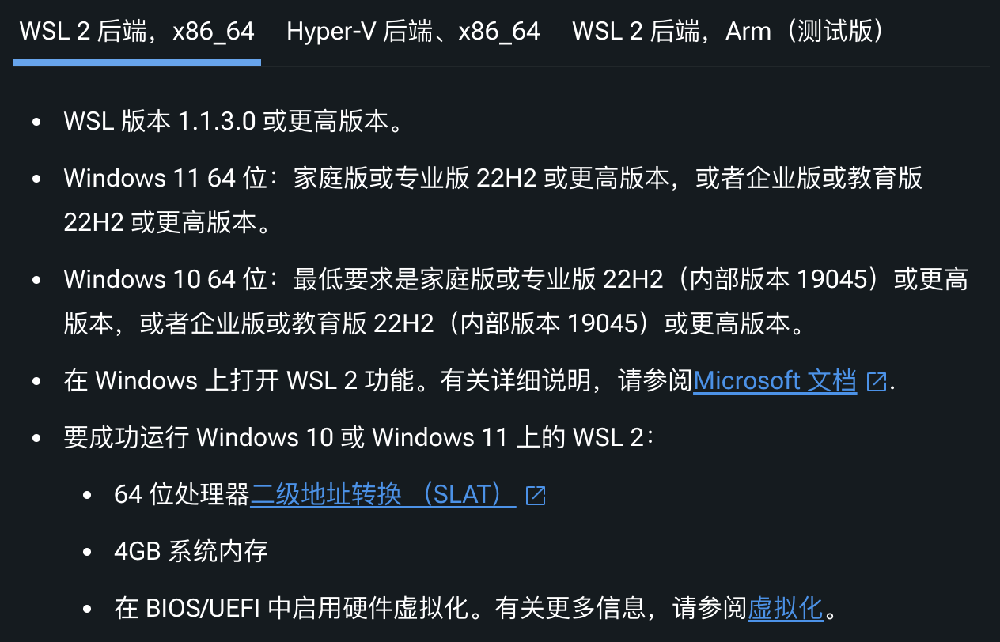

# docker 各环境下的安装
## docker 的版本
* Docker 是一个开源的商业产品，有两个版本：
  - 社区版（Community Edition，缩写为 CE）
  - 企业版（Enterprise Edition，缩写为 EE），一般我们说的都是 CE 版本

## CentOS
* 安装新版本之前先卸载旧的
  ```bash
    sudo yum remove docker \
                  docker-client \
                  docker-client-latest \
                  docker-common \
                  docker-latest \
                  docker-latest-logrotate \
                  docker-logrotate \
                  docker-engine
  ```
  - 注意：Images, containers, volumes, and networks stored in /var/lib/docker/ aren’t automatically removed when you uninstall Docker.

* 安装
  ```bash
    # Install the yum-utils package (which provides the yum-config-manager utility) and set up the repository.
    yum install -y yum-utils

    # 添加稳定的 Docker 软件源
    yum-config-manager --add-repo https://mirrors.aliyun.com/docker-ce/linux/centos/docker-ce.repo

    # 安装 docker 
    yum install docker-ce docker-ce-cli containerd.io docker-buildx-plugin docker-compose-plugin

    # 安装完测试
    docker -v
    docker info

    # Docker 需要用户具有 sudo 权限，为了避免每次命令都输入sudo，可以把用户加入 Docker 用户组
    sudo usermod -aG docker $USER
  ```

* 启动
  ```bash
   # systemctl 命令的用法
   systemctl enable docker    # 设置Docker开机自启动
   systemctl status docker    # 查看Docker的运行状态

   systemctl start docker    # 启动 Docker 
   systemctl stop docker     # 停止 Docker服务
   systemctl restart docker  # 重启 Docker

  ```

## mac
* brew 安装
* 客户端 安装

## windows
* 客户端 安装
  
* 注意：新版的 docker 需要依赖 WSL2。版本不是2的要升级
  ```powershell
   wsl -l -v  # 检查 WSL 版本：

  # 方式一
   wsl --update   # 自动更新
   wsl --install  # 在线安装的新 Linux 安装将默认设置为 WSL2，离线手动下载安装

   wsl --shutdown # 更新完后重启一下
   wsl --set-default-version 2 # 升级完成后 设置 WSL 2 为默认版本
   
   # 方式二：管理员运行 CMD 执行 
   netsh winsock reset
   wsl --shutdown  # 避免重启电脑
  ```
