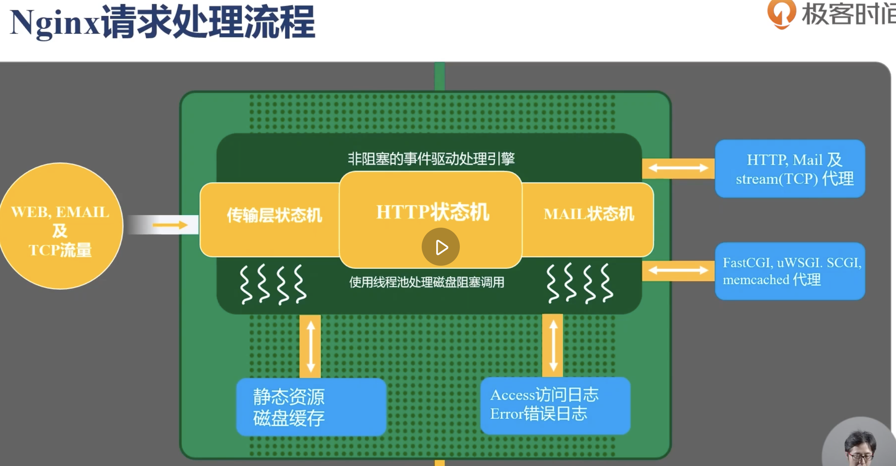
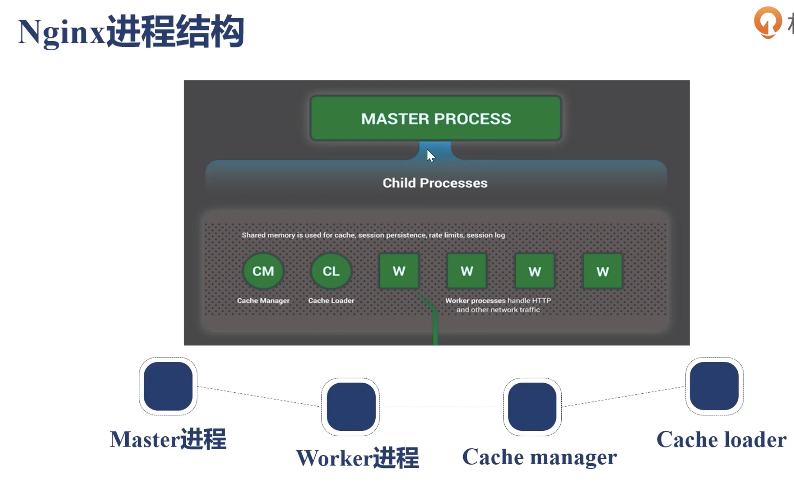
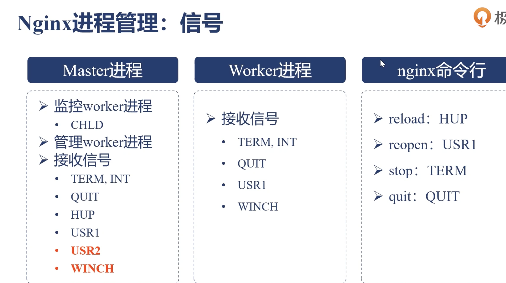

# nginx
> nginx是一个高性能的HTTP和反向代理服务器，也是一个通用的TCP/UDP代理服务器，最初由俄罗斯人Igor Sysoev编写。
## 应用场景
* 静态资源服务
  - 通过本地文件系统提供服务
* 反向代理服务
  - Nginx 的强大性能
  - 缓存
  - 负载均衡
* Api服务
  - OpenResty

## 优点
* 高性能
* 可拓展性好
* 高可靠性
* 热部署
* BSD许可证

## 安装
[nginx安装](./nginx安装.md)

## nginx的组成
* nginx 二进制可执行文件
* nginx.conf 配置 
* access.log 访问日志 纪录每一条 http 请求信息
* error.log 错误日志 定位问题

## 版本
* nginx.org 开源版
* nginx.com 商业版
* Tengine(阿里)定制nginx
* OpenResty.org 以lua语言的方式，提供了更多的可能性

## 常用命令
* linux (需要加 systemctl)
  ```bash
    # 开机启动
    systemctl enable nginx
    
    # 启动和停止
    systemctl start nginx
    systemctl stop nginx

    # 查看 Nginx 运行状态：
    systemctl status nginx

    nginx  # 启动
    
    # 热重启(重新加载配置文件,-s 表示发送信号)：
    nginx -s reload

    # 重启
    nginx -s reopen  

    # 停止
    nginx -s stop

    # 检查配置文件是否出错：
    nginx -t 

    # 查看 nginx 的进程：
    ps -ef | grep nginx

    # 强制停止
    kill -9 进程id
  ```

## nginx配置
* 语法规则
  - 配置文件由指令与指令块构成；
  - 每条指令以 ; 分号结尾，指令与参数间以空格符号分隔；
  - 指令块以 {} 大括号将多条指令组织在一起；
  - include 语句允许组合多个配置文件以提升可维护性；
  - 使用 # 符号添加注释，提高可读性；
  - 使用 $ 符号使用变量；
  - 部分指令的参数支持正则表达式；

* nginx.conf 常用配置
  - worker_processes: Nginx 进程数，一般设置为和 CPU 核数一样
  - pid  Nginx 服务启动时的 pid 存放位置
  + events
      - use epoll: 使用epoll的I/O模型(如果你不知道Nginx该使用哪种轮询方法，会自动选择一个最适合你操作系统的)
      - worker_connections 每个进程允许最大并发数
  
  + http：可嵌套多个server，配置代理，缓存，日志定义等绝大多数功能和第三方模块的配置。
    - include /etc/nginx/conf.d/*.conf; 表示引入 /etc/nginx/conf.d/ 目录下所有以 .conf 结尾的文件作为 Nginx 的配置文件。
    - server:配置虚拟主机的相关参数

  + location：配置请求的路由，以及各种页面的处理情况。
    - = 精确匹配路径，用于不含正则表达式的 uri 前，如果匹配成功，不再进行后续的查找；
    - ^~ 用于不含正则表达式的 uri 前，表示如果该符号后面的字符是最佳匹配，采用该规则，不再进行后续的查找；
    - ~ 表示用该符号后面的正则去匹配路径，区分大小写；
    - ~* 表示用该符号后面的正则去匹配路径，不区分大小写。跟 ~ 优先级都比较低，- 如有多个location的正则能匹配的话，则使用正则表达式最长的那个；
    - 如果 uri 包含正则表达式，则必须要有 ~ 或 ~* 标志。
  - upstream：配置后端服务器具体地址，负载均衡配置不可或缺的部分。

* 常用的全局变量，你可以在配置的任何位置使用它们
  - $host 请求信息中的 Host，如果请求中没有 Host 行，则等于设置的服务器名，不包含端口
  - $request_method 客户端请求类型，如 GET、POST
  - $remote_addr 客户端的 IP 地址
  - $remote_port	客户端的端口

  - $args 请求中的参数
  - $http_user_agent	客户端agent信息
  - $http_cookie	客户端cookie信息

  - $server_protocol	请求使用的协议，如 HTTP/1.0、HTTP/1.1
  - $server_addr	服务器地址
  - $server_name	服务器名称
  - $server_port	服务器的端口号

  - $scheme	HTTP 方法（如http，https）

* 请求过滤与重定向
  ```
    # 状态码过滤
    error_page 500 501 502 503 504 506 /50x.html;
      location = /50x.html {
          #将跟路径改编为存放html的路径。
          root /root/static/html;
      }

    # URL名称过滤，精准匹配URL，不匹配的URL全部重定向到主页。
    location / {
      rewrite  ^.*$ /index.html  redirect;
    }

    # 请求类型过滤。
    if ($request_method !~ ^(GET|POST|HEAD)$) {
        return 403;
    }

    # 单域名重定向
    if ($host = 'www.sherlocked93.club'){
        return 301 https://www.sherlocked93.club$request_uri;
    }

    # 全局非 https 协议时重定向
    if ($scheme != 'https') {
        return 301 https://$server_name$request_uri;
    }

    # 或者全部重定向
    return 301 https://$server_name$request_uri;
  ```

* 反向代理的配置
  ```
    location ~ ^/api {
        proxy_pass http://xxxx.com;

        # 获取代理时真实的请求
        proxy_set_header Host        $host;
        proxy_set_header X-Real-IP   $remote_addr;
        proxy_set_header X-Forwarded-For $proxy_add_x_forwarded_for;
    }
  ```
  + 反向代理还有一些其他的指令
    - proxy_set_header：在将客户端请求发送给后端服务器之前，更改来自客户端的请求头信息；
    - proxy_connect_timeout：配置 Nginx 与后端代理服务器尝试建立连接的超时时间；
    - proxy_read_timeout：配置 Nginx 向后端服务器组发出 read 请求后，等待相应的超时时间；
    - proxy_send_timeout：配置 Nginx 向后端服务器组发出 write 请求后，等待相应的超时时间；
    - proxy_redirect：用于修改后端服务器返回的响应头中的 Location 和 Refresh。

* 支持浏览器跨域访问
  ```
    location / {
        # 允许所有域名访问
        add_header 'Access-Control-Allow-Origin' '*';
        add_header 'Access-Control-Allow-Methods' 'GET, POST, OPTIONS';
        add_header 'Access-Control-Allow-Headers' 'Content-Type,Authorization';

        # 处理 OPTIONS 请求
        # 处理预检请求（OPTIONS）。这对于某些类型的跨域请求（例如使用 PUT 或 DELETE 法时）是必需的。
        # 返回 HTTP 204 No Content 响应，表示请求成功，但没有内容返回。

        if ($request_method = 'OPTIONS') {
            add_header 'Access-Control-Allow-Origin' '*';
            add_header 'Access-Control-Allow-Methods' 'GET, POST, OPTIONS';
            add_header 'Access-Control-Allow-Headers' 'Content-Type, Authorization';
            add_header 'Content-Length' 0;
            return 204;  
        }
    }
  ```

* gzip 配置
    + Nginx 在启用了GZip的情况下，不会等文件 GZip 完成再返回响应，而是边压缩边响应，这样可以显著提高 TTFB(Time To First Byte，首字节时间，WEB 性能优化重要指标)。
    ```
        gzip                 on;
        gzip_comp_level      5; # 压缩级别，级别越高压缩率越大，当然压缩时间也就越长（传输快但比较消耗cpu）。默认值为 1 压缩级别取值为1-9
        gzip_min_length      1k; # 设置允许压缩的页面最小字节数，Content-Length小于该值的请求将不会被压缩，默认值:0，建议设置1k以上
        gzip_types text/csv text/xml text/css text/plain text/javascript application/javascript application/x-javascript application/json application/xml; # 要采用gzip压缩的文件类型(MIME类型)  默认值:text/html(默认不压缩js/css)
    ```

* 限制流量(limit_req|limit_conn)
  > 限流主要是为了控制单位时间内请求的数量，防止某个客户端或某个资源遭受过多请求，导致服务器资源耗尽。下面是常见的限流配置方式：
  - 基于 IP 的请求限流（limit_req）
  ```nginx
    # limit_req 模块允许你对特定的请求进行限制，限制单位时间内的请求数。
    http {
        # 定义了一个名为 one 的共享内存区，大小为 10MB，限制客户端 IP 每秒钟最多请求 5 次。
        limit_req_zone $binary_remote_addr zone=one:10m rate=5r/s;
        server {
            listen 80;
            location / {
                # 在 location 配置中应用该限制，每个 IP 地址的突发请求数（burst）最多允许 5 次,即在正常请求速率之上，最多可以有 10 个请求的突发。
                # nodelay 表示突发请求数超出限制后立即丢弃，而不延迟。
                limit_req zone=one burst=10 nodelay;
                # 其他配置...
            }
        }
    }

  ```
  - 基于连接数的限制（limit_conn）
  ```nginx
   # limit_conn 模块可以限制同一时间内的并发连接数，常用于限制某个 IP 地址或某个资源的并发连接数。
   http {
        # 定义一个共享内存区域，限制每个 IP 地址最大并发连接数为 1
        limit_conn_zone $binary_remote_addr zone=addr:10m;
        server {
            listen 80;
            location / {
                # 限制每个 IP 地址的最大并发连接数为 1
                limit_conn addr 1;
                # 其他配置...
            }
        }
    }
  ```
  - 基于请求速率和并发连接的联合限制
  ```nginx
    # 可以同时配置 limit_req 和 limit_conn，限制请求速率和并发连接数，保护服务器免受高流量和高并发的攻击。
    http {
        # 定义请求限流
        limit_req_zone $binary_remote_addr zone=req_zone:10m rate=1r/s;

        # 定义连接限流
        limit_conn_zone $binary_remote_addr zone=conn_zone:10m;

        server {
            listen 80;
            location / {
                # 应用请求速率限制
                limit_req zone=req_zone burst=5 nodelay;

                # 应用并发连接数限制
                limit_conn conn_zone 1;

                # 其他配置...
            }
        }
    }

  ```
  + 应用场景的数值设置
    - API 服务限流设置：通常需要防止恶意用户或爬虫过度请求接口 rate=5r/s：burst=10
    - Web 应用防刷限流：尤其是登录、注册等高频操作接口，需要防止暴力破解攻击和恶意刷接口 rate=20r/m burst=30
    - 高并发请求的限流设置：经常处理大规模的并发请求（例如电商、新闻站点等） limit_conn addr 5
    - 静态资源限流：静态资源，如图片、JS 文件等，通常请求频率较高，但并不需要过于严格的限制 rate=50r/s，burst=100 适合避免单个 IP 的刷图行为，或者大量的爬虫请求
    - 针对爬虫和恶意流量的限流：rate=10r/m burst=5 limit_conn addr 2

* 限制IP访问
  ```nginx
    location / {
       # 网站根目录
       root /home/web/dist;
       index index.html ;               # 默认首页文件
       try_files $uri $uri/ /index.html;

       deny 172.168.22.11;              # 禁止单个ip
       deny all;

       allow 172.168.33.44;             # 允许单个ip
       allow 192.168.1.0/24;            # 允许一段ip       
    }
  ```

* access 阶段对用户名和密码做限制(auth_basic)
  - 应用场景：做Web页面开发时，如果需要简单的用户验证，又不想搭建LDAP等用户鉴权服务，可以用它。比如access.log分析的goaccess页面
  - 先使用生成工具 htppasswd  生成用户和密码的文件
  ```bash
    yum install httpd-tools
    htpasswd -c file -b user pass  # 生成了 auth.pass 文件
    
  ```
  ```nginx
   server {
     server_name xxx.com;

     location / {
        satisfy any;
        auth_basic "网站名称提示";
        auth_basic_user_file xxx/auth.pass
        deny all;
     }
   }
  ```

* 日志设置格式
  ```
    server {
        # 定义访问日志的输出格式，log_format 在 http 配置块中进行定义，这样会对所有的 server 块生效。
        # Nginx 中常用的日志格式有 main、combined(默认)

        # $remote_user 用户身份验证，如使用了 HTTP 基本认证，可以记录用户身份信息。
        # $time_local 请求时间 格式为 [day/month/year:hour:minute:second zone]，即 31/Dec/2024:13:45:12 +0800
        # X-Forwarded-For 代理时，用于传递客户端的真实 IP
        # $request_length 请求长度，包括请求头和请求体
        # $body_bytes_sent 返回的字节数，不包括响应头。这个字段有助于衡量请求的响应大小
        # $request_time 请求时长 
        # $upstream_response_time 上游响应时间，请求经过了代理或负载均衡，此字段记录从上游服务器获取响应所花费的时间。可以用于调试反向代理和负载均衡的性能问题。
        log_format  custom  '$remote_addr - $remote_user [$time_local] "$request" '
                            '$status [$request_length:$body_bytes_sent] [$request_time:$upstream_response_time] '
                            '"$http_referer" "$http_user_agent" "$http_x_forwarded_for"';
        # Nginx访问日志存放位置
        access_log  /usr/local/var/log/nginx/xxx.com.access.log custom; 
    }

  ```

## 服务配置
* [静态资源服务配置](./server.conf/8082.statc.server.conf)
* [spa-web服务配置](./server.conf/8084.spa.conf)
* [https服务配置](./server.conf/443.https.conf)
* [http2服务配置](./server.conf/http2.conf)
* [负载均衡服务配置](./server.conf/8080.up_server.conf)

## 实时Web日志分析工具
* GoAccess 实时监听 access.log 文件 适合小型的站点
  ```bash
    # -f 选项允许在命令行上实时查看日志
    # log-format 需要与 Nginx 等服务的 log_format 定义保持一致
    # %h：客户端的 IP 地址 (127.0.0.1)
    # %^[%d:%t %^]：日志的日期和时间（18/Nov/2024:13:50:57 +0800）， %d 是日期，%t 是时间。
    # "%r"：请求方法和请求 URL (GET /demo-nginx/logs/ HTTP/1.1)
    # %s：HTTP 响应状态码 (200)
    # %b：返回给客户端的字节数（这里是响应体字节数，564）
    # [%T:%^]：请求处理时间（0.000）和其他（-）。其中 %T 是处理请求的时间，%^ 用于忽略特定信息。
    # "%R"：Referer (http://local_static.com:8082/demo-nginx/)
    # "%u"：用户代理
    
    # Mac 用户 注意：许多日志文件的时间戳和日期格式都是基于英文环境的（例如，18/Nov/2024），而如果你使用本地语言环境（例如中文环境），goaccess 可能无法正确解析英文日期（如 Nov）并导致解析错误。
    # 通过设置 LANG="en_US.UTF-8"，确保了日期和时间的解析符合英文格式。
    # [转换工具](https://github.com/stockrt/nginx2goaccess)

    # 静态 html 
    goaccess /Users/qinmao/Desktop/demo-pro/demo-nginx/logs/local_static.com_access.log --log-format=COMBINED  -o /xxx/xxx/report.html

    # 实时html报告: websocket 默认绑定 7890 端口 --port 可更改
    # --daemonize 后端运行
    # linux
    goaccess /Users/qinmao/Desktop/demo-pro/demo-nginx/logs/local_static.com_access.log \
    --log-format="%h - %^ [%d:%t %^] \"%r\" %s [%^:%b] [%^:%^] \"%R\" \"%u\" \"%x\" "   \
    --date-format="%d/%b/%Y" \
    --time-format="%T" \
    --real-time-html \
    --no-global-config \
    -o /Users/qinmao/Desktop/demo-pro/demo-nginx/html/report.html

    # mac 
    LANG="en_US.UTF-8" bash -c 'goaccess /Users/qinmao/Desktop/demo-pro/demo-nginx/logs/local_static.com_access.log \
    --log-format="%h - %^ [%d:%t %^] \"%r\" %s [%^:%b] [%^:%^] \"%R\" \"%u\" \"%x\" "   \
    --date-format="%d/%b/%Y" \
    --time-format="%T" \
    --real-time-html \
    --no-global-config \
    -o /Users/qinmao/Desktop/demo-pro/demo-nginx/html/report.html'

    # 多日志文件
    goaccess access.log access.log.1
  ```
* EFK 更灵活也更强大.

## nginx 架构



