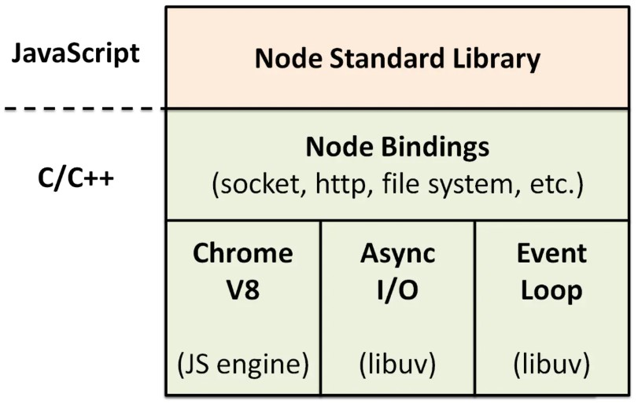

# node
## 总体上的感知
* Node.js® is a JavaScript runtime built on Chrome's V8 JavaScript engine. 
* Node.js uses an event-driven, non-blocking I/O model that makes it lightweight and efficient.
> Node.js (v12以前) 是单线程，它无需进程/线程切换上下文的成本，非常高效，但它在执行具体任务的时候是多线程的。

## install
* node 安装完成后 npm 默认安装，推荐安装nvm 来切换node 版本
* windows 安装node 推荐使用nvm-windows 
* [详情参考 nvm-windows](https://github.com/coreybutler/nvm-windows)

## node结构图


## node 事件驱动模型
* 主线程：
  1. 执行node的代码，把代码放入队列
  2. 事件循环程序（主线程）把队列里面的同步代码都先执行了
  3. 同步代码执行完成，执行异步代码
  4. 异步代码分2种状况
    - 异步非io setTimeout() setInterval() 判断是否可执行，如果可以执行就执行，不可以跳过。
    - 异步io 文件操作会从线程池当中去取一条线程，帮助主线程去执行。
  5. 主线程会一直轮训，队列中没有代码了，主线程就会退出。

* 子线程：被放在线程池里面的线程，用来执行异步io操作
  1. 在线程池里休息
  2. 异步io的操作来了，执行异步io操作。
  3. 子线程会把异步io操作的callback函数，扔回给队列
  4. 子线程会回到线程池了去休息。callback，在异步io代码执行完成的时候被扔回主线程。

## 应用场景
> NodeJS适合运用在高并发、I/O密集、少量业务逻辑的场景
* RESTful API：
  - 这是NodeJS最理想的应用场景，可以处理数万条连接，本身没有太多的逻辑，只需要请求API，组织数据进行返回即可。它本质上只是从某个数据库中查找一些值并将它们组成一个响应。由于响应是少量文本，入站请求也是少量的文本，因此流量不高，一台机器甚至也可以处理最繁忙的公司的API需求。

* 统一Web应用的UI层：
  - 做前后端的依赖分离。如果所有的关键业务逻辑都封装成REST调用，就意味着在上层只需要考虑如何用这些REST接口构建具体的应用。那些后端程序员们根本不操心具体数据是如何从一个页面传递到另一个页面的，他们也不用管用户数据更新是通过Ajax异步获取的还是通过刷新页面。

* 大量Ajax请求的应用

## 优缺点
* 优点:
  - 高并发
  - 适合I/O密集型应用

* 缺点:
  - 不适合CPU 密集型应用，老版本由于JavaScript单线程的原因(新版本支持多线程)，如果有长时间运行的计算（比如大循环），将会导致CPU时间片不能释放，使得后续I/O无法发起；
  + 解决：分解大型运算任务为多个小任务，使得运算能够适时释放，不阻塞I/O调用的发起；
    - 开源组件库质量参差不齐，更新快，向下不兼容
    - 写法上恶心的回调，终极解决方案：Async/Await

## 执行node
* 相对路径
  - ./当前路径
  - ../上级目录

* node + 文件路径的形式执行
  + supervisor
    - 每次修改代码保存后，我们都需要手动重启程序,使用 supervisor 可以解决这个繁琐的问题
    - npm install -g supervisor
    - 运行supervisor --harmony index启动程序
    - supervisor 会监听当前目录下 node 和 js 后缀的文件，当这些文件发生改动时，supervisor 会自重启程序。
  + 在package.json中设置scripts
    ```
      "scripts": {
          "start": "node ./bin/www"
      }
    ```

## 模块
* 核心模块
  - http：提供HTTP服务器功能。
  - url：解析URL。
  - querystring：解析URL的查询字符串。
  - path：处理文件路径。
  - fs：与文件系统交互。
  - child_process：新建子进程。
  - util：提供一系列实用小工具。
  - crypto：提供加密和解密功能，基本上是对OpenSSL的包装。

* 特殊的模块
  - global 有且仅有一个全局对象
  - process 代表当前的nodejs 进程
    ```js
      process.env.NODE_ENV // 读取环境变量
      process.argv         // 获取输入的参数
      process.exit(1)  // 退出node 进程并返回退出码
      // 将在下一轮事件循环中调用:
      process.nextTick(function () {
        console.log('nextTick callback!');
      });
      console.log('nextTick was set!');
      // nextTick was set!
      // nextTick callback!

      // 程序即将退出时的回调函数:
      process.on('exit', function (code) {
        console.log('about to exit with code: ' + code);
      });
    ```

* setImmediate 与 setTimeout(() => {}, 0), process.nextTick()区别？
  - setImmediate参数传入的任何函数都是在事件循环的下一个迭代中执行的回调
  - 传给 process.nextTick() 的函数会在事件循环的当前迭代中（当前操作结束之后）被执行。 这意味着它会始终在 setTimeout 和 setImmediate 之前执行
  - 延迟 0 毫秒的 setTimeout() 回调与 setImmediate() 非常相似。 执行顺序取决于各种因素，但是它们都会在事件循环的下一个迭代中运行
  
## web framework
* 常用web的框架
  - [express](https://www.expressjs.com.cn/)
  - [koa](http://www.ruanyifeng.com/blog/2017/08/koa.html)
  - [egg](https://eggjs.org/zh-cn/intro/index.html)

* web框架脚手架
  - koa-generator 非官方，狼叔开发的
    ```
     npm install koa-generator -g
     koa2 projectName
    ```
  - egg
    ```
    $ mkdir egg-example && cd egg-example
    $ npm init egg --type=simple
    $ npm i
    ```

## web 模板引擎
* Nunjucks 
  - 是Mozilla开发的一个纯JavaScript编写的模板引擎，既可以用在Node环境下（主要），又可以运行在浏览器端（有更好的mvvm框架）
* [pug](./pug/pug.md)

## 数据库
* mysql
  - [mysql](https://github.com/mysqljs/mysql#escaping-query-values) 
  - [orm(Sequelize)](https://sequelize.org/)

* mongoDB
  - 安装驱动 npm install mongodb
  - [curd](node-mongoDB/index.js)

## 缓存
* redis

## 接口风格
- RESTful
* RPC
  + 和ajax不同点
    - 不一定适用dns作为寻址服务
    - 应用层协议一般不使用HTTP
    - 基于TCP 或者UDP 协议

## 日志

## 监控

## api接口文档

## 部署
* [pm2](pm2/readme.md)

## 学习的计划
- 整体上了解 nodejs
- 框架：koa express egg
- 实战：
- 部署：
- 运维：日志、监控

