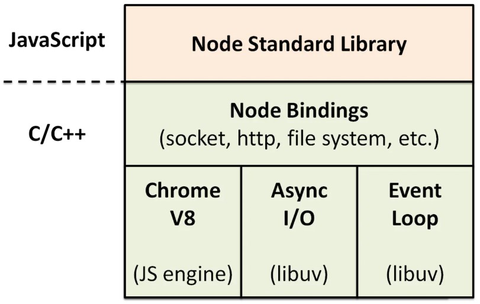

# node
## 总体上的感知
* Node.js® is a JavaScript runtime built on Chrome's V8 JavaScript engine. 
* Node.js uses an event-driven, non-blocking I/O model that makes it lightweight and efficient.
## 安装
* node 安装完成后 npm 默认安装，
* Mac|Linux 推荐安装 nvm 来切换 node 版本
* windows 推荐使用[nvm-windows](https://github.com/coreybutler/nvm-windows)
* 使用 nvm 安装 nodejs 更换版本后，全局模块需要重新安装的问题?
  - nvm 提供 nvm reinstall-packages 命令
  - 例子：如你新安装的是 14.17.3 老版本是 14.17.0
  - 执行 nvm reinstall-packages 14.17.0 就可以把老版本上的全局包重新安装在新版本上了
## 源码编译
1. 安装依赖
  ```bash
  sudu apt-get install g++ curl libssl-dev apache2-utils git-core build-essential
  ```
2. 下载源码编译
  ```bash
    git clone https://github.com/nodejs/node.git
    cd node
    ./configure --prefix=/usr/local/node  
    make
    make install
  ```
## es支持检测
* npm install -g es-checker
* 运行：es-checker
## 软件管理包
* [npm](../包管理/npm.md)
* yarn
## node架构

## node 事件驱动模型
* 主线程：
  1. 执行node的代码，把代码放入队列
  2. libuv中的事件循环程序（主线程）把队列里面的同步代码都先执行了
  3. 同步代码执行完成，执行异步代码
  4. 异步代码分2种状况
    - 异步非io setTimeout setInterval 判断是否可执行，如果可以执行就执行，不可以跳过。
    - 异步io 文件操作 libuv 会从线程池当中去取一条线程，帮助主线程去执行。
    - 而网络I/O是不通过线程池完成
  5. 主线程会一直轮训，队列中没有代码了，主线程就会退出。

* 子线程：被放在线程池里面的线程，用来执行异步io操作
  1. 在线程池里休息
  2. 异步io的操作来了，执行异步io操作。
  3. 子线程会把异步io操作的callback函数，扔回给队列
  4. 子线程会回到线程池了去休息,callback在异步io代码执行完成的时候被扔回主线程。
## 事件循环
* nodejs 中的事件循环
  > Node.js启动的时候会初始化由libuv提供的事件循环，每次的事件循环都包含6个阶段，这6个阶段会在每一次的事件循环当中按照顺序反复执行
  - timers 阶段：这个阶段执行timer（setTimeout、setInterval）的回调
  - I/O callbacks 阶段 ：处理一些上一轮循环中的少数未执行的 I/O 回调
  - idle, prepare 阶段 ：仅node内部使用

  - poll 阶段 ：获取新的I/O事件, 适当的条件下node将阻塞在这里
  - check 阶段 ：执行 setImmediate 的回调
  - close callbacks 阶段：执行 socket 的 close 事件回调
* 浏览器的事件循环和 nodejs 事件循环的区别？
  - 浏览器环境下，microtask的任务队列是每个macrotask执行完之后执行。
  - 在Node.js中，microtask 会在事件循环的各个阶段之间执行，也就是一个阶段执行完毕，就会去执microtask队列的任务。
* process.nextTick 并不属于 Event loop 中的某一个阶段, 而是在 Event loop 的每一个阶段结束后, 直接执行 nextTickQueue 中插入的 "Tick",
## 应用场景
> NodeJS适合运用在高并发、I/O密集、少量业务逻辑的场景
* RESTful API
* 统一Web应用的UI层
* 大量Ajax请求的应用
## 优缺点
* 优点:
  + 高并发,高性能
    - 构建在Chrome V8 引擎上，动态语言运行时里最快的
    - 天生异步的
  + 适合I/O密集型应用
    - 网络应用的瓶颈在I/O的处理
  + 并发编程简单
    - 有了事件驱动和非阻塞的I/O机制，可以使用少量的资源处理非常多的连接和任务
* 缺点:
  - 不适合CPU 密集型应用，老版本由于JavaScript单线程的原因(新版本支持多线程)，如果有长时间运行的计算（比如大循环），将会导致CPU时间片不能释放，使得后续I/O无法发起；
  + 解决：分解大型运算任务为多个小任务，使得运算能够适时释放，不阻塞I/O调用的发起；
    - 开源组件库质量参差不齐，更新快，向下不兼容
    - 写法上恶心的回调，终极解决方案：Async/Await
## 模块nvm 
* 全局：就是无须引用就可以直接使用的对象，内置对象大致能够分为5大类：
  + ① 为模块包装而提供的全局对象： 
    - exports、require、module、__fileName、__dirname
  + ② 内置的process对象
    - 代表当前的 nodejs 进程
      ```js
        process.cwd()    // 获取当前工作目录
        process.env.NODE_ENV // 读取环境变量
        process.argv         // 获取输入的参数
        process.exit(1)  // 退出node 进程并返回退出码
        // 将在下一轮事件循环中调用:
        process.nextTick(function () {
            console.log('nextTick callback!');
        });
        // nextTick was set!
        // nextTick callback!

        // 程序即将退出时的回调函数:
        process.on('exit', function (code) {
            console.log('about to exit with code: ' + code);
        });
       ```
  + ③ 控制台Console模块
    - console.table(非常有用)
    - console.time
      ```js
        console.time('100-elements'); // 打印：100-elements: 0.093ms 0
        for (let i = 0; i < 100; i++) {
          console.timeLog('100-elements',i) // 打印100次：100-elements: xxxms i
        }
        console.timeEnd('100-elements'); // 打印：100-elements: 34.542ms
      ```
  - ④ EventLoop相关API:SetTimeout、SetInterval、SetImmediate
  - ⑤ Buffer数据类型和全局对象global
* 核心模块
  - http：提供HTTP服务器功能。
  - fs：与文件系统交互。
  - buffer
  - stream
  - events
  - net
  - crypto：提供加密和解密功能，基本上是对OpenSSL的包装
  - vm
* os
  > 通过 OS 模块可以获取到当前系统一些基础信息的辅助函数.
    - os.arch()	返回当前系统的 CPU 架构, 如 'x86' 和 'x64'
    - os.constants	返回系统常量

    - os.cpus()	返回 CPU 每个核的信息
    - os.freemem()	返回系统空闲内存的大小, 单位是字节
    - os.totalmem()	返回总内存大小(同内存条大小)

    - os.homedir()	返回当前用户的根目录
    - os.hostname()	返回当前系统的主机名
    - os.loadavg()	返回负载信息
    - os.networkInterfaces()	返回网卡信息 (类似 ifconfig)
    - os.platform()	返回编译时指定的平台信息, 如 win32, linux, 同 process.platform()
    - os.release()	返回操作系统的分发版本号
## 进程
* 熟悉与进程有关的基础命令, 如 top, ps, pstree 等命令.
* child_process
  - child.kill 与 child.send 的区别. 二者一个是基于信号系统, 一个是基于 IPC.
* Cluster 
  - 是常见的 Node.js 利用多核的办法. 它是基于 child_process.fork() 实现的
  - cluster 产生的进程之间是通过 IPC 来通信的, 并且它也没有拷贝父进程的空间, 而是通过加入 cluster.isMaster 这个标识, 来区分父进程以及子进程, 达到类似 POSIX 的 fork 的效果.
* 进程间通信
  - ipc
  - 消息队列
  - 信号量
* 守护进程
## web framework
* 通用型
  - [express](https://www.expressjs.com.cn/)
  - [koa](http://www.ruanyifeng.com/blog/2017/08/koa.html)
* 企业级：
    - [egg](https://eggjs.org/zh-cn/intro/index.html)
    - nest(基于typescript)
* koa-generator
  - 非官方，狼叔开发的
    ```
     npm install koa-generator -g
     koa2 projectName
    ```
## 数据库
* mysql
  - [typeorm](https://typeorm.io/)
* redis
## 接口风格
- RESTful
* RPC
  + 和ajax不同点
    - 不一定适用dns作为寻址服务
    - 应用层协议一般不使用HTTP
    - 基于TCP 或者UDP 协议
## 完整项目的常见配置需求
* 全局统一处理：
  - 拦截器统一接口返回参数
  - 异常处理：base、http, business
* 接口参数校验
* 环境配置：
    - dev、test、pre、prod
* 接口版本管理（单个方法、整个控制器所有方法、全局版本控制）
* 接口文档：swagger
  - 接口入参描述
  - 接口返回结果描述
  - GET接口、POST接口、上传接口
  - 模块归类
  - 支持搜索
* 数据库
  + orm:typeORM（mysql、mongodb）
    - 单表对象更新同步数据库
    - 手动执行复杂的 sql
  + 新增：单条、多条
  + 删除：软删、硬删、删单条、删多条
  + 修改：单条、多条
  + 查询：单条、多条、分页
* 接口访问鉴权(流行的有 JWT、OAuth2.0)
  - 有调用者身份
  - 请求具有唯一性
  - 请求的参数不能被篡改
  - 请求有效时间，及api对应的令牌（token）
    * 认证的技术方案
    + passport 是目前最流行的 node.js 认证库 集成到nest下为 @nestjs/passport
        - 验证用户的身份（用户名/密码、JSON Web令牌JWT）
        - 管理经过身份验证的状态
        - 把经过验证的用户的信息附加到请求对象，以便在路由处理程序中进一步使用
    + Passport-local 的策略，它实现了一种用户名/密码身份验证机制
    + passport-jwt 的策略 验证请求的token
* 外接第三方服务
  - 微信
  - 飞书
* 定时任务
* 缓存
  - nestjs 自带的 cache-manager
  - redis
* 使用c++插件
* 多进程、多线程
  - 利于多核cpu
* 日志
  + Fastify 作为一款专注于性能 Http 框架，使用 pino 作为内置日志工具
  + 日志拆分、格式化、落库 
## 调试
* vscode
* chrome
## 接入C++插件
* TODO
## 安全
* 限流 
  - 同一个ip在指定的时间内访问的次数
* Helmet
  - 设置与安全相关的 HTTP 标头
## 测试
* http 性能指标
  - qps（request per second） 每秒服务器能够承载的并发量
  - transfer rate(吞吐量) 每秒吞吐的数据量大小
* 性能测试工具
  - ab
  ```bash
    # 安装Apache会自动安装，如果要单独安装ab，可以使用yum安装：
    yum -y install httpd-tools

    #  基本的参数：-c 200 并发请求个数 -n 1600 执行的请求数量  -t20 测试20s 
    # -p 包含了需要POST的数据的文件 -T POST数据所使用的Content-type头信息
    ab -c200 -n1600 -t10 http://127.0.0.1:3000/app/hello

    # mac apr_socket_recv: Connection reset by peer (54)
  ```
   > 注意：mac 系统下 请求本地 报apr_socket_recv: Connection reset by peer (54) 原因是：mac自带的ab限制了并发数导致的。下载最新的 ab
    ```bash
      brew install httpd
      # 最后需要使用新安装的httpd下的 ab
    ```
  - autocannon 
  > Node.js 写的压测工具
  ```bash
    npm i -g autocannon
    autocannon -v

    -a, --amount: 总请求数量，默认值为 0（表示持续运行）
    -b,--body BODY 请求报文体  可以是 JSON 文件、URL 编码的字符串或二进制文件路径。
    -c, --connections NUM 并发连接的数量，默认100
    -d,--duration SEC 执行的时间，单位秒
    -p, --pipelining 管道请求数量，默认值为 1。
    -m,--method METHOD 请求类型 默认GET
    -t, --timeout: 单个请求最长超时时间，单位为秒，默认值为 10。
    -H, --header: 自定义请求头，例如 -H 'Authorization: Bearer xxxx'.


    # 使用示例
    autocannon -c 10 -d 5 -p 1 http://127.0.0.1:3000

  ```
* linux 的命令找性能瓶颈
  - top：cpu、内存
  - iostat：硬盘
  - profile 性能分析工具（nodejs自带的）
  - chrome devtool
## 分析性能瓶颈的步骤
1. 命令行运行 node --inspect-brk main.js 出现 Debugger listening on xxx 表示成功
2. chrome 浏览器 输入 chrome://inspect  找到 target 下的 inspect 点击， 工具栏有 Profile(cpu)、Memory(内存) 
3. 点击cpu 开始记录 使用 ab 压测cpu
 ```bash
   ab -c 100 -n 100 -t 10 http://127.0.0.1:3000/app/hello
 ```
4. 点击 chrome 停止记录按钮, 找到百分比高的函数具体分析:
## 部署
 > 四个阶段: 手动部署、 命令工具部署、 docker镜像部署、平台化部署
* 手动部署
    - 本地build构建打包 ——> FTP文件上传 ——> 通过域名访问最新文件
* 命令工具部署
    - git push代码到代码仓库 ——> gitlab CI/CD或github action 依赖配置文件打包并构建上传 ——> 通过域名访问最新文件
* [pm2部署](部署/pm2.md)
* [docker部署](部署/docker.md)
## 监控
* TODO