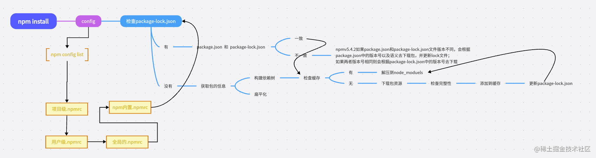

# npm
## npm 配置
* nrm 配置源
  ``` bash
    npm install  nrm -g
    # 选择网络延迟最少的
    nrm test 
    nrm use cnpm  //switch registry to cnpm
    nrm ls 查看所有
    # 命令添加公司私有npm源
    nrm add 
    # 例子
    nrm add qihoo http://registry.npm.360.org
  ```
* npm config
  ```bash
    # 查看配置信息
    npm config list    

    # 查看源
    npm config get registry

    npm config set registry https://registry.npmmirror.com
    
    npm config set registry https://mirrors.tuna.tsinghua.edu.cn/npm/
    # 科学上网后或者发布时移掉
    npm config rm registry
  ```
* 项目中 .npmrc 配置环境变量
    ```
    registry="https://registry.npmmirror.com"
    ELECTRON_MIRROR="https://npmmirror.com/mirrors/electron/"
    ELECTRON_BUILDER_BINARIES_MIRROR="https://npmmirror.com/mirrors/electron-builder-binaries/"
    chromedriver_cdnurl=http://registry.npmmirror.com/mirrors/chromedriver
    operadriver_cdnurl=http://registry.npmmirror.com/mirrors/operadriver
    phantomjs_cdnurl=http://registry.npmmirror.com/mirrors/phantomjs
    fse_binary_host_mirror=https://registry.npmmirror.com/mirrors/fsevents
    sass_binary_site=http://registry.npmmirror.com/mirrors/node-sass
    
  ```
## npm 基础用法
* install
  - npm install  将 package.json 中的文件依赖的包从网上下载到本地
  - npm install  包名 -save 将包下载下来并且加载到 dependencies中去（npm 5.x开始不需要-save）
  - npm install  包名 -save-dev  将包下载下来并且加载到devDependencies中去 简写 -D
  - npm install  包名 -g  全局安装
  - npm install express@3.21.2 安装指导版本的包
  - npm i electron -D --timeing=true --loglevel=verbose  安装 electron 并打印安装日志
  
  + ci 和 install 的区别
  > ci 一般用在 CICD pipeline，比 install 更快
    - 必须有个 package-lock.json
    - 如果包锁定中的依赖项与 package.json 中的依赖项不匹配，npm ci 将退出并出现错误，而不是更新包锁定。
    - 一次只能安装整个项目,不能使用此命令添加单个依赖项。
    - 如果 node _ module 已经存在，那么将在 npm ci 开始安装之前自动删除它。
    - 它永远不会写入 package.json 或任何包锁: 安装基本上是冻结的
    - npm ci --omit=dev 忽略安装开发依赖
* update
  - ncu（npm 检查更新）
    ```bash
        # 安装
        npm install -g npm-check-updates
        # 检查 package.json 的最新依赖项
        ncu
        # 检查单个版本
        ncu vue

        #检查除某个包以外的所有包
        ncu \!vue
        ncu -x vue
        ncu --reject vue

        # 查看全局的安装包最新版本
        ncu -g
        
        # 更新 package.json 的最新依赖项
        ncu -u
    ```
* uninstall
    - npm uninstall  <package> 加-D 或-S 移除依赖
    - npm uninstall -g <package>
    + npm <command> -h  quick help on <command>
    + npm docs 包名 查看包的文档

* npm rebuild 重新构建包：
    - 如：针对electron环境从新构建包
    - npm rebuild --runtime=electron --target=1.1.3 --disturl=https://atom.io/download/atom-shell --abi=102

* npm list -g --depth 0  查看安装了哪些全局的包

## package.json
> npm init  创建package.json文件,--yes 获得默认值
* npm 启动 node 
    ```json
    "main": "lib/index.js",
    "bin": {
        "vm2": "./bin/vm2"
    },
    "scripts": {
        "start": "node ./bin/www",
        "test": "node ./bin/test",
        "qm":"node ./bin/test"
    },
    "dependencies":{},
    "devDependencies":{}
    ```
* bin 字段指定了各个内部命令对应的可执行文件的位置。如果全局安装模块报
  - npm 会使用符号链接把可执行文件链接到 /usr/local/bin，会链接到 ./node_modules/.bin/。
* [package.json](http://www.mujiang.info/translation/npmjs/files/package.json.html)

* npx (npm5.2以上自带)
    ```
    # 项目的根目录下执行
    $ node-modules/.bin/mocha --version

    # npx 更方便
    npx mocha --version

    # 就是运行的时候，会到node_modules/.bin路径和环境变量$PATH里面，检查命令是否存在
    ```
* 版本号
    - 1.2.3 (1表示重大更新,2表示向下兼容,3表示补丁包更新)
    - ">" +版本号   下载大于某个版本号，npm会下最新版
    - "<" +版本号   下载小于某个版本号，npm会下小于这个版本号最新版
    - "<=" 小于等于 一定会下你写的这个版本，除非没有你写的这个版本
    - ">=" 大于等于  下载最新版
    - " *、' '、X "  任意 npm会给你下最新版
    - "^" +版本号  不跃迁版本下载，^2.1.0 npm会下载大版本不变，去下载2.x.x版本里的最近版
    - "~" +版本号  会去下约等于这个版本的最新版，在大版本不变的情况下下一个比较新的版本
## 创建Node包,发布、更新
* 创建
  - package.json文件被创建后，创建一个当你的模块被需要的时候加载的文件。该文件的默认名称是index.js。在该文件中，添加一个函数作为exports对象  一个属性。这将使该功能可用于其他代码。
  ```js
      exports.printMsg = function() {
          console.log("This is a message from the demo package");
      }
  ```
* 发布和更新
  - tip:发布时切回原始的源（从淘宝等镜像源切回npm）
  - 注意： npm 对包名的限制：不能有大写字母/空格/下滑线!
  - 你的项目里有部分私密的代码不想发布到npm上？将它写入.gitignore 或.npmignore中，上传就会被忽略了
  - 第一次发布包：在终端输入npm adduser，输入账号。npm adduser成功的时候默认你已经登陆了。
  - 非第一次发布包：在终端输入npm login，然后输入你创建的账号和密码，和邮箱
  - npm publish 发布和更新
  - npm view 查看是否发布成功
  - 通过npm version <update_type>自动改变版本（或者手动更改package.json）
  - update_type为patch, minor, or major其中之一，分别表示补丁，小改，大改
* 撤销发布的包
  - npm --force unpublish 你的模块名，来删除发布的模块（超过24小时就不能删除了）
  - npm unpublish的推荐替代命令：npm deprecate <pkg>[@<version>] <message>
  - 使用这个命令，并不会在社区里撤销你已有的包，但会在任何人尝试安装这个包的时候得到警告
  - 例如：npm deprecate penghuwanapp '这个包我已经不再维护了哟～'
* 发布遇到的问题
  1. npm ERR! no_perms Private mode enable, only admin can publish this module:
      - 这里注意的是因为国内网络问题，许多小伙伴把npm的镜像代理到淘宝或者别的地方了，这里要设置回原来的镜像。
      - npm config set registry=http://registry.npmjs.org（推荐使用nrm来切换源）
  2. npm ERR! you do not have permission to publish "your module name". Are you logged in as the correct user?
      - 提示没有权限，其实就是你的module名在npm上已经被占用啦，
      - 去npm搜索你的模块名称，搜不到，就能用，并且把 package.json里的name修改过来，重新npm publish         

## npm install 发生了什么？

1. 命令解析与初始化:解析命令参数、定位项目根目录、加载配置
2. 依赖解析与安装:
  - 读取依赖信息
  - 构建依赖树:扁平化处理(尝试复用相同版本的依赖)、版本冲突解决：根据 package-lock.json 安装固定版本
  - 下载包：检查本地缓存、
  - 更新元数据：生成/更新 package-lock.json：
3. 生命周期脚本执行
  - preinstall：安装前执行（如清理旧文件）。
  - install：包安装后执行（较少使用）。
  - postinstall：安装完成后执行（常见于编译原生模块，如 node-gyp rebuild）。
  - 其他钩子：如 prepublish、prestart、posttest 等。
  
## npm run xxx 发生了什么
* 运行 npm run xxx 的时候，npm 会先在当前目录的 node_modules/.bin 查找要执行的程序，如果找到则运行；
* 没有找到则从全局的 node_modules/.bin 中查找，npm i -g xxx就是安装到到全局目录；
* 如果全局目录还是没找到，那么就从 path 环境变量中查找有没有其他同名的可执行程序。

## 搭建私有仓库
- [参考](https://blog.csdn.net/qq1195566313/article/details/132039589?spm=1001.2014.3001.5501)
-  verdaccio