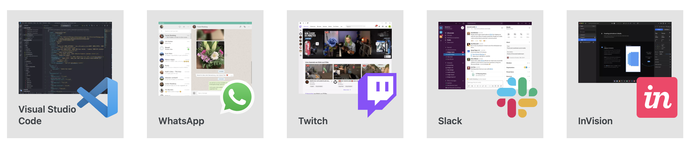
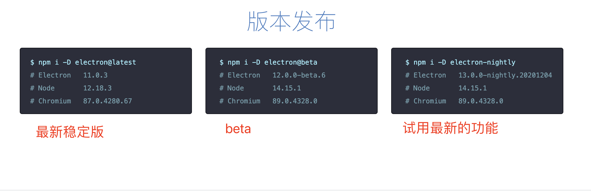

# electron 跨平台桌面开发
> Electron 是一个使用 JavaScript, HTML 和 CSS 等 Web 技术创建原生程序的框架,帮助我们构建跨平台的桌面应用程序
## 有名的案例：

## 支持的平台
* OS X
  - 系统仅有64位的二进制文档，支持的最低版本是 OS X 10.8。
* Windows
  - 仅支持 Windows 7 及其以后的版本
  - 对于 Windows 提供 x86 和 amd64 (x64) 版本的二进制文件。需要注意的是ARM 版本的 Windows 目前尚不支持.
* Linux
  - 预编译的 ia32(i686) 和 x64(amd64) 版本 Electron 二进制文件都是在
  Ubuntu 12.04 下编译的
  - arm 版的二进制文件是在 ARM v7（硬浮点 ABI 与Debian Wheezy 版本的 NEON）下完成的。
## 发展历史
* electron 的由来
  - 早期想开发一个桌面的GUI软件，希望能在Windows、Linux、和Mac 平台上运行，可选的框架不多，主要有GTK、Qt、wxWidgets。这三个框架都是C/C++ 开发的。受限于语言开发效率的限制，完成快速开发不太现实，对前端同学来说十分不友好
  - 有这么一句话 "凡是能用javascript实现的注定会被用JavaScript 实现"，所以桌面GUI 也不例外，NW.js(https://nwjs.io)和Electron(https://electronjs.org) 横空出世了
  + NW.js 和 Electron 如何产生的？
   - 这两框架和中国人都有极深的渊源。2011年英特尔开源中心的 王文睿 希望用nodejs 操作webkit,创建了node-webkit 这就是 NW.js 的前身，之后有一个 赵成 加入了王文睿的得小组，并对node-webkit 做了大量改进，后来赵走了，去帮助GitHub 把node-webkit 应用到Atom 编辑器上，由于各种因素这次尝试失败了。但是Github 和赵成并没有放弃，开发了一个类似node-webkit 的项目 Atom Shell 这个项目就是Electron 的前身，后来（2015年4月）开源出来起名叫 Electron

  + 两框架的都是基于Chromium 和nodejs 实现的
    - 前端:可以使用js 、html 、css
    - 针对前端访问系统API 方面的不足，封装了一些系统api 如系统对话框、系统托盘、系统菜单剪切板
    - Electron应用基本上是一种Node.js应用,所以需要安装nodejs。
    - nodejs的程序的起点将是一个 package.json 文件

  + 两种框架的主要差别
    - Electron 区分主进程和渲染进程，主进程负责创建、管理渲染进程以及控制整个应用的生命周期
    - 渲染进程负责显示界面及控制用户的交互逻辑
    - 两者通讯ipcMain 和ipcRenderer 传递消息来实现
    - NW.js不需要关心这些，它关心的是所有窗口共享一个nodejs 环境带来的问题。
* 当前的版本
  - electron 版本迭代的速度非常快,截止2020年12月6
  
* 能力:
  - 自定义代理
  - 截获网路请求
  - 注入脚本到目标网站
## 安装
  ```bash
    # 安装最新版
    npm install electron -D

    # 指定版本位数
    npm install --arch=ia32 electron -D

    # 指定平台
    npm install --platform=win32 electron -D

    # 兼容Windows7及32位系统
    # Electron23 中开始结束 Windows 7, Windows 8 和 Windows 8.1 的支持。
    yarn add  electron@22

    npm install  electron@22
  ```
## 生态
* electron-builder 是Electron的构建工具，提供自动下载、自动构建、自动打包、自动升级
  - electron-builder 比 electron-packager支持更多的平台，同时也支持自动更新
  - 由electron-builder打出的包更为轻量
  - 可以打包出不暴露源码的setup安装程序
* Vue ClI Plugin Electron Builder 和 electron-vue 基于它们可以在Electron 应用内使用Vue 及其组件（包括HMR热更新），推荐前者, 基于Vue ClI Plugin 更新频繁。
* 不想用框架也可以用 webpack 与传统的 web 开发技术
## 优势
* 基于web技术开发桌面，web生态繁荣，开发效率高
* 内置 node 环境，node 可以方便调用 c++ 的拓展
* 内置 Chromium，对浏览器标准支持更好，不用考虑兼容问题，es6 h5 css3 放心使用
## 不足
* 打包后体积较大，没什么功能的桌面经过 electron-builder 压缩打包后，大概有40MB,升级再次下载同样体积的包
* 跨进程通信必须要了解，开发较复杂
* 版本更新太快，为跟上 chrominum 更新节奏，每次 chrominum 更新都可能导致 electron 出现新的问题。
* 由于底层基于 chrominum，chrominum 内存占用过高
## 使用
* 安装的问题
    - electron 安装不成功问题（卡在install.js）
    - 配置 .npmrc 文件
    ```
    ELECTRON_MIRROR="https://npmmirror.com/mirrors/electron/"
    ```
* 为什么 ELECTRON 是 DEVDEPENDENCY?
    - npm install electron -D
    - 打包后的应用本身会包含 Electron 的二进制文件，因此不需要将 Electron 作为生产环境依赖。
* Electron API Demos: Electron API 演示工具
* Electron Fiddle 试验工作，写一段代码运行
* 脚手架
  - Vue ClI Plugin Electron Builder
  ```
  vue add electron-builder
  ```
## 运行流程
* 执行的过程
    1. 在 package.json 中 main 定义 app 入口的文件 main.js
    2. 在主进程中也就是 main.js 中创建一个渲染进程
    3. 在渲染进程中布局和画 app 的界面（index.html）

* 主进程
    - Electron 运行 package.json 的 main 脚本的进程被称为主进程。 在主进程中运行的脚本通过创建 web 页面来展示用户界面。
    - 一个 Electron 应用总是有且只有一个主进程。
    - 主进程使用 BrowserWindow 实例创建页面。 每个 BrowserWindow 实例都在自己的渲染进程里运行页面。 当一个 BrowserWindow 实例被销毁后，相应的渲染进程也会被终止。

* 渲染进程
    - 由于 Electron 使用了 Chromium 来展示 web 页面，所以 Chromium 的多进程架构也被使用到。 每个 Electron 中的 web 页面运行在它自己的渲染进程中
    - electron 渲染进程中通过 Nodejs 读取本地文件
## 窗口
* BrowserWindow 的属性
    - x, y, center,movable 当创建多个窗口时，有可能后创建的窗口覆盖前面的窗口，此时应该x,y 调整位置
    - width,height,minWidth,maxWidth,maxHeight,minHeight,resizeable,minimizabel,maxminizable
    - frame 设为 false，会屏蔽系统的标题栏和边框
    + webPreferences: 
      - nodeIntegration
      - nodeIntegrationInWorker
      - nodeIntegrationInSubFrames 控制渲染进程访问 Nodejs 的环境
    - preload,webviewTag,contextIsolation 增加渲染进程的能力
* 自定义窗口
## 界面
* webContents 是 Electron 的核心模块，负责渲染和控制应用内的 web 界面
  ```js 
    // 主进程下 获取激活状态下的窗口的实例
    const { webContents } =require('electron')
    const webContent=webContents.getFocuseWebContents()

    // 渲染进程
    const { remote } = require("electron");
    // remote.getCurrentWindow()
    remote.getCurrentWebContents()
  ```
* 网页页面加载事件及触发顺序(关键的几个)
  - did-start-loding: 页面加载的首个事件，tab 页图标开始旋转
  - page-title-updated：页面标题更新事件
  - dom-ready: dom 加载完成 背后是网页的 DOMContentLoaded 事件
  - did-frame-finish-load：框架加载完成，多个iframe 会触发多次
  - did-finish-load 页面加载完时触发
  - did-stop-loading:所有内容加载完成时触发，浏览器中发生相当 tab 页图标停止旋转
* 页面跳转相关的事件
  - did-navigate 主页面跳转完成时触发 （location.hash、点击一个锚点链接不会触发）
  - did-navigate-in-page location.has或点击一个锚点链接时触发 
* 集成web页面的方式
>有三种方式可以让你在 BrowserWindow里集成（第三方）web内容，<iframe>, <webview> 和 `BrowserViews 每个功能都略有不同，适用于不同的情况。 
  * iframe 共享宿主页面
    - webContents.isLoadingMainFrame MainFrame是否加载完成
  * webview 
    > 官方不建议使用，因为这个标签会发生剧烈的结构变化，可能会影响您应用程序的稳定性
    - WebView是一个自定义元素 (<webview>)，仅在 Electron 内工作。 所有与 <webview> 的通信都是异步使用 IPC 进行的，
    - 与 <iframe>相比，<webview> 往往稍慢，但在加载和与第三方内容通信以及处理各种事件方面提供了更大的控制，
     ```html
        <webview src="http://xxx.com/" preload="./test.js" nodeintegration></webview>
    ```
    ```js
        const webview = document.querySelector('webview')
        webview.addEventListener('dom-ready', () => {
            webview.openDevTools()
        })
    ```
    + nodeintegration 
        - 当有此属性时, webview 中的访客页将具有Node集成, 并且可以使用像 require 和 process 这样的node APIs 去访问低层系统资源。 Node 集成在访客页中默认是禁用的。

    + sendToHost 
        - 就像 ipcRenderer.send，不同的是消息会被发送到 host 页面上的 <webview> 元素，而不是主进程。

    + send
        - webview->向渲染进程发送消息

    + ipc-message 访客页面向嵌入页面发送异步消息时触发。
        ```js
            // In embedder page.
            const webview = document.querySelector('webview')
            webview.addEventListener('ipc-message', (event) => {
                console.log(event.channel)
            // Prints "pong"
            })
            webview.send('ping')

            // In guest page.
            const { ipcRenderer } = require('electron')
            ipcRenderer.on('ping', () => {
                ipcRenderer.sendToHost('pong')
            })
        ```
  * BrowserViews
    - 不是 DOM 的一部分，而是由主进程创建和控制
    - 它们只是现有窗口之上的另一层 Web 内容。与 BrowserWindow 内容完全分离
    - 替代webview标签.
    ```js   
        const view=new BrowserView({
            webPreference:{ preload }
        })
        view.setAutoResize({
            width:true,
            height:true
        })
        view.webContents.loadURL(url)

        win.setBrowserView(view) // 已设置过，会覆盖
        win.addBrowserView(view) // 添加多个,移除的加回来不会重新渲染
        win.removeBrowerView(view) // 移除窗口

        // css 显示和隐藏
        view.webContents.insertCSS('html{ display:block }')
        view.webContents.insertCSS('html{ display:none }')
    ```
## 增强渲染进程能力的属性
* preload 脚本注入
    - 由于预加载脚本与渲染器共享同一个全局 Window 接口，并且可以访问 Node.js API，因此它通过在 window 全局中暴露任意您的网络内容可以随后使用的 API 来增强渲染器。
    - 虽然预加载脚本与其所附加的渲染器在全局共享着一个 window 变数，但您并不能从中直接附加任何变数到 window 之中，因为默认是环境隔离的
    - 语境隔离（Context Isolation）意味着预加载脚本与渲染器的主要运行环境是隔离开来的，以避免泄漏任何具特权的 API 到您的网页内容代码中。
    - 取而代之，我们將使用 contextBridge 模块来安全地实现交互
      ```js
        // preload.js
        const { contextBridge } = require('electron')

        contextBridge.exposeInMainWorld('myAPI', {
            desktop: true
        })

        // renderer
        console.log(window.myAPI)
        // => { desktop: true }
        ```

    - executeJavaScript 返回一个 promise 对象 允许你执行一段脚本
* webSecurity 控制网页的同源策略，关闭后不会出现跨域
* contextIsolation 
* 渲染进程开启访问服务端的能力
  ```js
    // Create the browser window.
  win = new BrowserWindow({
    webPreferences: {
      // webSecurity: false, // 禁用同源策略
      nodeIntegration: true, // 在渲染进程中开启node环境
      contextIsolation: false, // 默认是true 关闭环境隔离
      // preload: path.join(__dirname, "preload.js"),
    },
  });
  ```
## 原生App特性
* 关于窗口：
  - 图标+产品名+版本号+版权+..
  - npm i electron-about-window 直接配置
  ```js
    const openAboutWindow = require("electron-about-window").default;
    const path = require("node:path");

    const create = () =>
    openAboutWindow({
        icon_path: path.join(__dirname, "icon.png"),
        package_json_dir: path.resolve(__dirname + "/../../../"),
        copyright: "Copyright (c) 2024 dragon",
        homepage: "https://github.com/dengyaolong/geektime-electron",
        bug_report_url: "https://github.com/dengyaolong/geektime-electron/issues",
    });
    module.exports = { create };

  ```
## 进程间的通讯
* ipcMain
  - 当在主进程中使用时，它处理从渲染器进程(网页)发送出来的异步和同步信息,当然也有可能从主进程向渲染进程发送消息。
  ```js
      const { ipcMain }  = require('electron')
      // 主进程发消息给渲染进程
      webContents.send('ping', 'whoooooooh!')

      // 给某个窗口发消息
      // const winId = BrowserWindow.getFocusedWindow().id;
      // 通过 id 查找窗口
      // let win = BrowserWindow.fromId(winId);
      // 给某个窗口发消息
      //  win.webContents.send('msg',winId,'我是 index.html 的数据');

      // 主进程监听 渲染进程发送的消息
      ipcMain.on('sendMsg', (event, data)=> {
          console.log('data\n ', data)
          console.log('event\n ', event) 
          // 主进程给渲染进程广播数据
          event.sender.send('sendFeedbackToRender', '来自主进程的反馈')
      })

  ```
* ipcRender
  > 使用它提供的一些方法从渲染进程 (web 页面) 发送同步或异步的消息到主进程。 也可以接收主进程回复的消息
  - 注意：主进程向渲染进程发消息，如果返回的对象是字符串或者数字 elctron 复制一份返回给渲染进程，渲染进程中持有的远程对象被回收，主进程相应的对象也会被回收
  ```js
    const { ipcRenderer } = require('electron');

    sendBtn.onclick = function () {
        // 发消息给主进程
        ipcRenderer.send('sendMsg', {name:'poetries', age: 23})
    }
    // 渲染进程监听主进程发送的消息
    ipcRenderer.on('ping', (event, message) => {
        console.log(message) // Prints 'whoooooooh!'
    })
* invoke
  ```js
    // Renderer process 触发一个事件
    ipcRenderer.invoke('some-name', someArgument).then((result) => {
        // ...
    })

    // Main process
    ipcMain.handle('some-name', async (event, someArgument) => {
        const result = await doSomeWork(someArgument)
            return result
        }
    )
  ```   
* 渲染进程间通讯
  ```js
    // Sends a message to a window with webContentsId
    ipcRenderer.sendTo(webContentsId, channel, ...args)

    // 消息会被发送到 host 页面上的 <webview> 元素
    ipcRenderer.sendToHost(channel, ...args)
  ```
* 其他一些事件api
  - removeListener
  - removeAllListeners
## 数据持久化
> 保存用户的数据存放地址供用户选择
* 获取常用文件路径
    - app.getPath('appData') 用户个性化数据目录
    - 重置用户数据目录
    ```js
        app.setPath('appData','D:\\xxxx\\xxx')
    ```
* 读写本地文件
  - lowdb
  - electron-store
* electron-store 对比 window.localStorage 优点
    - localStorage 仅在浏览器进程（渲染进程）中起作用。
    - localStorage 的容错性不是很高，因此，如果您的应用遇到错误并意外退出，则可能会丢失数据。
    - localStorage 仅支持持久字符串。 此模块支持任何JSON支持的类型。
    - localStorage 不是很安全，可能是由于xss攻击而泄漏信息。
    - electron-store 模块的API更好。 您可以设置并获取嵌套属性。 您可以设置默认的初始配置。

* vuex 、localstorage、electron-store 存储方式：
    - vuex存储在内存，localstorage则以文件的方式存储在本地，electron-store数据存储卸载应用之后依然存在。
* sqlite3(node-sqlite3)
    - 安装：见官网 node-sqlite3
    - knexjs sql 指令构建器，帮助我们把代码转成sql 语句，数据库返回的数据也会转成JSON 对象
    - 支持多种数据库：mysql、MSSQL、Oracle、
## Electron 中 编译 原生模块
* 自动编译（推荐）
  - 像 Node 项目一样安装模块，然后用 electron-rebuild 包重建这些模块以适配 Electron。 这个包可以自动识别当前 Electron 版本，为你的应用自动完成下载 headers、重新编译原生模块等步骤
  ```bash
    npm install --save-dev @electron/rebuild
    npx electron-rebuild

    # If you have trouble on Windows, try:
    .\node_modules\.bin\electron-rebuild.cmd

    # 你可以尝试使用 DEBUG 环境变量来重新运行 electron-rebuild，以便获取更详细的调试信息
    DEBUG=electron-rebuild npx electron-rebuild

  ```
## 注册唤起协议
* 调起应用时触发的钩子函数
  - mac 通过 app.on(‘open-url’, fun)监听
  - window 通过 app.on(“second-instance”,fun)监听 
## 集成 vue 的项目（vite）
* 如何在渲染环境下引入 ipcRenderer ？
  - 方案一：打开 node 环境开关（不推荐）
  - 方案二：preload 注入脚本形式
  - 注意：webpack 需要配置 target 为 electron 
## 集成 dll(动态链接库)
* npm i ffi-napi
* 使用场景：
  - 使用系统 Api 或 拓展应用程序
  - 使用第三方 dll ,如硬件设备进行通信
## 开机自启动
* node-auto-launch
## 调试
* vscode 主进程调试配置文件
    ```json
        {
            "version": "0.2.0",
            "compounds": [
                {
                "name": "Main + renderer",
                "configurations": ["Debug Main Process", "Debug Renderer Process"],
                "stopAll": true
                }
            ],
            "configurations": [
                {
                "name": "Debug Main Process",
                "type": "node",
                "request": "launch",
                "cwd": "${workspaceFolder}",
                "runtimeExecutable": "${workspaceFolder}/node_modules/.bin/electron",
                "windows": {
                  "runtimeExecutable": "${workspaceFolder}/node_modules/.bin/electron.cmd"
                },
                "args": [".", "--remote-debugging-port=9222"],
                "env": { "RUNNING_ENV": "dev" },
                "outputCapture": "std",
                "console": "integratedTerminal"
                },
                {
                "name": "Debug Renderer Process",
                "port": 9222,
                "request": "attach",
                "type": "chrome",
                "webRoot": "${workspaceFolder}/src"
                }
            ]
        }

    ```
  + 快捷键：刷新页面（未开起热重载）
    - mac:command+r 
    - windows:ctr+r
  
* 开发环境调试
    ```js
        const { app, BrowserWindow } = require('electron')
        let mainWindow
        app.on('ready', () => {
            mainWindow = new BrowserWindow({
                width:600
                height:400
            })
            if (process.env.NODE_ENV === "debug") {
                mainWindow.webContents.openDevTools()  
            }
        })
    ```

* 生产环境调试工具 
  - Debugtron

* Chrome 扩展支持
    - 工具加载 DevTools 扩展:electron-devtools-installer
    - 手动加载:Electron 只支持加载未打包的扩展 (即不能使用 .crx 文件)
    ```js
        const { app, session } = require('electron')
        const path = require('path')
        const os = require('os')

        // on macOS
        const reactDevToolsPath = path.join(
        os.homedir(),
        '/Library/Application Support/Google/Chrome/Default/Extensions/fmkadmapgofadopljbjfkapdkoienihi/4.9.0_0'
        )

        app.whenReady().then(async () => {
            await session.defaultSession.loadExtension(reactDevToolsPath)
        })
    ```
## 硬件
* 获取平台硬件信息
  - npm i systeminformation
  ```js
    const si = require('systeminformation');

    async function getHardwareInfo() {
    try {
        const osInfo = await si.osInfo();
        console.log('Operating System:', osInfo.distro, osInfo.release);

        const cpuInfo = await si.cpu();
        console.log('CPU:', cpuInfo.manufacturer, cpuInfo.brand, cpuInfo.speed);

        const memInfo = await si.mem();
        console.log('Total Memory:', memInfo.total);

        const diskInfo = await si.diskLayout();
        console.log('Disks:');
        diskInfo.forEach(disk => {
        console.log(`- ${disk.name} (${disk.size} GB)`);
        });

        const batteryInfo = await si.battery();
        console.log('Battery:', batteryInfo.hasbattery ? 'Present' : 'Not Present');

        const graphicsInfo = await si.graphics();
        console.log('Graphics:');
        graphicsInfo.controllers.forEach(controller => {
        console.log(`- ${controller.model}`);
        });
    } catch (error) {
        console.error('Error fetching hardware information:', error);
    }
    }

    getHardwareInfo();


   ```
* 获取设备唯一编号（控制分发）
  - npm install node-machine-id
  ```js
   import {machineId, machineIdSync} from 'node-machine-id';

    // Asyncronous call with async/await or Promise

    async function getMachineId() {
        let id = await machineId();
        ...
    }

    machineId().then((id) => {
        ...
    })

    // Syncronous call

    let id = machineIdSync()
    // id = c24b0fe51856497eebb6a2bfcd120247aac0d6334d670bb92e09a00ce8169365

    // hashed value (sha-256), default: false
    let id = machineIdSync({original: true})
    // id = 98912984-c4e9-5ceb-8000-03882a0485e4
  ```
* 阻止系统息屏
  ```js
   import { powerSaveBlocker } = from 'electron'
   powerSaveBlocker.start("prevent-display-sleep");
  ```
## 打包
* [应用-构建打包](./应用-构建打包.md)
## 更新
* 使用 electron-update
  - mac: 把 xxx-mac.zip、xxx.dmg、latest.yaml 三个文件到升级服务器
  - windows 把xxx-setup.exe 和 latest.yaml 两个文件放到升级服务器
  - linux  把 xxx.AppIamge 和 latest.yaml 两个文件放到升级服务器
## 监控
* 日志
  - npm i electron-log   主进程和渲染进程都可使用
  - 默认保存在 app.getPath("userData") 目录下的log.log 文件中
  ```js
    const log =require('electron-log')
    log.error('error')
    log.warn('warn')
    log.info('info')
    log.debug('debug')
   
  ```
* TODO
## 性能优化
* app体积优化 
TODO
## 安全
* Code signingz:代码签名是一种用来证明应用是由你创建的一种安全技术。您应该对应用程序进行签名，以使它不会触发用户操作系统的安全检查
* 保护用户界面不被捕获
  ```js
    win.setContentProtection(true);
  ```
* 源码混淆：
  - javascript-obfuscator 使用16进制、数组、匿名函数等手段来混淆代码。增加了源码逆向的难度，也降低了一定的执行效率
  ```bash
    npm i  javascript-obfuscator -D
    javascript-obfuscator test.js
  ```
  
