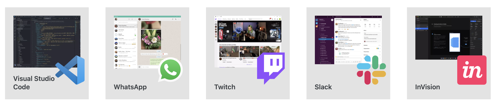
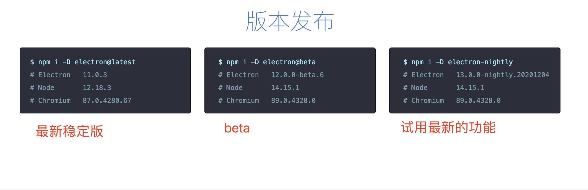
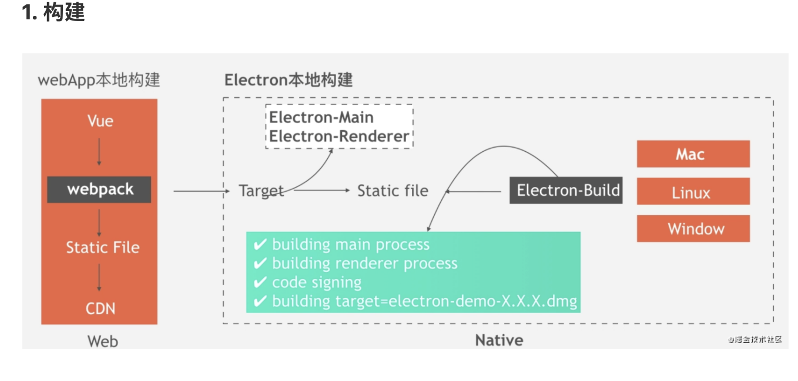

# electron 跨平台桌面开发
> Electron 是一个使用 JavaScript, HTML 和 CSS 等 Web 技术创建原生程序的框架,帮助我们构建跨平台的桌面应用程序

## 有名的案例：


## 发展历史
* electron 的由来
  - 早期想开发一个桌面的GUI软件，希望能在Windows、Linux、和Mac 平台上运行，可选的框架不多，主要有GTK、Qt、wxWidgets。这三个框架都是C/C++ 开发的。受限于语言开发效率的限制，完成快速开发不太现实，对前端同学来说十分不友好
  - 有这么一句话 "凡是能用javascript实现的注定会被用JavaScript 实现"，所以桌面GUI 也不例外，NW.js(https://nwjs.io)和Electron(https://electronjs.org) 横空出世了
  + NW.js 和 Electron 如何产生的？
   - 这两框架和中国人都有极深的渊源。2011年英特尔开源中心的 王文睿 希望用nodejs 操作webkit,创建了node-webkit 这就是 NW.js 的前身，之后有一个 赵成 加入了王文睿的得小组，并对node-webkit 做了大量改进，后来赵走了，去帮助GitHub 把node-webkit 应用到Atom 编辑器上，由于各种因素这次尝试失败了。但是Github 和赵成并没有放弃，开发了一个类似node-webkit 的项目 Atom Shell 这个项目就是Electron 的前身，后来（2015年4月）开源出来起名叫 Electron

  + 两框架的都是基于Chromium 和nodejs 实现的
    - 前端:可以使用js 、html 、css
    - 针对前端访问系统API 方面的不足，封装了一些系统api 如系统对话框、系统托盘、系统菜单剪切板
    - Electron应用基本上是一种Node.js应用,所以需要安装nodejs。
    - nodejs的程序的起点将是一个 package.json 文件

  + 两种框架的主要差别
    - Electron 区分主进程和渲染进程，主进程负责创建、管理渲染进程以及控制整个应用的生命周期
    - 渲染进程负责显示界面及控制用户的交互逻辑
    - 两者通讯ipcMain 和ipcRenderer 传递消息来实现
    - NW.js不需要关心这些，它关心的是所有窗口共享一个nodejs 环境带来的问题。

* 当前的版本
  - electron 版本迭代的速度非常快,截止2020年12月6
  

* 能力:
  - 自定义代理
  - 截获网路请求
  - 注入脚本到目标网站

## 生态
* electron-builder 是Electron的构建工具，提供自动下载、自动构建、自动打包、自动升级
  - electron-builder 比 electron-packager支持更多的平台，同时也支持自动更新
  - 由electron-builder打出的包更为轻量
  - 可以打包出不暴露源码的setup安装程序
  
* Vue ClI Plugin Electron Builder 和electron-vue 基于它们可以在Electron 应用内使用Vue 及其组件（包括HMR热更新），推荐前者,基于Vue ClI Plugin 更新频繁。

* 不想用框架也可以用 webpack 与传统的web开发技术

## 优势
* 基于web技术开发桌面，web生态繁荣，开发效率高
* 内置node环境，node 可以方便调用c++ 的拓展
* 内置Chromium，对浏览器标准支持更好，不用考虑兼容问题，es6 h5 css3 放心使用

## 不足
* 打包后体积较大，没什么功能的桌面经过electron-builder 压缩打包后，大概有40MB,升级再次下载同样体积的包
* 跨进程通信必须要了解，开发较复杂
* 版本更新太快，为跟上chrominum更新节奏，每次chrominum 更新都可能导致electron 出现新的问题。
* 由于底层基于chrominum，chrominum 内存占用过高

## 使用
* 安装的问题
    - electron 安装不成功问题（卡在install.js）
    - 配置 .npmrc文件
    ```
        electron_mirror="https://npm.taobao.org/mirrors/electron/"
    ```

* Electron API Demos: Electron API 演示工具

* Electron Fiddle 试验工作，写一段代码运行

* 脚手架
  - 将 Electron Forge 添加到您应用的开发依赖中，并使用其"import"命令设置 Forge 的脚手架：
  - 使用 Forge 的 make 命令来创建可分发的应用程序：
    ```
       npm install --save-dev @electron-forge/cli
       npx electron-forge import
       npm run make
    
    ```

## 运行流程
* 执行的过程
    1. 在package.json 中main 定义app入口的文件main.js
    2. 在主进程中也就是main.js中创建一个渲染进程
    3. 在渲染进程中布局和画app的界面（index.html）

* 主进程
    - Electron 运行 package.json 的 main 脚本的进程被称为主进程。 在主进程中运行的脚本通过创建web页面来展示用户界面。
    - 一个 Electron 应用总是有且只有一个主进程。
    - 主进程使用 BrowserWindow 实例创建页面。 每个 BrowserWindow 实例都在自己的渲染进程里运行页面。 当一个 BrowserWindow 实例被销毁后，相应的渲染进程也会被终止。

* 渲染进程
    - 由于 Electron 使用了 Chromium 来展示 web 页面，所以 Chromium 的多进程架构也被使用到。 每个 Electron 中的 web 页面运行在它自己的渲染进程中
    - electron 渲染进程中通过 Nodejs 读取本地文件

## 窗口
* BrowserWindow 的属性
    - x, y, center,movable 当创建多个窗口时，有可能后创建的窗口覆盖前面的窗口，此时应该x,y 调整位置
    - width,height,minWidth,maxWidth,maxHeight,minHeight,resizeable,minimizabel,maxminizable
    - frame 设为false，会屏蔽系统的标题栏和边框
    - webPreferences: nodeIntegration,nodeIntegrationInWorker,nodeIntegrationInSubFrames 控制渲染进程访问Nodejs 的环境
    - preload,webviewTag,contextIsolation 增加渲染进程的能力

## 界面
* webContents 是Electron 的核心模块，负责渲染和控制应用内的web界面
    ```js 
        // 主进程下 获取激活状态下的窗口的实例
        const { webContents } =require('electron')
        const webContent=webContents.getFocuseWebContents()

        // 渲染进程
        const { remote } = require("electron");
        // remote.getCurrentWindow()
        remote.getCurrentWebContents()
    ```

* 页面加载事件及触发顺序(关键的几个)
    - did-start-loding: 页面加载的首个事件，tab 页图标开始旋转
    - page-title-updated：页面标题更新事件
    - dom-ready:dom 加载完成 背后是网页的DOMContentLoaded 事件
    - did-frame-finish-load：框架加载完成，多个iframe 会触发多次
    - did-finish-load 页面加载完时触发
    - did-stop-loading:所有内容加载完成时触发，浏览器中发生相当tab 页图标停止旋转

* 页面跳转相关的事件
    - did-navigate 主页面跳转完成时触发 （location.hash、点击一个锚点链接不会触发）
    - did-navigate-in-page location.has或点击一个锚点链接时触发
    
## 集成web页面的方式
>有三种方式可以让你在Electron的BrowserWindow里集成（第三方）web内容，<iframe>, <webview> 和 `BrowserViews 每个功能都略有不同，适用于不同的情况。 
* iframe 共享宿主页面
    -webContents.isLoadingMainFrame MainFrame是否加载完成
* webview 
    - 官方不建议使用，因为这个标签会发生剧烈的结构变化，可能会影响您应用程序的稳定性
    - WebView是一个自定义元素 (<webview>)，仅在 Electron 内工作。 所有与 <webview> 的通信都是异步使用 IPC 进行的，
    - 与 <iframe>相比，<webview> 往往稍慢，但在加载和与第三方内容通信以及处理各种事件方面提供了更大的控制，
     ```html
        <webview src="http://xxx.com/" preload="./test.js" nodeintegration></webview>
    ```
    ```js
        const webview = document.querySelector('webview')
        webview.addEventListener('dom-ready', () => {
            webview.openDevTools()
        })
    ```
    + nodeintegration 
        - 当有此属性时, webview 中的访客页将具有Node集成, 并且可以使用像 require 和 process 这样的node APIs 去访问低层系统资源。 Node 集成在访客页中默认是禁用的。

    + sendToHost 
        - 就像 ipcRenderer.send，不同的是消息会被发送到 host 页面上的 <webview> 元素，而不是主进程。

    + send
        - webview->向渲染进程发送消息

    + ipc-message 访客页面向嵌入页面发送异步消息时触发。
        ```js
            // In embedder page.
            const webview = document.querySelector('webview')
            webview.addEventListener('ipc-message', (event) => {
                console.log(event.channel)
            // Prints "pong"
            })
            webview.send('ping')

            // In guest page.
            const { ipcRenderer } = require('electron')
            ipcRenderer.on('ping', () => {
                ipcRenderer.sendToHost('pong')
            })
        ```

* BrowserViews
    - 不是 DOM 的一部分，而是由主进程创建和控制
    - 它们只是现有窗口之上的另一层 Web 内容。与 BrowserWindow 内容完全分离
    - 替代webview标签.
    ```js   
        const view=new BrowserView({
            webPreference:{ preload }
        })
        view.setAutoResize({
            width:true,
            height:true
        })
        view.webContents.loadURL(url)

        win.setBrowserView(view) // 已设置过，会覆盖
        win.addBrowserView(view) // 添加多个,移除的加回来不会重新渲染
        win.removeBrowerView(view) // 移除窗口

        // css 显示和隐藏
        view.webContents.insertCSS('html{ display:block }')
        view.webContents.insertCSS('html{ display:none }')
    ```
   
## 控制渲染进程访问 node.js 的能力
* nodeIntegration
* nodeIntergrationInWorker
* nodeIntegrationInSubFrames
## 增强渲染进程能力的属性
* preload 注入脚本
* webSecurity 控制网页的同源策略，关闭后调用三方服务不会出现跨域
* contextIsolation

## 脚本注入
+ preload 
    - 脚本包含了那些执行于渲染器进程中，且先于网页内容开始加载的代码
    - 由于预加载脚本与渲染器共享同一个全局 Window 接口，并且可以访问 Node.js API，因此它通过在 window 全局中暴露任意您的网络内容可以随后使用的 API 来增强渲染器。
        ```js
            window.myAPI = {
                desktop: true
            }
            
            console.log(window.myAPI)
            // => undefined
        ```
    - 虽然预加载脚本与其所附加的渲染器在全局共享着一个 window 变数，但您并不能从中直接附加任何变数到 window 之中，因为 contextIsolation 是默认的。
    - 语境隔离（Context Isolation）意味着预加载脚本与渲染器的主要运行环境是隔离开来的，以避免泄漏任何具特权的 API 到您的网页内容代码中。
    - 取而代之，我们將使用 contextBridge 模块来安全地实现交互：
        ```js
            // preload.js
            const { contextBridge } = require('electron')

            contextBridge.exposeInMainWorld('myAPI', {
                desktop: true
            })

            // renderer
            console.log(window.myAPI)
            // => { desktop: true }


        ```

+ executeJavaScript 返回一个 promise 对象

+ 用于全局回退的用户代理字符串
    - 当用户代理在webContents 或 session 级别没有被设置时，将使用此用户代理。 有助于确保您的整个应用程序具有相同的用户代理。
  ```js
    app.userAgentFallback=''
  ```

## 进程间的通讯
* 通讯的工具
    - ipcMain: 当在主进程中使用时，它处理从渲染器进程(网页)发送出来的异步和同步信息,当然也有可能从主进程向渲染进程发送消息。
    - ipcRender
    > 使用它提供的一些方法从渲染进程 (web 页面) 发送同步或异步的消息到主进程。 也可以接收主进程回复的消息
    - 注意：主进程向渲染进程发消息，如果返回的对象是字符串或者数字 elctron 复制一份返回给渲染进程，渲染进程中持有的远程对象被回收，主进程相应的对象也会被回收

* 具体通讯的方式
    + 渲染进程-->主进程发送异步消息
        - 渲染进程发消息
         ```js
            // src/render/ipcRender.js
            //渲染进程
            let send = document.querySelector('#send');
            const { ipcRenderer } = require('electron');
            send.onclick = function () {
                // 传递消息给主进程
                ipcRenderer.send('sendMsg', {name:'poetries', age: 23})
            }

            // 向主进程发送消息后，接收主进程广播的事件
            ipcRenderer.on('sendFeedbackToRender', (e, data)=>{
                console.log('event\n ', e)
                console.log('data\n ', data)
            })

        ```
            ```html
                <!--src/index.html-->
                <button id="send">在 渲染进程中执行主进程里的方法（异步）</button>
                <script src="render/ipcRender.js"></script>

            ```
        - 主进程接收消息
            ```js
            // src/main/ipcMain.js
            const { ipcMain }  = require('electron')
            // 主进程处理渲染进程广播数据
            ipcMain.on('sendMsg', (event, data)=> {
                console.log('data\n ', data)
                console.log('event\n ', event) 
                // 主进程给渲染进程广播数据
                event.sender.send('sendFeedbackToRender', '来自主进程的反馈')
            })
           
            ```

    + 渲染进程-->主进程发送同步消息
        - 发消息
        ```js
        let sendSync = document.querySelector('#sendSync');
        // 渲染进程和主进程同步通信
        sendSync.onclick = function () {
            // 同步广播数据
            let msg =  ipcRenderer.sendSync('sendsync', {name:'poetries', age: 23})
            // 同步返回主进程反馈的数据
            console.log('msg\n ', msg)
        }

        ```
        - 接消息
        ```js
            // 渲染进程和主进程同步通信 接收同步广播
            ipcMain.on('sendsync', (event, data)=> {
                // console.log('data\n ', data)
                // console.log('event\n ', event)
                // 主进程给渲染进程广播数据
                event.returnValue ='渲染进程和主进程同步通信 接收同步广播，来自主进程的反馈.';
            })
        ```

    + 渲染进程间通讯
      - localstorage
      + BrowserWindow 和 webContents
        - webContents 是一个事件发出者.它负责渲染并控制网页，也是 BrowserWindow 对象的属性 
        - 前置知识
            1. 获取当前窗口的 id
            ```js
                const winId = BrowserWindow.getFocusedWindow().id;
            ```
            2. 监听当前窗口加载完成的事件
             ```js
                win.webContents.on('did-finish-load',(event) => {

                })

            ```
            3. 同一窗口之间广播数据
             ```js
                win.webContents.on('did-finish-load',(event) => {
                    win.webContents.send('msg',winId,'我是 index.html 的数据');
                })

            ```
            4. 通过 id 查找窗口
             ```js
                let win = BrowserWindow.fromId(winId);
            ```


## 调试
* vscode 主进程调试配置文件
    ```json
        {
            "version": "0.2.0",
            "configurations": [
                {
                    "name": "Debug Main Process",
                    "type": "node",
                    "request": "launch",
                    "cwd": "${workspaceFolder}",
                    "runtimeExecutable": "${workspaceFolder}/node_modules/.bin/electron",
                    "args" : ["."],
                    "outputCapture": "std",
                    "env": {
                        "NODE_ENV": "debug"
                    }
                }
            ]
        }
    
    ```
  + 快捷键：刷新页面（未开起热重载）
    - mac:command+r 
    - windows:ctr+r
  
* 渲染进程调试
  - 同浏览器
  
* 开发环境调试
    ```js
        const { app, BrowserWindow } = require('electron')
        let mainWindow
        app.on('ready', () => {
            mainWindow = new BrowserWindow({
                width:600
                height:400
            })
            if (process.env.NODE_ENV === "debug") {
                mainWindow.webContents.openDevTools()  
            }
        })
    ```

* 生产环境调试工具 
  - Debugtron
  
* Chrome 扩展支持
- Electron 只支持加载未打包的扩展 (即不能使用 .crx 文件)
    ```js
        const { session } = require('electron')

        session.loadExtension('path/to/unpacked/extension').then(({ id }) => {
        // ...
        })

    ```
## 技术体系
* 前端框架
  - Vue cli 搭建Vue-electron 项目
  ```
    vue create vue-electron-demo
    cd vue-electron-demo
    vue add electron-builder
  ```
* 相关技术体系
## 安装原生模块
-  像 Node 项目一样安装模块，然后用 electron-rebuild 包重建这些模块以适配 Electron 。 这个包可以自动识别当前 Electron 版本，为你的应用自动完成下载 headers、重新编译原生模块等步骤
    ```
        npm install --save-dev electron-rebuild

        # Every time you run "npm install", run this:
        ./node_modules/.bin/electron-rebuild

        # If you have trouble on Windows, try:
        .\node_modules\.bin\electron-rebuild.cmd

    ```

## 硬件
## 打包构建分发
* 
* electron-updater 是一个完备的Electron应用打包和分发解决方案

## electron 应用
* 爬虫
  + 网站自签名证书，chrome浏览器是会进行警告的，必须在警告页确认，如何绕过警告
    ```js
        // 移除安全警告信息，由于我们需求的原因，使用了部分非安全的设定，因此需要禁用安全检测
        process.env.ELECTRON_DISABLE_SECURITY_WARNINGS = true;

        session.defaultSession.setCertificateVerifyProc((req, cb) => {
            cb(0)
        })
    ```

  + 多平台客户端获取cookie,需要根据不同的域名去调用
    ```js
        ipcMain.on('get-cookies', (event, opts) => {
            let _opts = JSON.parse(opts)
            session.defaultSession.cookies.get(_opts, (err, cookie) => {
                if (!err && cookie.length) {
                let cookieStr = ''
                cookie.forEach(item => {
                    cookieStr += item.name + '=' + item.value + ';'
                })
                event.returnValue = cookieStr;
                } else {
                event.returnValue = -1;
                }
            })
        })
    ```

* 直播

## 性能
## 安全
* 开启node 集成时
  ```js
    webPreferences: {
      nodeIntegration: true, 
    },
    //  关闭开发运行时 console 打印的警告
    process.env.ELECTRON_DISABLE_SECURITY_WARNINGS = true;
  ```

* 远程网站当禁用Node.js集成时，你依然可以暴露API给你的站点以使用Node.js的模块功能或特性
    ```js
        // 推荐
        const mainWindow = new BrowserWindow({
        webPreferences: {
            preload: path.join(app.getAppPath(), 'preload.js')
        }
        })

        mainWindow.loadURL('https://example.com')

    ```

* 加载远程内容时，开启上下文隔离
    ```js
        webPreferences: {
            nodeIntegration: true
        }
    ```

* 定义一个内容安全策略
    ```
        // 下面的CSP设置使得Electron只能执行自身站点和来自apis.example.com的脚本。
        // 推荐
        Content-Security-Policy: script-src 'self' https://apis.example.com
    ```

