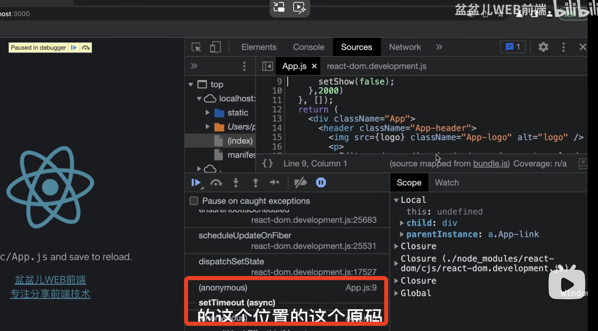
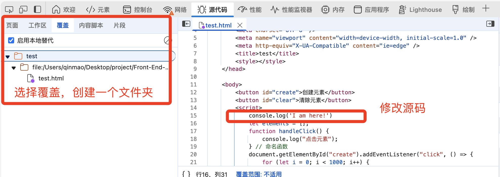

# chrome 调试

## Elements
* computed 看盒模型信息
* dom 断点的调试
  1. 选择一个dom节点：该节点断点有三个选项 
    - 子树修改（subtree modifications）
    - 属性修改(attibute modifications）)
    - 删除节点(node removal)
  
  2. 在框架内部看不出来源码是如何操作的，此时可以查看调用栈，一层层找到源码位置
  

## Sources
* 在浏览器中修改并运行网页的源代码？
  

## Network
* 接口重新请求
  - 点击Fetch/XHR
  - 选择要重新发送的请求
  - 右键选择 Replay XHR
* 复制请求
  - 点击Fetch/XHR
  - 选择 Copy as fetch，或其他
  - 控制台粘贴代码(fetch),终端（curl）
* 网络断点
  - 在发起程序的调用栈中

## performance|performance monitor 性能监控

## memory（内存）
* [参见js内存机制](../../开发语言/js/内存机制.md)

## 其他一些小技巧
* 使用copy函数，复制 JavaScript 变量，将对象作为入参执行即可
* 截取一张全屏的网页
  - 准备好需要截屏的内容（注意懒加载）
  - 打开开发者工具，cmd + shift + p 执行Command命令
  - 输入 Capture full size screenshot 按下回车