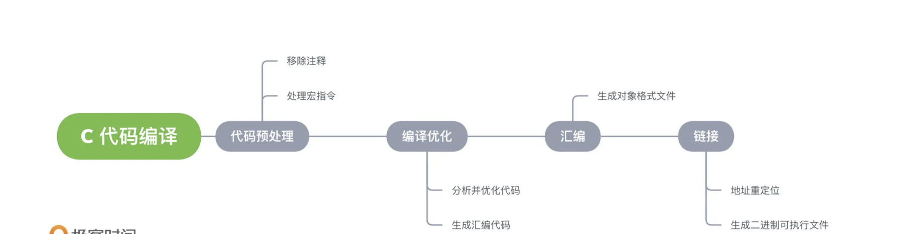

# C 基础
## 开发环境配置
* [环境配置](./%E7%8E%AF%E5%A2%83%E9%85%8D%E7%BD%AE.md)
## C语言标准
* c89（c90） -> c99 -> c11 -> c17 ->C2x
## 流行的编译器
- Gcc
```bash
    # 编译 hello.c 文件，默认会在当前目录下生成一个编译产物文件a.out
    # 执行该文件，就会在屏幕上输出 Hello World。
    gcc hello.c

    # -o参数（output 的缩写）可以指定编译产物的文件名。
    gcc hello.c -o hello

    # GCC 的-std=参数（standard 的缩写）还可以指定按照哪个 C 语言的标准进行编译。
    gcc -std=c99 hello.c
    
    # 编译并运行，
    # -Wall”，让编译器明确指出程序代码中存在的 所有语法使用不恰当的地方。
    gcc demo.c -o demo -Wall && ./demo
  ```
- Clang 对标准的支持更好
- MSVC
## 头文件
  ```c
    // 引入头文件，stdio.h文件声明了 printf
    #include <stdio.h>
    #include <stdlib.h>
    int main()
    {
        /* 我的第一个 C 程序 */
        printf("Hello, World! \n");
        // 打开一个外部程序 windows
        // system('calc');

        // mac path 程序绝对路径
        // const result = system("/Applications/NeteaseMusic.app");
        const result =  system('ls');
        // 成功 result=0,失败任意数字
        return 0;
    }
  ```
* std 是一个标准库
* <> 表示导入系统文件 ”“ 自定义文件
## C语言的编译过程
1. 预处理
  - 宏定义展开
  - 头文件展开
  - 条件编译
  - 删除注释
2. 编译
  - 检查语法
  - 将预处理后的文件编译成汇编文件
3. 汇编
  - 编译器会将这些汇编代码编译成具有一定格式，可以被操作系统使用的某种对象文件 格式。
4. 链接
  - 通过链接处理，编译器会将所有程序目前需要的对象文件进行整合、设置好程序中所有调用函数的正确地址，并生成对应的二进制可执行文件。

## 常用内置I/O 函数
* printf 占位符的用法
  - printf("%d",result) 单个参数整数的占位符
  - printf("a=%d b=%d",123,23) 多个参数整数的占位符 
  - printf("%s",arr1) 输出字符串
  - printf("%c",ch)   输出字符值
* sizeof 以字节为单位输出指定类型的的大小
* scanf  读取键盘的输入 
  - 注意：安全警告，把 #define _CRT_SECURE_NO_WARNINGS 放第一行
  - 处理数值占位符时，会自动过滤空白字符，包括空格、制表符、换行符等
* getchar
  - 函数返回用户从键盘输入的一个字符，使用时不带有任何参数。
  - 程序运行到这个命令就会暂停，等待用户从键盘输入，等同于使用scanf()方法读取一个字符
  - 不会忽略起首的空白字符，总是返回当前读取的第一个字符
  - 读取失败，返回常量 EOF，由于 EOF 通常是-1，所以返回值的类型要设为 int，而不是 char。
* putchar
  - 把字符输出到屏幕，等同于使用printf()输出一个字符
  - 由于getchar()和putchar()这两个函数的用法，要比scanf()和printf()更简单，而且通常是用宏来实现，所以要比scanf()和printf()更快。如果操作单个字符，建议优先使用这两个函数。
* puts
  - 将参数字符串显示在屏幕（stdout）上，并且自动在字符串末尾添加换行符
  ```c
    puts("Here are some messages:");
    puts("Hello World");
  ```
## 变量
> 变量（variable）可以理解成一块内存区域的名字。通过变量名，可以引用这块内存区域，获取里面存储的值。由于值可能发生变化，所以称为变量，否则就是常量了。
* 变量命名规范
  - 只能由字母（包括大写和小写）、数字和下划线（_）组成。
  - 不能以数字开头。
  - 长度不能超过63个字符。
* 变量作用域（scope）:
  > 指的是变量生效的范围。C 语言的变量作用域主要有两种：文件作用域（file scope）和块作用域（block scope）。
  - 文件作用域:在源码文件顶层声明的变量，从声明的位置到文件结束都有效。
  - 块作用域:指的是由大括号（{}）组成的代码块，它形成一个单独的作用域。凡是在块作用域里面声明的变量，只在当前代码块有效，代码块外部不可见。
## 运算符
* 位运算符
    ```c
    // 取反运算符～
    // 用来将每一个二进制位变成相反值，即0变成1，1变成0。
    // 返回 01101100
    ~ 10010011

    // 与运算符& 
    // 将两个值的每一个二进制位进行比较，返回一个新的值。当两个二进制位都为1，就返回1，否则返回0。
    // 返回 00010001
    10010011 & 00111101

    int val = 3;
    val = val & 0377;
    // 简写成
    val &= 0377;

    // 或运算符|
    // 将两个值的每一个二进制位进行比较，返回一个新的值。两个二进制位只要有一个为1（包含两个都为1的情况），就返回1，否则返回0。
    // 返回 10111111
    10010011 | 00111101

    int val = 3;
    val = val | 0377;
    // 简写为
    val |= 0377;

    // 异或运算符^
    // 将两个值的每一个二进制位进行比较，返回一个新的值。两个二进制位有且仅有一个为1，就返回1，否则返回0。
    // 返回 10101110
    10010011 ^ 00111101

    int val = 3;
    val = val ^ 0377;

    // 简写为
    val ^= 0377;

    // 左移运算符<<
    // 将左侧运算数的每一位，向左移动指定的位数，尾部空出来的位置使用0填充。
    // 1000101000
    10001010 << 2


    int val = 1;
    val = val << 2;

    // 简写为
    val <<= 2;


    // 右移运算符>>
    // 将左侧运算数的每一位，向右移动指定的位数，尾部无法容纳的值将丢弃，头部空出来的位置使用0填充。
    // 返回 00100010
    10001010 >> 2
    ```
## 流程控制
```c
    // do...while 结构是 while 的变体，它会先执行一次循环体，然后再判断是否满足条件。
    // 如果满足的话，就继续执行循环体，否则跳出循环。
    i = 10;
    do {
        printf("i is %d\n", i);
        i++;
    } while (i < 10);

    printf("All done!\n");

    // break 语句
    // break语句有两种用法。一种是与switch语句配套使用，用来中断某个分支的执行。
    // 另一种用法是在循环体内部跳出循环，不再进行后面的循环了。
    while ((ch = getchar()) != EOF) {
        if (ch == '\n') break;
        putchar(ch);
    }

    // continue 语句
    // 用于在循环体内部终止本轮循环，进入下一轮循环
    while ((ch = getchar()) != '\n') {
        if (ch == '\t') continue;
        putchar(ch);
    }

```
## 数据类型
* 基本的数据类型
  > 有3个char、int、float，复杂的类型都是基于它们构建的。
  + char 字符数据类型
    - 字符类型使用一个字节（8位）存储。C 语言将其当作整数处理，所以字符类型就是宽度为一个字节的整数。每个字符对应一个整数（由 ASCII 码确定），比如B对应整数66。
    ```c
        // 只要在字符类型的范围之内，整数与字符是可以互换的，都可以赋值给字符类型的变量。
        char c = 66;
        // 等同于
        // C 语言规定，字符常量必须放在单引号里面。
        char c = 'B';

        char a = 'B'; // 等同于 char a = 66;
        char b = 'C'; // 等同于 char b = 67;
        printf("%d\n", a + b); // 输出 133

        // 单引号本身也是一个字符，如果要表示这个字符常量，必须使用反斜杠转义。
        char t = '\'';

        // 四种写法都是等价的。
        char x = 'B';
        char x = 66;
        char x = '\102'; // 八进制
        char x = '\x42'; // 十六进制

    ```
  + int   整型
    - 不同计算机的int类型的大小是不一样的。比较常见的是使用4个字节（32位）存储一个int类型的值
    - signed:C 语言使用 signed 关键字，表示一个类型带有正负号，包含负值
    - unsigned:使用 unsigned 关键字，表示该类型不带有正负号，只能表示零和正整数,整数变量声明为 unsigned的好处是，同样长度的内存能够表示的最大整数值，增大了一倍。比如，16位的 signed int 最大值为32,767，而unsigned int 的最大值增大到了65,535。
  + 整数的子类型:
    - int类型使用4个或8个字节表示一个整数，对于小整数，这样做很浪费空间。另一方面，某些场合需要更大的整数，8个字节还不够。为了解决这些问题，C 语言在int类型之外，又提供了三个整数的子类型
    - short int（简写为short） 一般占用2个字节（整数范围为-32768～32767)
    - long int（简写为long）：占用空间不少于int，至少为4个字节。
    - long long int（简写为long long）：占用空间多于long，至少为8个字节。
      ```c
        short int a;
        long int b;
        long long int c;
      ```
  + float 单精度浮点
    - 占用4个字节（32位），其中8位存放指数的值和符号，剩下24位存放小数的值和符号
    - double： 双精度浮点，占用8个字节（64位），至少提供13位有效数字。
    - long double：通常占用16个字节。
  + 布尔类型 
    - C 语言原来并没有为布尔值单独设置一个类型，而是使用整数0表示伪，所有非零值表示真。
    - C99 标准添加了类型_Bool，表示布尔值。但是，这个类型其实只是整数类型的别名，还是使用0表示伪，1表示真
    ```c
        _Bool isNormal;

        isNormal = 1;
        if (isNormal)
        printf("Everything is OK.\n");

        // 头文件stdbool.h定义了另一个类型别名bool，并且定义了true代表1、false代表0。只要加载这个头文件，就可以使用这几个关键字。
        #include <stdbool.h>

        bool flag = false;
    ```
* 数据量的单位
  - bit  比特位 最小的存储单位，每个位可以存二进制码码值的0或1
  - byte 字节 8bit，最小的可寻址单位，CPU 在使用数据时，以字节为单位，为每一字节内存分配一个相应的独立地址
  - kb   1024 byte
  - mb   1024 kb
  - gb   1024 mb
## 汇编语言
> 是一种低级编程语言，语言使用的指令 与具体平台紧密相关,这意味着，针对不同 CPU 体系架构设计的汇编语言无法共用，也不具 备可移植性。
* 常用的助记符
  - mov
  - add
  - push 压栈
  - pop  出栈
  - call 调用
* c程序中运行汇编代码
    ```c
    #include <stdio.h>
    int main(void) {
        int src=1;
        int dst;
        asm ("mov %1, %0\n\t"
            "add $1, %0"
            : "=r" (dst)
            : "r" (src));
        printf("%d\n", dst);
    }
    ```
* 在c中调试汇编代码（vs）
  - 第一步开始调试，断点停住后，在调试中，选择窗口，反汇编
* 寄存器
  - 有时也被称为“寄存器文件(Register File)”
  - 把它简单理解为由 CPU 提供 的一组位于芯片上的高速存储器硬件，可用于存储数据
  - 寄存器拥有最快的数据访问速度和最低的延迟
## 指针
> 它是一个值，这个值代表一个内存地址，因此指针相当于指向某个内存地址的路标。 字符 * 表示指针，通常跟在类型关键字的后面，表示指针指向的是什么类型的值
  ```c
    // 指针变量的初始化
    // 声明指针变量之后，编译器会为指针变量本身分配一个内存空间，这个内存空间里面的值是随机的
    int* p;
    int i;

    p = &i;
    *p = 13;

    // 一个指针指向的可能还是指针
    int** foo;

    // * 运算符
    // * 这个符号除了表示指针以外，还可以作为运算符，用来取出指针变量所指向的内存地址里面的值
    void increment(int* p) {
      *p = *p + 1;
    }

    // &运算符
    // 用来取出一个变量所在的内存地址。
    void increment(int* p) {
       *p = *p + 1;
    }

    // &运算符与*运算符互为逆运算
    int x = 1;
    increment(&x);
    printf("%d\n", x); // 2

    // 指针的运算
    // 1. 指针与整数值的运算，表示指针的移动。
    // j + 1 表示指针向内存地址的高位移动一个单位，而一个单位的short类型占据两个字节的宽度，所以相当于向高位移动两个字节
    short* j;
    j = (short*)0x1234;
    j = j + 1; // 0x1236

    // 2. 指针与指针的加法运算
    // 指针只能与整数值进行加减运算，两个指针进行加法是非法的。

    // 3. 指针与指针的减法
    // 相同类型的指针允许进行减法运算，返回它们之间的距离，即相隔多少个数据单位
    short* j1;
    short* j2;

    j1 = (short*)0x1234;
    j2 = (short*)0x1236;

    ptrdiff_t dist = j2 - j1;
    printf("%td\n", dist); // 1
  ```
## 函数
* 参数的传值引用
  - 传入的是这个变量的值的拷贝，而不是变量本身
* 函数指针
  - 函数本身就是一段内存里面的代码，C 语言允许通过指针获取函数
  ```c
    void print(int a) {
        printf("%d\n", a);
    }
    void (*print_ptr)(int) = &print;
  ```
* exit
  - 该函数的原型也是定义在头文件 stdlib.h
  ```c
    // 程序运行成功
    // 等同于 exit(0);
    exit(EXIT_SUCCESS);

    // 程序异常中止
    // 等同于 exit(1);
    exit(EXIT_FAILURE);
  ```
* static 说明符
  - 默认情况下，每次调用函数时，函数的内部变量都会重新初始化，不会保留上一次运行的值。static说明符表示该变量只需要初始化一次，不需要在每次调用时都进行初始化
  ```c
    #include <stdio.h>
    void counter(void) {
        static int count = 1;  // 只初始化一次
        printf("%d\n", count);
        count++;
    }

    int main(void) {
        counter();  // 1
        counter();  // 2
        counter();  // 3
        counter();  // 4
    }
  ```
## 数组
  ```c
    // 声明时赋值，数组赋值之后，再用大括号修改值，也是不允许的。
    int a[5] = {22, 37, 3490, 18, 95};
    // 数组初始化时，可以指定为哪些位置的成员赋值，其他位置的值都自动设为0。
    int a[15] = {[2] = 29, [9] = 7, [14] = 48};

    // 可省略方括号里面的数组成员数量
    int a[] = {22, 37, 3490};
    // 等同于
    int a[3] = {22, 37, 3490};

    int a[] = {22, 37, 3490};
    //  len 数组的成员数量
    int len= sizeof(a) / sizeof(a[0])

    // 变长数组
    int n = x + y;
    int arr[n];

    // 数组的地址
    int a[5] = {11, 22, 33, 44, 55};
    int* p = &a[0];
    // 等同于
    int* p = a;

    // 写法一
    int sum(int arr[], int len);
    // 写法二
    int sum(int* arr, int len);

    // 数组复制
    // 1. 数组元素逐个进行复制。
    for (i = 0; i < N; i++)
    a[i] = b[i];
    // 2. 使用memcpy()函数（定义在头文件string.h），直接把数组所在的那一段内存，再复制一份。
    // 将数组b所在的那段内存，复制给数组a。这种方法要比循环复制数组成员要快。
    memcpy(a, b, sizeof(b));
  ```
## 字符串
> C 语言没有单独的字符串类型，字符串被当作字符数组，即char类型的数组
> 在字符串结尾，C 语言会自动添加一个全是二进制0的字节，写作\0字符，表示字符串结束
* 字符串变量的声明
  ```c
    // 声明了一个10个成员的字符数组，可以当作字符串。
    // 由于必须留一个位置给\0，所以最多只能容纳9个字符的字符串。
    char localString[10];
    
    // 字符串写成数组的形式，是非常麻烦的。C 语言提供了一种简写法，双引号之中的字符，会被自动视为字符数组。
    {'H', 'e', 'l', 'l', 'o', '\0'}
    // 等价于
    "Hello"

    // 写法一
    char s[] = "Hello, world!";

    // 写法二
    char* s = "Hello, world!";
   
    // 这两种写法有个差异
    // 1. 指针指向的字符串，在 C 语言内部被当作常量，不能修改字符串本身。
    // 数组声明字符串变量，就没有这个问题，可以修改数组的任意成员
    char* s = "Hello, world!";
    const char* s = "Hello, world!"; // 一般加const 提醒用户字符串声明为指针后不能修改
    s[0] = 'z'; // 错误

    char s[] = "Hello, world!";
    s[0] = 'z';

    // 2. 指针变量可以指向其它字符串。
    //    字符数组变量不能指向另一个字符串。
    char* s = "hello";
    s = "world";

    char s[] = "hello";
    s = "world"; // 报错
    
    // 同理，声明字符数组后，不能直接用字符串赋值。
    char s[10];
    s = "abc"; // 错误

    // 想要重新赋值，必须使用 C 语言原生提供的 strcpy()函数，通过字符串拷贝完成赋值
    char s[10];
    strcpy(s, "abc");
  ```
* 字符串常用函数
  ```c
   // strlen()的原型在标准库的string.h文件中定义
   // strlen() 函数返回字符串的字节长度，不包括末尾的空字符\0

    #include <stdio.h>
    #include <string.h>
    int main(void) {
        const char* s = "Hello, world!";
        printf("The string is %zd characters long.\n", strlen(s));
    }

   // strcpy() 
   // 用于将一个字符串的内容复制到另一个字符串，相当于字符串赋值。该函数的原型定义在string.h头文件里面。
    #include <stdio.h>
    #include <string.h>

    int main(void) {
        char s[] = "Hello, world!";
        char t[100];

        strcpy(t, s);

        t[0] = 'z';
        printf("%s\n", s);  // "Hello, world!"
        printf("%s\n", t);  // "zello, world!"
    }

   // strncpy() () 
   // strcpy 函数有安全风险，因为它并不检查目标字符串的长度，是否足够容纳源字符串的副本，可能导致写入溢出。如果不能保证不会发生溢出，建议使用strncpy()函数代替。

   // strcat()
   // 函数用于连接字符串。它接受两个字符串作为参数，
   // 把第二个字符串的副本添加到第一个字符串的末尾。
   // 这个函数会改变第一个字符串，但是第二个字符串不变。
    char s1[12] = "hello";
    char s2[6] = "world";

    strcat(s1, s2);
    puts(s1); // "helloworld"

    // strncat()
    // 注意，strcat()的第一个参数的长度，必须足以容纳添加第二个参数字符串。否则，拼接后的字符串会溢出第一个字符串的边界，写入相邻的内存单元，这是很危险的，建议使用下面的strncat()代替。

    // strcmp()  函数用于比较两个字符串的内容

    // sprintf()，snprintf()
    // sprintf()函数跟printf()类似，但是用于将数据写入字符串，而不是输出到显示器。该函数的原型定义在stdio.h头文件里面。
    int sprintf(char* s, const char* format, ...);

    char first[6] = "hello";
    char last[6] = "world";
    char s[40];
    sprintf(s, "%s %s", first, last);

    printf("%s\n", s); // hello world
    
  ```
* 字符串数组
  ```c
    // 因为第一维的长度，编译器可以自动计算，所以可以省略。
    char weekdays[][10] = {
        "Monday",
        "Tuesday",
        "Wednesday",
        "Thursday",
        "Friday",
        "Saturday",
        "Sunday"
    };
   // 数组的第二维，长度统一定为10，有点浪费空间，因为大多数成员的长度都小于10。解决方法就是把数组的第二维，从字符数组改成字符指针。
    char* weekdays[] = {
        "Monday",
        "Tuesday",
        "Wednesday",
        "Thursday",
        "Friday",
        "Saturday",
        "Sunday"
    };
    // 上面的字符串数组，其实是一个一维数组，成员就是7个字符指针，每个指针指向一个字符串（字符数组）。
    // 遍历字符串数组的写法如下。
    for (int i = 0; i < 7; i++) {
        printf("%s\n", weekdays[i]);
    }
  ```
## 内存管理
> C 语言的内存管理，分成两部分。一部分是系统管理的，另一部分是用户手动管理的。
* 系统管理的内存：
   - 主要是函数内部的变量（局部变量）。这部分变量在函数运行时进入内存，函数运行结束后自动从内存卸载。
   - 这些变量存放的区域称为”栈“（stack），”栈“所在的内存是系统自动管理的。
* 手动管理的
   - 主要是程序运行的整个过程中都存在的变量（全局变量），这些变量需要用户手动从内存释放。
   - 如果使用后忘记释放，它就一直占用内存，直到程序退出，这种情况称为”内存泄漏“（memory leak）。
   - 这些变量所在的内存称为”堆“（heap），”堆“所在的内存是用户手动管理的。
* void 指针
  > void 指针等同于无类型指针，可以指向任意类型的数据，但是不能解读数据
  ```c
    int x = 10;
    void* p = &x; // 整数指针转为 void 指针
    int* q = p;   // void 指针转为整数指针

    // 由于不知道 void 指针指向什么类型的值，所以不能用*运算符取出它指向的值。
    char a = 'X';
    void* p = &a;

    printf("%c\n", *p); // 报错

  ```
* malloc|calloc
  - malloc 函数用于分配内存，该函数向系统要求一段内存，系统就在“堆”里面分配一段连续的内存块给它
  - calloc 函数的作用与malloc 相似，也是分配内存块
  ```c
    // 原型定义在头文件 stdlib.h
    // 举例说明
    int* p = malloc(sizeof(int));

    *p = 12;
    printf("%d\n", *p); // 12

    // malloc()分配内存有可能分配失败，这时返回常量NULL
    int* p = malloc(sizeof(int));
    if (p == NULL) {
    // 内存分配失败
    }

    // malloc()最常用的场合，就是为数组和自定义数据结构分配内存。
    int* p = (int*) malloc(sizeof(int) * 10);

    for (int i = 0; i < 10; i++)
        p[i] = i * 5;

    // 内存初始化
    char* p = malloc(4);
    strcpy(p, "abc");

    // calloc 与 malloc的区别
    // 1. calloc()接受两个参数，第一个参数是某种数据类型的值的数量，第二个是该数据类型的单位字节长度。
    int* p = calloc(10, sizeof(int));
    // 等同于
    int* p = malloc(sizeof(int) * 10);
    memset(p, 0, sizeof(int) * 10);

  ```
* free
  > free()用于释放malloc()函数分配的内存，将这块内存还给系统以便重新使用,该函数的原型定义在头文件stdlib.h里面
  ```c
    int* p = (int*) malloc(sizeof(int));
    *p = 12;
    free(p);
  ```
* realloc 
  - 函数用于修改已经分配的内存块的大小，可以放大也可以缩小，返回一个指向新的内存块的指针,如果分配不成功，返回 NULL
* restrict 说明符
  - 声明指针变量时，可以使用restrict说明符，告诉编译器，该块内存区域只有当前指针一种访问方式，其他指针不能读写该块内存。这种指针称为“受限指针”
  ```c
    int* restrict p;
    p = malloc(sizeof(int));
    // p 指向malloc()函数返回的一块内存区域，就意味着，该区域只有通过p来访问，不存在其他访问方式。
  ```
* memcpy|memmove|memcmp
  - memcpy 用于将一块内存拷贝到另一块内存。该函数的原型定义在头文件 string.h。
  - memmove 函数用于将一段内存数据复制到另一段内存
  - memcmp 函数用来比较两个内存区域
  ```c
  #include <stdio.h>
  #include <string.h>

  int main(void) {
    char source[] = "Goats!";
    char dest[100];

    memcpy(dest, source, sizeof(s));  // 拷贝7个字节，包括终止符
    printf("%s\n", t);  // "Goats!"
    return 0;
  }


  char* s = "hello world";
  size_t len = strlen(s) + 1;
  char *c = malloc(len);

  if (c) {
    // strcpy() 的写法
    strcpy(c, s);

    // memcpy() 的写法
    memcpy(c, s, len);
  }
  // memcpy 可以取代 strcpy 进行字符串拷贝，而且是更好的方法，不仅更安全，速度也更快，它不检查字符串尾部的\0字符。
  ```
## 结构体
> C语言内置的数据类型，除了最基本的几种原始类型，只有数组属于复合类型,实际使用中，需要更灵活强大的复合类型。C 语言没有其他语言的对象（object）和类（class）的概念，struct 结构很大程度上提供了对象和类的功能。
  ```c
    // 注意结尾分好不能省略
    struct fraction {
        int numerator;
        int denominator;
    };
    struct fraction f1;

    f1.numerator = 22;
    f1.denominator = 7;

    // 一次性对 struct 结构的所有属性赋值
    struct car {
        char* name;
        float price;
        int speed;
    };

    struct car saturn = { "Saturn SL/2", 16000.99, 175 };

    // 声明变量的同时，对变量赋值。
    struct {
        char title[500];
        char author[100];
        float value;
    } b1 = {"Harry Potter", "J. K. Rowling", 10.0},
    b2 = {"Cancer Ward", "Aleksandr Solzhenitsyn", 7.85};

    // typedef 命令可以为 struct 结构指定一个别名
    typedef struct cell_phone {
        int cell_no;
        float minutes_of_charge;
    } phone;

    phone p = { 5551234, 5 };

    // 指针变量指向结构体
    struct book {
        char title[500];
        char author[100];
        float value;
    };
    struct book* b1;

    // struct 结构占用的存储空间，不是各个属性存储空间的总和，而是最大内存占用属性的存储空间的倍数，其他属性会添加空位与之对齐。这样可以提高读写效率。

    // 为什么浪费这么多空间进行内存对齐呢？这是为了加快读写速度，把内存占用划分成等长的区块，就可以快速在 Struct 结构体中定位到每个属性的起始地址。
    struct foo {
        int a; // 4
        char* b; // 8
        char c;  // 1
    };
    printf("%d\n", sizeof(struct foo)); // 24

    // struct 的复制
    // 赋值运算符（=）可以将 struct 结构每个属性的值，一模一样复制一份，拷贝给另一个 struct 变量。这一点跟数组完全不同，使用赋值运算符复制数组，不会复制数据，只会共享地址。

    // struct 的嵌套

    struct species {
        char* name;
        int kinds;
    };

    struct fish {
        char* name;
        int age;
        struct species breed;
    };

    // 赋值的多种写法
    // 写法一
    struct fish shark = {"shark", 9, {"Selachimorpha", 500}};

    // 写法二
    struct species myBreed = {"Selachimorpha", 500};
    struct fish shark = {"shark", 9, myBreed};

    // 写法三
    struct fish shark = {
        .name="shark",
        .age=9,
        .breed={"Selachimorpha", 500}
    };

    // 写法四
    struct fish shark = {
        .name="shark",
        .age=9,
        .breed.name="Selachimorpha",
        .breed.kinds=500
    };

    printf("Shark's species is %s", shark.breed.name);

    // 位字段：用来定义二进制位组成的数据结构，这对于操作底层的二进制数据非常有用。
    struct {
        unsigned int ab:1;
        unsigned int cd:1;
        unsigned int ef:1;
        unsigned int gh:1;
    } synth;

    synth.ab = 0;
    synth.cd = 1;
    // 每个属性后面的:1，表示指定这些属性只占用一个二进制位，所以这个数据结构一共是4个二进制位。
    // 注意，定义二进制位时，结构内部的各个属性只能是整数类型。
  ```
## typedef
  > 命令用来为某个类型起别名。
  ```c
     // typedef 命令可以为 struct 结构指定一个别名
    typedef struct cell_phone {
        int cell_no;
        float minutes_of_charge;
    } phone;

    phone p = { 5551234, 5 };
  ```
* 好处：
  - 更好的代码可读性。
  - 为 struct、union、enum 等命令定义的复杂数据结构创建别名，从而便于引用。
  - typedef 方便以后为变量改类型。
  - 可移植性:某一个值在不同计算机上的类型，可能是不一样的。C 语言的解决办法，就是提供了类型别名，在不同计算机上会解释成不同类型，比如int32_t。
## Union 结构
> 有时需要一种数据结构，不同的场合表示不同的数据类型,C 语言提供了 Union 结构，用来自定义可以灵活变更的数据结构
  ```c
  union quantity {
    short count;
    float weight;
    float volume;
  };

   // 写法一
    union quantity q;
    q.count = 4;

    // 写法二
    union quantity q = {.count=4};
    // Union 结构的好处，主要是节省空间。它将一段内存空间，重用于不同类型的数据。定义了三个属性，但同一时间只用到一个，使用 Union 结构就可以节省另外两个属性的空间。Union 结构占用的内存长度，等于它内部最长属性的长度。
  ```
## Enum 类型
  ```c
    // C 语言会自动从0开始递增，为常量赋值。但是，C 语言也允许为 ENUM 常量指定值，不过只能指定为整数，不能是其他类型
    enum colors {RED, GREEN, BLUE};

    printf("%d\n", RED); // 0
    printf("%d\n", GREEN);  // 1
    printf("%d\n", BLUE);  // 2

    enum { ONE = 1, TWO = 2 };

    printf("%d %d", ONE, TWO);  // 1 2
  ```
## 预处理器
> 预处理器首先会清理代码，进行删除注释、多行语句合成一个逻辑行等工作。然后，执行#开头的预处理指令。预处理指令可以出现在程序的任何地方，但是习惯上，往往放在代码的开头部分。所有预处理指令都是一行的，除非在行尾使用反斜杠，将其折行。指令结尾处不需要分号。
* #define 
  - 是最常见的预处理指令，用来将指定的词替换成另一个词
  - 每条替换规则，称为一个宏（macro）
  ```c
    #define MAX 100
    // 过长用反斜杠
    #define OW "C programming language is invented \
    in 1970s."

    // 带参数的宏
    #define SQUARE(X) X*X

    // 由于宏不涉及数据类型，所以替换以后可能为各种类型的值。
    // 如果希望替换后的值为字符串，可以在替换文本的参数前面加上#
    #define STR(x) #x

    // 等同于 printf("%s\n", "3.14159");
    printf("%s\n", STR(3.14159));

    // ##运算符。它起到粘合作用，将参数“嵌入”一个标识符之中。
    #define MK_ID(n) i##n
    int MK_ID(1), MK_ID(2), MK_ID(3);
    // 替换成
    int i1, i2, i3;
  ```
* #undef
  - 用来取消已经使用#define定义的宏
  ```C
    #define LIMIT 400
    #undef LIMIT
  ```
* #include
  - 用于编译时将其他源码文件，加载进入当前文件
  ```c
    // 形式一
    #include <foo.h> // 加载系统提供的文件

    // 形式二
    #include "foo.h" // 加载用户提供的文件
  ```
* #if...#endif
  - 指令用于预处理器的条件判断，满足条件时，内部的行会被编译，否则就被编译器忽略。
  ```c
    #if 0
      const double pi = 3.1415; // 不会执行
    #endif

    #define FOO 1

    #if FOO
      printf("defined\n");
    #else
      printf("not defined\n");
    #endif

    // #if的常见应用就是打开（或关闭）调试模式。
    #define DEBUG 1

    #if DEBUG
        printf("value of i : %d\n", i);
        printf("value of j : %d\n", j);
    #endif
    // gcc -DDEBUG=1 foo.c
  ```
* #ifdef...#endif
  - 用于判断某个宏是否定义过。
  ```c
    #ifdef MAVIS
        #include "foo.h"
        #define STABLES 1
    #else
        #include "bar.h"
        #define STABLES 2
    #endif
  ```
* defined 运算符
  - #ifdef指令，等同于#if defined
* 预定义宏
  - C 语言提供一些预定义的宏，可以直接使用。
  - __DATE__：编译日期，格式为“Mmm dd yyyy”的字符串（比如 Nov 23 2021）。
  - __TIME__：编译时间，格式为“hh:mm:ss”。
  - __FILE__：当前文件名。
  - __LINE__：当前行号。
  - __func__：当前正在执行的函数名。该预定义宏必须在函数作用域使用。
  - __STDC__：如果被设为1，表示当前编译器遵循 C 标准。
  - __STDC_HOSTED__：如果被设为1，表示当前编译器可以提供完整的标准库；否则被设为0（嵌入式系统的标准库常常是不完整的）。
  - __STDC_VERSION__：编译所使用的 C 语言版本，是一个格式为yyyymmL的长整数，C99 版本为“199901L”，C11 版本为“201112L”，C17 版本为“201710L”。
  ```c
    #include <stdio.h>

    int main(void) {
        printf("This function: %s\n", __func__);
        printf("This file: %s\n", __FILE__);
        printf("This line: %d\n", __LINE__);
        printf("Compiled on: %s %s\n", __DATE__, __TIME__);
        printf("C Version: %ld\n", __STDC_VERSION__);
    }

    /* 输出如下
    This function: main
    This file: test.c
    This line: 7
    Compiled on: Mar 29 2021 19:19:37
    C Version: 201710
    */
  ```
* #pragma
  - 用来修改编译器属性
  ```c  
    // 使用 C99 标准
    #pragma c9x on
  ```
## 文件操作
* 文件指针
  - C 语言提供了一个 FILE 数据结构，记录了操作一个文件所需要的信息，该结构定义在头文件stdio.h
  - 开始操作一个文件之前，就要定义一个指向该文件的 FILE 指针，相当于获取一块内存区域，用来保存文件信息。
  ```c
    // 读取文件完整的示例
    #include <stdio.h>

    int main(void) {
    
        FILE* fp;
        char c;
        // 第一步，使用fopen()打开指定文件，返回一个 File 指针。如果出错，返回 NULL
        fp = fopen("hello.txt", "r");
        if (fp == NULL) {
            return -1;
        }
        // 第二步，使用读写函数，从文件读取数据，或者向文件写入数据。fgetc()函数，从已经打开的文件里面，读取一个字符。
        c = fgetc(fp);
        printf("%c\n", c);

        // 第三步，fclose()关闭文件，同时清空缓存区。
        fclose(fp);

        return 0;
    }

  ```
* fopen
  - 它接受两个参数。第一个参数是文件名(可以包含路径)，第二个参数是模式字符串，指定对文件执行的操作，比如下面的例子中，r表示以读取模式打开文件。
  + fopen()的模式字符串有以下几种。
    - r：读模式，只用来读取数据。如果文件不存在，返回 NULL 指针。
    - w：写模式，只用来写入数据。如果文件存在，文件长度会被截为0，然后再写入；如果文件不存在，则创建该文件。
    - a：写模式，只用来在文件尾部追加数据。如果文件不存在，则创建该文件。
    - r+：读写模式。如果文件存在，指针指向文件开始处，可以在文件头部添加数据。如果文件不存在，返回 NULL 指- 针。
    - w+：读写模式。如果文件存在，文件长度会被截为0，然后再写入数据。这种模式实际上读不到数据，反而会擦掉数- 据。如果文件不存在，则创建该文件。
    - a+：读写模式。如果文件存在，指针指向文件结尾，可以在现有文件末尾添加内容。如果文件不存在，则创建该文件
* 标准流
  + Linux 系统默认提供三个已经打开的文件，它们的文件指针如下。
    - stdin（标准输入）：默认来源为键盘，文件指针编号为0。
    - stdout（标准输出）：默认目的地为显示器，文件指针编号为1。
    - stderr（标准错误）：默认目的地为显示器，文件指针编号为2。
* fprintf
  - 用于向文件写入格式化字符串，用法与printf()类似
  ```c
    // fprintf()可以替代printf()。
    printf("Hello, world!\n");
    fprintf(stdout, "Hello, world!\n");
  ```
* fwrite
  - 用来一次性写入较大的数据块，主要用途是将数组数据一次性写入文件，适合写入二进制数据
  ```c
    #include <stdio.h>

    int main(void) {
        FILE* fp;
        unsigned char bytes[] = {5, 37, 0, 88, 255, 12};

        fp = fopen("output.bin", "wb");
        fwrite(bytes, sizeof(char), sizeof(bytes), fp);
        fclose(fp);
    return 0;
    }

  ```
## 多文件项目
* 新建一个xx.h的头文件，include 导入
  ```c
    // File bar.h
    int add(int, int);

    // File foo.c
    #include <stdio.h>
    #include "bar.h"

    int main(void) {
        printf("%d\n", add(2, 3));  // 5!
    }
  ```
* 重复加载的问题
  ```c
    // File bar.h
    #ifndef BAR_H
        #define BAR_H
        int add(int, int);
    #endif

    // 上面示例中，头文件 bar.h 使用#ifndef和 #endif 设置了一个条件判断。每当加载这个头文件时，就会执行这个判断，查看有没有设置过宏 BAR_H。如果设置过了，表明这个头文件已经加载过了，就不再重复加载了，反之就先设置一下这个宏，然后加载函数原型。
  ```
* make 命令
  - 大型项目的编译，如果全部手动完成，是非常麻烦的，容易出错。一般会使用专门的自动化编译工具，比如 make。
  - make 是一个命令行工具，使用时会自动在当前目录下搜索配置文件 makefile（也可以写成 Makefile）
  - 该文件定义了所有的编译规则，每个编译规则对应一个编译产物。为了得到这个编译产物，它需要知道两件事。依赖项（生成该编译产物，需要用到哪些文件），生成命令（生成该编译产物的命令）
## 命令行环境
> C 语言提供了 getenv()函数（原型在stdlib.h）用来读取命令行环境变量。
  ```c
    #include <stdio.h>
    #include <stdlib.h>

    int main(void) {
        char* val = getenv("HOME");

        if (val == NULL) {
            printf("Cannot find the HOME environment variable\n");
            return 1;
        }

        printf("Value: %s\n", val);
        return 0;
    }
  ```
## 断言
> 我们通常会使用断言，来对某种需要支持程序正常运行的假设性条件进行检 查。而当条件不满足时，则在程序编译或运行时终止，并向用户抛出相应的错误信息
* 静态断言:会在代码编译时进行检查
* 动态断言:则会在程序运行过程中，执行到该断言语句时再进行检查。
