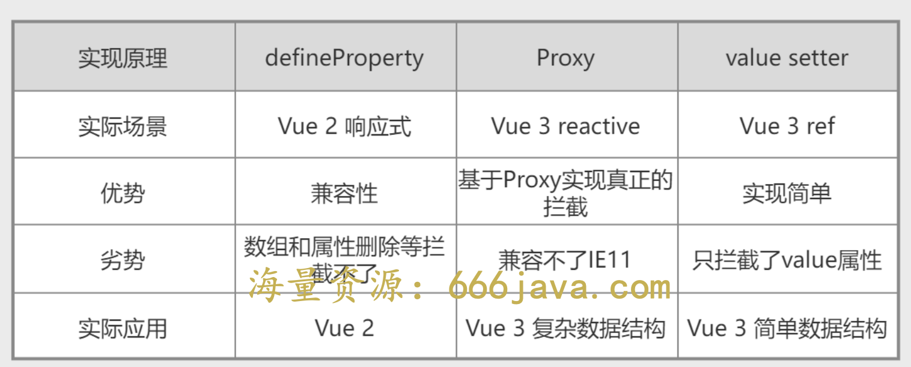

# vue3
## 生态
* 脚手架
  + Vue CLI v4.5+
  + Vite
    - npm init vue@latest
* IDE
  - vue-offical插件
* 浏览器
  - 新的 Devtools 插件
* 官方的库
  - Vue Router 4.0 提供了 Vue 3 支持
  - Vuex 4.0 提供了 Vue 3 支持
  - pinia 简化了 Vuex 推荐使用
* 静态网站生成:  
  - VuePress -> VitePress
## 生命周期
* destroyed 生命周期选项被重命名为 unmounted
* beforeDestroy 生命周期选项被重命名为 beforeUnmount
## 全局API
* createApp
  ```js
    // 返回一个应用实例
    import { createApp } from 'vue'
    const app = createApp({})
  ```
* 实例的API
  - app.config
  - app.component
  - app.directive
  - app.mixin
  - app.use
  - Vue.prototype -> app.config.globalProperties
* nextTick
  ```js
   // tree-shaking 的支持
   import { nextTick } from 'vue'
   nextTick(() => {
    // 一些和 DOM 有关的东西
   })

  ```
## 模版指令
* key 使用
  ```html
    <!-- Vue 3.x -->
    <template v-for="item in list" :key="item.id">
        <div>...</div>
        <span>...</span>
    </template>
  ```
* v-if 与 v-for 的优先级
  - 2.x v-for 优先
  - 3.x v-if 优先
* 移除 v-on.native 修饰符
## 移除的 API
* 按键修饰符
  ```html
    <!-- Vue 3 在 v-on 上使用按键修饰符 -->
    <input v-on:keyup.page-down="nextPage">
    <!-- 同时匹配 q 和 Q -->
    <input v-on:keypress.q="quit">
  ```
* 事件API
  - $on，$off 和 $once 实例方法已被移除
* 过滤器
  - 建议用方法调用或计算属性来替换
* $children 当前实例的直接子组件 $refs 代替
* Vue.extend 移除 defineComponent 替代
* 全局函数 set 和 delete 以及实例方法 $set 和 $delete。基于代理的变化检测已经不再需要它们了。
## 新增变化
* 自定义指令
  ```js
    const MyDirective = {
        created(el, binding, vnode, prevVnode) {}, // 新增
        beforeMount() {},
        mounted() {},
        beforeUpdate() {}, // 新增
        updated() {},
        beforeUnmount() {}, // 新增
        unmounted() {}
    }

  ```
* 自定义事件
  ```html
    <template>
    <div>
        <p>{{ text }}</p>
        <button @click="$emit('accepted')">OK</button>
    </div>
    </template>
    <script>
    export default {
        props: ['text'],
        emits: ['accepted']
    }
    </script>
  ```
* data 选项
  - 应始终被声明为一个函数
  - 合并操作现在是浅层次的而非深层次的 (只合并根级属性)
* mount api
  - 2.x 被渲染的内容会替换我们要挂载的目标元素
  - 3.x 中，被渲染的应用会作为子元素插入，从而替换目标元素的 innerHTML
* transition class 名更改
  ```css
    .v-enter-from,
    .v-leave-to {
       opacity: 0;
    }

    .v-leave-from,
    .v-enter-to {
        opacity: 1;
    }

  ```
* 片段:不需要用 div 包裹
  ```html
    <!-- Layout.vue -->
    <template>
        <header>...</header>
        <main v-bind="$attrs">...</main>
        <footer>...</footer>
    </template>
  ```  
* ref 数组
    ```html
    <div v-for="item in list" :ref="setItemRef"></div>
    ```
    ```js
    export default {
        data() {
            return {
                itemRefs: []
            }
        },
        methods: {
            setItemRef(el) {
                if (el) {
                    this.itemRefs.push(el)
                }
            }
        },
        beforeUpdate() {
            this.itemRefs = []
        },
        updated() {
            console.log(this.itemRefs)
        }
    }
    ```
* 组合式 api 替代继承 mixin
    ```js
    import { fetchUserRepositories } from '@/api/repositories'
    import { ref,onMounted,watch,computed } from 'vue'
    export default {
        setup(props,{ attrs, slots, emit, expose }) {
            // 1. 因为 props 是响应式的，你不能使用 ES6 解构，它会消除 prop 的响应性。
            // 2. 如果要解构保留响应式,使用 `toRefs` 创建对 `props` 中的 `user` property 的响应式引用
            const { user } = toRefs(props)

            // 3. title 是可选的 prop，传入的 props 中可能没有 title ,toRefs 将不会为 title 创建一个 ref 。你需要使用 toRef 替代它
            // const title = toRef(props, 'title')

            const repositories = ref([])
            const getUserRepositories = async () => {
                repositories.value = await fetchUserRepositories(props.user)
            }

            // computed 是响应式的
            const counter = ref(0)
            const twiceTheCounter = computed(() => counter.value * 2)
            counter.value++
            watch(counter, (newValue, oldValue) => {
                console.log('The new counter value is: ' + counter.value)
            })

            // watch
            watch(user, getUserRepositories)

            // 生命周期钩子
            onMounted(getUserRepositories)

            // 返回供引用调用
            return {
                repositories,
                getUserRepositories
        }
    }
    
    ```
* Teleport 
  - 例子说明:在子组件 Header 中使用到 Dialog 组件，此时 Dialog 就被渲染到一层层子组件内部，处理嵌套组件的定位、z-index和样式都变得困难。我们希望继续在组件内部使用 Dialog,又希望渲染的DOM结构不嵌套在组件的DOM中.我们可以用 <Teleport> 包裹 Dialog, 此时就建立了一个传送门，可以将Dialog渲染的内容传送到任何指定的地方。
  - 使用案例
    ```html
        <body>
            <div id="app"></div>
            <!-- 希望与根组件同级 -->
            <div id="dialog"></div>
        </body>

        <!-- dialog 组件 -->
        <template>
            <teleport to="#dialog">
                <div class="dialog">
                <!-- todo -->
                </div>
            </teleport>
        </template>
    ```
## 响应式
* 几种响应式方案

* reactive
  > 函数创建一个响应式对象或数组，返回的是一个原始对象的 Proxy,对一个已存在的代理对象调用 reactive() 会返回其本身
  - 仅对对象类型有效（对象、数组和 Map、Set 这样的集合类型），而对 string、number 和 boolean 这样的 原始类型 无效。
  - 是通过 property 访问进行追踪的，替换一个响应式对象，这将导致对初始引用的响应性连接丢失，当我们将响应式对象的 property 赋值或解构至本地变量时，或是将该 property 传入一个函数时，我们会失去响应性：
    ```js
      const state = reactive({ count: 0 })

      // 失去响应性：1.赋值失去响应性连接
      let n = state.count
      // 不影响原始的 state
      n++

      // 失去响应性：解构至本地变量时 count 也和 state.count 失去了响应性连接
      let { count } = state
      // 不会影响原始的 state
      count++
    ```
* ref
  - 为了解决 reactive 带来的限制，ref 方法来允许我们创建可以使用任何值类型的响应式
  - ref 被传递给函数或是从一般对象上被解构时，不会丢失响应性：
  - 当 ref 在模板中作为顶层 property 被访问时，它们会被自动“解包”，所以不需要使用 .value
  ```js
    import { ref } from 'vue'
    const count = ref(0)
    console.log(count) // { value: 0 }
    console.log(count.value) // 0

    count.value++
    console.log(count.value) // 1

    // 对象
    const objectRef = ref({ count: 0 })
    // 这是响应式的替换
    objectRef.value = { count: 1 }

    const obj = {
        foo: ref(1),
        bar: ref(2)
    }

    // 该函数接收一个 ref
    // 需要通过 .value 取值
    // 但它会保持响应性
    callSomeFunction(obj.foo)

    // 仍然是响应式的
    const { foo, bar } = obj
  ```
## 组件插槽
* v-slot 合并了 slot 和 slot-scope 作用域插槽
  ```html
    <!-- 父组件中使用 -->
    <template v-slot:content="scoped">
      <div v-for="item in scoped.data">{{item}}</div>
    </template>

    <!-- 也可以简写成： -->
    <template #content="{data}">
      <div v-for="item in data">{{item}}</div>
    </template>
  ```
## 组件通讯（新增优化）
* provide inject
  - 层级过深 prop 传值的解决方案
  ```js
    const app = Vue.createApp({})
    // 非实例数据
    app.component('todo-list', {
        provide: {
            user: 'John Doe'
        },
    })
    app.component('todo-list-statistics', {
        inject: ['user'],
        created() {
            console.log(`Injected property: ${this.user}`) // > 注入的 property: John Doe
        }
    })

    // setUp中使用
    import { provide } from 'vue'
    import MyMarker from './MyMarker.vue'

    export default {
        components: {
            MyMarker
        },
        setup() {
            provide('location', 'North Pole')
            provide('geolocation', {
                longitude: 90,
                latitude: 135
            })
        }
    }
    // src/components/MyMarker.vue 
    import { inject } from 'vue'
    export default {
        setup() {
            const userLocation = inject('location', 'The Universe')
            const userGeolocation = inject('geolocation')
            return {
                userLocation,
                userGeolocation
            }
        }
    }
  ```
* pinia
## watch 与 watchEffect 的用法
> 我们需要在响应式状态变化时执行一些“副作用”：如更改 DOM，或是根据异步操作的结果去修改另一处的状态。
* watch 默认是懒执行的：仅当数据源变化时，才会执行回调
  ```js
    const x = ref(0)
    const y = ref(0)
    // 单个 ref
    watch(x, (newX) => {
        console.log(`x is ${newX}`)
    })
    // getter 函数
    watch(
        () => x.value + y.value,
        (sum) => {
            console.log(`sum of x + y is: ${sum}`)
        }
    )
    // 多个来源组成的数组
    watch([x, () => y.value], ([newX, newY]) => {
        console.log(`x is ${newX} and y is ${newY}`)
    })

    // 1. 传入一个响应式对象，会隐式地创建一个深层侦听器——该回调函数在所有嵌套的变更时都会被触发：
    const obj = reactive({ count: 0 })
    watch(obj, (newValue, oldValue) => {
        // 在嵌套的属性变更时触发
        // 注意：`newValue` 此处和 `oldValue` 是相等的
        // 因为它们是同一个对象！
    })
    obj.count++
    // 深度侦听需要遍历被侦听对象中的所有嵌套的属性，当用于大型数据结构时，开销很大。因此请只在必要时才使用它，并且要留意性能。

    // 2. 一个返回响应式对象的 getter 函数，只有在返回不同的对象时，才会触发回调：
    watch(
        () => state.someObject,
        () => {
            // 仅当 state.someObject 被替换时触发
        }
    )
    // 3. 也可以给上面这个例子显式地加上 deep 选项，强制转成深层侦听器：
    watch(
        () => state.someObject,
        (newValue, oldValue) => {
            // 注意：`newValue` 此处和 `oldValue` 是相等的
            // *除非* state.someObject 被整个替换了
        },
        { deep: true }
    )
    // 4. 即时回调的侦听器:某些场景中，我们希望在创建侦听器时，立即执行一遍回调
    watch(
        source,
        (newValue, oldValue) => {
            // 立即执行，且当 `source` 改变时再次执行
        },
        { immediate: true }
    )
    // Vue 3.5+ 中，deep 选项还可以是一个数字，表示最大遍历深度——即 Vue 应该遍历对象嵌套属性的级数

    // 5. 一次性侦听器 3.4+
    watch(
        source,
        (newValue, oldValue) => {
            // 当 `source` 变化时，仅触发一次
        },
        { once: true }
    )
  ```
  - 注意：你不能侦听响应式对象的属性值
    ```js
        const obj = reactive({ count: 0 })
        // 这不起作用，因为你是向 watch() 传入了一个 number
        watch(obj.count, (count) => {
            console.log(`count is: ${count}`)
        })
        // 这么写
        watch(
            () => obj.count,
            (count) => {
                console.log(`count is: ${count}`)
            }
        )
    ```
* watchEffect 允许我们自动跟踪回调的响应式依赖
  - 对于有多个依赖项的侦听器来说，使用 watchEffect() 可以消除手动维护依赖列表的负担
  - 需要侦听一个嵌套数据结构中的几个属性，watchEffect() 可能会比深度侦听器更有效
  ```js
    const url=ref('')
    watchEffect(async () => {
        const response = await fetch(url.value)
        data.value = await response.json()
    })
  ```
* watch vs. watchEffect 区别
  - watch 只追踪明确侦听的数据源。它不会追踪任何在回调中访问到的东西。另外，仅在数据源确实改变时才会触发回调。watch 会避免在发生副作用时追踪依赖，因此，我们能更加精确地控制回调函数的触发时机。
  - watchEffect，则会在副作用发生期间追踪依赖。它会在同步执行过程中，自动追踪所有能访问到的响应式属性。这更方便，而且代码往往更简洁，但有时其响应性依赖关系会不那么明确。
* 副作用清理 onWatcherCleanup 3.5+
  ```js
    import { watch, onWatcherCleanup } from 'vue'
    watch(id, (newId) => {
        const controller = new AbortController()
        fetch(`/api/${newId}`, { signal: controller.signal }).then(() => {
            // 回调逻辑
        })
        onWatcherCleanup(() => {
            // 终止过期请求
            controller.abort()
        })
    })
  ```
* 回调触发时机
  ```js
    // 在侦听器回调中能访问被 Vue 更新之后的所属组件的 DOM
    watch(source, callback, {
        flush: 'post'
    })

    watchEffect(callback, {
        flush: 'post'
    })

    // 后置刷新的 watchEffect() 有个更方便的别名 watchPostEffect()：
    import { watchPostEffect } from 'vue'
    watchPostEffect(() => {
        /* 在 Vue 更新后执行 */
    })
  ```
* 同步侦听器
  ```js
    watch(source, callback, {
        flush: 'sync'
    })
    watchEffect(callback, {
        flush: 'sync'
    })
    // 同步触发的 watchEffect() 有个更方便的别名 watchSyncEffect()：
    import { watchSyncEffect } from 'vue'
    watchSyncEffect(() => {
      /* 在响应式数据变化时同步执行 */
    })
  ```
## TypeScript 类型支持
* defineComponent  
  - 在定义 Vue 组件时提供类型推导的辅助函数。也支持对纯 js 编写的组件进行类型推导。
    ```js
    import { defineComponent } from 'vue'
    export default defineComponent({
        // 启用了类型推导
        props: {
            name: String,
            msg: { type: String, required: true }
        },
        data() {
            return {
                count: 1
            }
        },
        mounted() {
            this.name // 类型：string | undefined
            this.msg // 类型：string
            this.count // 类型：number
        }
    })

    ```
* defineProps
  ```ts
    // 运行时声明
    const props = defineProps({
        foo: { type: String, required: true },
        bar?: Number
    })
    props.foo // string
    props.bar // number | undefined

    // 泛型定义
    interface Props {
        foo: string
        bar?: number
    }
    const props = defineProps<Props>()
    import { Props } from './other-file'
    // 暂不支持！
    defineProps<Props>()

  ```
* defineEmits 
  ```ts
    // 运行时
    const emit = defineEmits(['change', 'update'])

    // 基于类型
    const emit = defineEmits<{
        (e: 'change', id: number): void
        (e: 'update', value: string): void
    }>()
  ```
* ref 
  ```ts
    // 得到的类型：Ref<string | number>
    const year = ref<string | number>('2020')
    year.value = 2020 // 成功！
  ```
* reactive
  ```ts
   import { reactive } from 'vue'
    interface Book {
        title: string
        year?: number
    }
    const book: Book = reactive({ title: 'Vue 3 指引' })
  ```
* computed
  ```ts
    const double = computed<number>(() => {
        // 若返回值不是 number 类型则会报错
    })
  ``` 
## 相对vue2做的优化
### 如何更快
* Object.defineProperty => Proxy，它不仅让内存占用变得更小，还让组件的初始化变得更快
  - Proxy不仅消除了Vue2中现有的限制（比如对象新属性的增加、数组元素的直接修改不会触发响应式机制），而且有着更好的性能
  - vue2对数据的侦听劫持是在组件初始化时去遍历递归一个对象,给其中的每一个属性用Object.defineProperty设置它的getter和setter，数据侦听是在属性层面。递归遍历这种操作对CPU来说还是比较昂贵的一个操作
  - Proxy 就是真正意义给一个对象包上一层代理从而去完成数据侦听劫持的操作
* Virtual DOM 优化
  - vue2 当数据发生改变的时候，两棵vdom的树会递归进行 diff 比较，找到需要更新的节点再 patch 为实际的DOM更新到浏览器上。 
  - vue3 通过 compiler 对模板的静态分析，将静态的内容进行 把静态节点提升到外面去，实际生成vnode的就只有动态的元素,再分析这个元素内可能发生变化的东西，对这个元素打上 patchFlag，表示这个元素可能发生变化的类型是文本内容,还是属性类class等等。
* 更多编译时优化
  - Slot 默认编译为函数
  - 模板静态分析生成VNode优化标记——patchFlag
### 如何更小
* vue 拆分成独立的功能模块，按需引入，有更好的 tree shaking
* composition API声明的一些响应式变量，就可以很安全地对变量名进行压缩，这种引用调用的方式，构建工具可以很轻松地利用 Tree shaking 去消除我们实际未使用到 “死代码“
## jsx 使用注意
* 使用 vModel 取代 v-model
* 使用 onClick 取代 @click
* 示例
  ```jsx
    export default defineComponent({
        setup(props) {
           let title = ref('')
           let todos = ref([{ title: "学习 Vue 3", done: true },{ title: "睡觉", done: false}])
           function addTodo(){
                todos.value.push({
                    title:title.value
                })
                title.value = ''
            }
        return () => <div>
            <input type="text" vModel={title.value} />
            <button onClick={addTodo}>添加</button>
            <ul>
            {
                todos.value.length ? todos.value.map(todo=>{
                    return <li>{todo.title}</li>
                }): <li>no data</li>
            }
            </ul>
            </div>
        }
    })
  ```