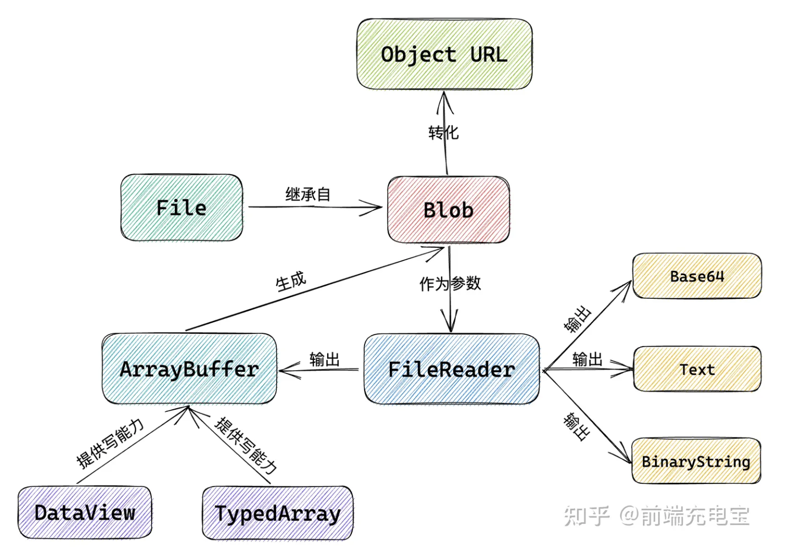

# 图像与二进制

## js中的图像
> 前端处理图片数据，有提供几个常用的 API，如 Image、ImageData、ImageBitmap等等。
* Image
  - 能够加载一张图片资源，创建并返回一个新的 HTMLImageElement 实例，拥有图像元素的所有属性和事件。
  + Image对象实例还有一些常用的属性和事件，也是我们必须要了解的：
    - 属性：src、width、height、complete、alt、name等
    - 事件：onload、onerror、onabort等
  + Image对图片资源的加载是一种异步的方式，一般是通过 onload 事件监听，实时获取到图片对象实例
    ```js
        const loadImage = (url) => {
            return new Promise((resolve, reject) => {
                const img = new Image()
                img.onload = () => {
                    resolve(img)
                }
                img.onerror = (err) => {
                    reject(err)
                }
                // src 本地图像路径、 网络图像链接、Object-URL、Base64图像字符串
                img.src = url
            })
        }
    ```
    - 通过简单的测试对比，单张或少量图片的加载性能上，Image() 和 createElement() 几乎没区别，都可以使用；但在大批量加载图片资源时，Image() 比 createElement() 稍微快一些。
     

* ImageData
  > img 标签用于加载图片资源，但在各种图片操作上稍显不足，所以一般会使用到 canvas 画布，ImageData、ImageBitmap都是在 canvas 环境下使用的
  - ImageData表示 canvas 元素指定区域的像素数据。
  - 图片像素数据实际上就是一个个的颜色值，可使用 RGBA 颜色模型来表示，所以 ImageData 对象的像素数据，就是图像的一个个像素点的颜色值，长度为 windth * height * 4，这里的 4 就是对应的 RGBA 4个颜色通道
  - 对象实例与属性
    ```js
        // array：是一个 Uint8ClampedArray 类型数组的实例，是8位无符号整型固定数组，属于11个类型化数组(TypeArray)中的一个，元素值固定在0-255区间的。
        // 存储的是像素点的颜色值数据，数组元素按每个像素点的 RGBA 4通道的数值依次排列
        // 该数组的长度必须为 windth * height * 4，否则报错。
        new ImageData(array, width, height);

        // 如果不给定该数组参数，则会根据宽高创建一个全透明的图像。
        const imgData = new ImageData(512, 512)
        console.log(imgData)
        // ImageData {data: Uint8ClampedArray(1048576), width: 512, height: 512, colorSpace: 'srgb'}
        // data: Uint8ClampedArray(1048576) [0, 0, 0, 0, 0, 0, 0, 0, 0, 0, 0, 0, 0, 0, 0, 0, …]
        // colorSpace：色彩空间，可取两个值 srgb 或 display-p3，都是RGB颜色模型的色彩空间，部分浏览器不支持。
    ```
  + 在canvas中的应用:
    > ImageData 图像像素点对象，是基于前端的canvas环境，应用也都是在canvas操作中，常见的如创建方法 createImageData()、读取方法 getImageData()、更新方法 putImageData()。这三个方法都是canvas的绘制上下文的实例方法
    - createImageData、getImageData、putImageData 语法
      ```js
        // 1. createImageData
        // createImageData() 用于创建一个全新的空的ImageData对象，与 ImageData() 构造函数作用一样，返回像素点信息数据。
        // 通过宽高、或者其他 ImageData 对象进行创建新的对象。
        context.createImageData(width, height)
        context.createImageData(imagedata)

        // 2. 返回canvas画布中部分或全部的像素点信息数据。
        // sx：返回图像的起始横坐标
        // sy：返回图像的起始纵坐标
        // sWidth：返回的图像的宽度
        // sHeight：返回图像的高度
        context.getImageData(sx, sy, sWidth, sHeight)

        // 3. putImageData
        // 参数说明：
        // imagedata：图像像素点信息
        // dx：在目标canvas中的起始横坐标
        // dy：在目标canvas中的起始纵坐标

        // dirtyX：图像数据渲染区域的左上角横坐标，可选
        // dirtyY：图像数据渲染区域的左上角纵坐标，可选
        // dirtyWidth：图像数据渲染区域的宽度，可选
        // dirtyHeight：图像数据渲染区域的高度，可选
        context.putImageData(imagedata, dx, dy [, dirtyX, [ dirtyY, [ dirtyWidth, [dirtyHeight]]]]);

      ```
    - 实际应用示例
      ```js
        const randomRGB = () => Math.floor(Math.random() * (255 - 0) + 0)

        const canvas = document.createElement('canvas')
        canvas.width = 100
        canvas.height = 100
        document.body.append(canvas)

        const ctx = canvas.getContext('2d')
        //  定义一个ImageData像素点对象实例，并给它的元素赋值，R通道默认255，BG通道取随机值，然后使用 putImageData() 将像素点数据绘制出来：
        const imagedata = ctx.createImageData(100, 100)
        const length = imagedata.data.length
        for (let i = 0; i < length; i += 4) {
            imagedata.data[i] = 255
            imagedata.data[i + 1] = randomInRange()
            imagedata.data[i + 2] = randomInRange()
            imagedata.data[i + 3] = 255
        }
        ctx.putImageData(imagedata, 0, 0)

        // 通过一个1s的定时器，使用 getImageData() 获取像素点数据后，将颜色值的R通道改为0，再重新绘制图像：
        setTimeout(() => {
            const imgData = ctx.getImageData(0, 0, 100, 100)
            const len = imgData.data.length
            for (let i = 0; i < len; i += 4) {
                imgData.data[i] = 0
            }
            ctx.putImageData(imgData, 0, 0)
        }, 1000)

      ```
    + putImageData 和 drawImage 对比
       - 使用场景上： putImageData 更适合像素级的处理和复杂的图像操作，例如图像滤镜、实时像素处理等。 drawImage 更适合常规的图像显示和简单的图像操作，如图像的缩放、裁剪、平铺等。
       - 在实时绘制场景下：drawImage 通常比 putImageData 更高效，尤其是涉及频繁的图像更新和动态绘制时。这是因为 drawImage 可以利用浏览器的硬件加速来优化图像渲染，而 putImageData 则更侧重于像素级的操作和更复杂的绘图需求。

* ImageBitmap
  > ImageBitmap 表示一个位图图像，可绘制到 canvas中，并且具有低延迟的特性。
  - 与 ImageData 一样的是，他们都是在浏览器环境下可以访问的全局对象。
  - 不一样的是，ImageBitmap 没有构造函数，可以直接引用对象(无意义)，但无法通过构造函数创建，而需要借助 createImageBitmap() 进行创建。
  - 创建
    ```js
        // 基本参数:
        // image：图像源 可取值：img, SVG-image, video, canvas, HTMLImageElement, SVGImageElement, HTMLVideoElement,  HTMLCanvasElement, Blob, File, ImageData, ImageBitmap, 或 OffscreenCanvas 对象

        // sx：裁剪起点横坐标
        // sy：裁剪起点纵坐标
        // sw：裁剪宽度
        // sh：裁剪高度

        // options：可选，为其设置选项的对象。可用的选项是:
        // imageOrientation: 是原样呈现还是垂直翻转，可选 none(默认)、flipY
        // premultiplyAlpha: 颜色通道是否由alpha通道预乘，可选 none、premultiply、default(默认)
        // colorSpaceConversion: 是否使用色彩空间转换进行解码，可选 none、default (默认)
        // resizeWidth: 压缩新宽度
        // resizeHeight: 压缩新高度
        // resizeQuality: 压缩质量，可选 pixelated、low(默认)、medium、high
        // createImageBitmap 可以直接读取多种图像数据源，比如 ImageData、File、以及多种HTML元素对象等等，这可以让我们更加灵活的处理图// 像数据。

        createImageBitmap(image[, options])
        createImageBitmap(image, sx, sy, sw, sh[, options])

    ```
   - 使用示例：ImageBitmap 对象主要用于在canvas中，使用 drawImage() 接口进行图像绘制时，作为该接口的参数(图像源)：
   ```js
        const canvas = document.createElement('canvas')
        const ctx = canvas.getContext('2d')
        document.getElementById('input-file').onchange = (e) => {
            const file = e.target.files[0]
            createImageBitmap(file).then(imageBitmap => {
                canvas.width = imageBitmap.width
                canvas.height = imageBitmap.height
                ctx.drawImage(imageBitmap, 0, 0)
                
                document.body.append(canvas)
            })
        }

   ```

    

## js中的二进制
> File、Blob、FileReader、ArrayBuffer、Base64
* 关系图
  
* Blob
  - Blob 全称为 binary large object ，即二进制大对象，它是 JavaScript 中的一个对象，表示原始的类似文件的数据
  - Blob 对象是包含有只读原始数据的类文件对象。简单来说，Blob 对象就是一个不可修改的二进制文件。
  - 创建
   ```js 
      // 构造函数
      // array：由 ArrayBuffer、ArrayBufferView、Blob、DOMString 等对象构成的，将会被放进 Blob；
      // options：可选的 BlobPropertyBag 字典，它可能会指定如下两个属性
      //        type：默认值为 ""，表示将会被放入到 blob 中的数组内容的 MIME 类型。
      //        endings：默认值为"transparent"，用于指定包含行结束符\n的字符串如何被写入，不常用。
      new Blob(array, options);

      // 简单的例子
      const blob = new Blob(["Hello World"], {type: "text/plain"});
      console.log(blob.size); // 11
      console.log(blob.type); // "text/plain"
      // 对象上有两个属性：
      // size：Blob对象中所包含数据的大小（字节）；
      // type：字符串，认为该Blob对象所包含的 MIME 类型。如果类型未知，则为空字符串。
   ```
  - 应用场景
    ```js
       // 使用 URL.createObjectURL() 方法将将其转化为一个 URL，并在 Iframe 中加载：
       // <iframe></iframe>

        const iframe = document.getElementsByTagName("iframe")[0];
        const blob = new Blob(["Hello World"], {type: "text/plain"});
        iframe.src = URL.createObjectURL(blob);
    ```
  - Blob 分片:
    ```js
        // 可以从 blob 对象中创建 blob，也就是将 blob 对象切片。Blob 对象内置了 slice() 方法用来将 blob 对象分片，其语法如下：
        // const blob = instanceOfBlob.slice([start [, end [, contentType]]]};
        const iframe = document.getElementsByTagName("iframe")[0];
        const blob = new Blob(["Hello World"], {type: "text/plain"});
        const subBlob = blob.slice(0, 5);
        iframe.src = URL.createObjectURL(subBlob);
        // 此时页面会显示"Hello"
    ```
* File
  - File 对象是特殊类型的 Blob，且可以用在任意的 Blob 类型的 context 中。Blob 的属性和方法都可以用于 File 对象。
  + 在 JavaScript 中，主要有两种方法来获取 File 对象：
    - <input> 元素上选择文件后返回的 FileList 对象；
    - 文件拖放操作生成的 DataTransfer 对象；
    ```js
        // 方式一
        const fileInput = document.getElementById("fileInput");
        fileInput.onchange = (e) => {
            console.log(e.target.files);
            // 每个 File 对象都包含文件的一些属性，这些属性都继承自 Blob 对象：
            // lastModified：引用文件最后修改日期，为自1970年1月1日0:00以来的毫秒数；
            // lastModifiedDate：引用文件的最后修改日期；
            // name：引用文件的文件名；
            // size：引用文件的文件大小；
            // type：文件的媒体类型（MIME）；
            // webkitRelativePath：文件的路径或 URL。

            // 通常，我们在上传文件时，可以通过对比 size 属性来限制文件大小，通过对比 type 来限制上传文件的格式等。
        }

        // 方式二
        // <div id="drop-zone"></div>
        const dropZone = document.getElementById("drop-zone");
        dropZone.ondragover = (e) => {
            e.preventDefault();
        }
        dropZone.ondrop = (e) => {
            e.preventDefault();
            const files = e.dataTransfer.files;
            console.log(files)
        }
    ```
* FileReader
  - 是一个异步 API，用于读取文件并提取其内容以供进一步使用。FileReader 可以将 Blob 读取为不同的格式。
  - 基本使用
   ```js
    const reader = new FileReader();

    // 对象常用属性如下
    // error：表示在读取文件时发生的错误；
    // result：文件内容。该属性仅在读取操作完成后才有效，数据的格式取决于使用哪个方法来启动读取操作。
    // readyState：表示FileReader状态的数字。取值如下：
    // 0 还没加载数据 1 正在加载  2 已完成加载

   ```
  + 加载文件方式：
    - readAsArrayBuffer()：读取指定 Blob 中的内容，完成之后，result 属性中保存的将是被读取文件的 ArrayBuffer 数据对象；
    - readAsBinaryString()：读取指定 Blob 中的内容，完成之后，result 属性中将包含所读取文件的原始二进制数据；
    - readAsDataURL()：读取指定 Blob 中的内容，完成之后，result 属性中将包含一个data: URL 格式的 Base64 字符串以表示所读取文件的内容。
    - readAsText()：读取指定 Blob 中的内容，完成之后，result 属性中将包含一个字符串以表示所读取的文件内容。
  + 事件处理
    > 这些方法可以加上前置 on 后在HTML元素上使用
    - abort：该事件在读取操作被中断时触发；
    - error：该事件在读取操作发生错误时触发；
    - load：该事件在读取操作完成时触发；
    - progress：该事件在读取 Blob 时触发。
    ```js
      // 简单的案例
        const fileInput = document.getElementById("fileInput");
        const reader = new FileReader();
        reader.onload = (e) => {
            console.log(e.target.result);

            // readAsDataURL
            preview.src = e.target.result;

        }
        // 上传大文件时，可以通过 progress 事件来监控文件的读取进度：
        reader.onprogress = (e) => {
            if (e.loaded && e.total) {
                const percent = (event.loaded / event.total) * 100;
                console.log(`上传进度: ${Math.round(percent)} %`);
            }
        });
        fileInput.onchange = (e) => {
            reader.readAsText(e.target.files[0]);
            reader.readAsDataURL(e.target.files[0]);
        }

    ```
* ArrayBuffer
  - ArrayBuffer 对象用来表示通用的、固定长度的原始二进制数据缓冲区。
  - ArrayBuffer 的内容不能直接操作，只能通过 DataView 对象或 TypedArrray 对象来访问。这些对象用于读取和写入缓冲区内容。
  + 常用的方法和属性
    ```js
      // 1. ArrayBuffer.prototype.byteLength 
      // 构造函数可以分配指定字节数量的缓冲区
      bytelength=16
      const buffer = new ArrayBuffer(bytelength) 
      console.log(buffer.byteLength);  // 16
      // byteLength是一个只读属性，表示 ArrayBuffer 的 byte 的大小，在 ArrayBuffer 构造完成时生成，不可改变。

      // 2. ArrayBuffer.prototype.slice()
      // 可以用来截取 ArrayBuffer 实例，它返回一个新的 ArrayBuffer ，
      // 它的内容是这个 ArrayBuffer 的字节副本，从 begin（包括），到 end（不包括）
      console.log(buffer.slice(0, 8));  // 16

      // 3. ArrayBuffer.isView()
      // 用来判断参数是否是 TypedArray 实例或者 DataView 实例：

      ArrayBuffer.isView(buffer)   // false
      const view = new Uint32Array(buffer);
      ArrayBuffer.isView(view)     // true
    ```
  + ArrayBuffer 与 Blob 区别
    - Blob 作为一个整体文件，适合用于传输；
    - 当需要对二进制数据进行操作时（比如要修改某一段数据时），就可以使用 ArrayBuffer。
  + TypedArray: 有9种数据类型
    - Int8Array 8 位有符号整数
    - Uint8Array 8 位无符号整数
    - Uint8ClampedArray 8 位无符号整数

    - Int16Array 16 位有符号整数
    - Uint16Array 16 位无符号整数

    - Int32Array 32 位有符号整数
    - Uint32Array 32 位无符号整数
    - Float32Array 32 位浮点
    - Float64Array 32 位浮点
  + 类型化数组和数组有什么区别呢？
    - 类型化数组的元素都是连续的，不会为空；
    - 类型化数组的所有成员的类型和格式相同；
    - 类型化数组元素默认值为 0；
    - 类型化数组本质上只是一个视图层，不会存储数据，数据都存储在更底层的 ArrayBuffer 对象中。
* Object URL
  - 又称 Blob URL,是HTML5中的新标准,用来表示File Object 或Blob Object 的URL
  - 对于 Blob/File 对象，可以使用 URL构造函数的 createObjectURL() 方法创建将给出的对象的 URL
  ```js
    const fileInput = document.getElementById("fileInput");
    const preview = document.getElementById("preview");

    fileInput.onchange = (e) => {
        // 使用 URL.createObjectURL() 将 File 对象转化为一个 URL：
        preview.src = URL.createObjectURL(e.target.files[0]);
        console.log(preview.src);

        // 为了提高性能,我们应该使用createObjectURL()来手动释放它
        URL.revokeObjectURL(preview.src);
    };
  ```
* Base64
  - 是一种基于64个可打印字符来表示二进制数据的表示方法
  + JavaScript 中，有两个函数被分别用来处理解码和编码 base64 字符串
    - atob()：解码，解码一个 Base64 字符串；
    - btoa()：编码，从一个字符串或者二进制数据编码一个 Base64 字符串。
    ```js
        btoa("JavaScript")       // 'SmF2YVNjcmlwdA=='
        atob('SmF2YVNjcmlwdA==') // 'JavaScript'
    ```
  + 应用场景
    - toDataURL()方法把 canvas 画布内容生成 base64 编码格式的图片：
    ```js
        const canvas = document.getElementById('canvas'); 
        const ctx = canvas.getContext("2d");
        const dataUrl = canvas.toDataURL();

    ```
    - readAsDataURL()方法把上传的文件转为base64格式的data URI，比如上传头像展示或者编辑：
    ```js
        // <input type="file" id="fileInput" />
        // 

        const fileInput = document.getElementById("fileInput");
        const preview = document.getElementById("preview");
        const reader = new FileReader();

        fileInput.onchange = (e) => {
            reader.readAsDataURL(e.target.files[0]);
        };

        reader.onload = (e) => {
            preview.src = e.target.result;
            console.log(e.target.result);
        };
    ```
* 格式转换
  ```js
    // ArrayBuffer → blob
    const blob = new Blob([new Uint8Array(buffer, byteOffset, length)]);

    // ArrayBuffer → base64
    const base64 = btoa(String.fromCharCode.apply(null, new Uint8Array(arrayBuffer)));

    // base64 → blob
    const base64toBlob = (base64Data, contentType, sliceSize) => {
        const byteCharacters = atob(base64Data);
        const byteArrays = [];

        for (let offset = 0; offset < byteCharacters.length; offset += sliceSize) {
            const slice = byteCharacters.slice(offset, offset + sliceSize);

            const byteNumbers = new Array(slice.length);
            for (let i = 0; i < slice.length; i++) {
            byteNumbers[i] = slice.charCodeAt(i);
            }

            const byteArray = new Uint8Array(byteNumbers);
            byteArrays.push(byteArray);
        }

        const blob = new Blob(byteArrays, {type: contentType});
        return blob;
    }

    // blob → ArrayBuffer
    function blobToArrayBuffer(blob) { 
        return new Promise((resolve, reject) => {
            const reader = new FileReader();
            reader.onload = () => resolve(reader.result);
            reader.onerror = () => reject;
            reader.readAsArrayBuffer(blob);
        });
    }

    // blob → base64
    function blobToBase64(blob) {
        return new Promise((resolve) => {
            const reader = new FileReader();
            reader.onloadend = () => resolve(reader.result);
            reader.readAsDataURL(blob);
        });
    }

    // blob → Object URL
    const objectUrl = URL.createObjectURL(blob);

  ```