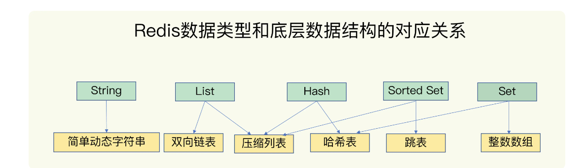
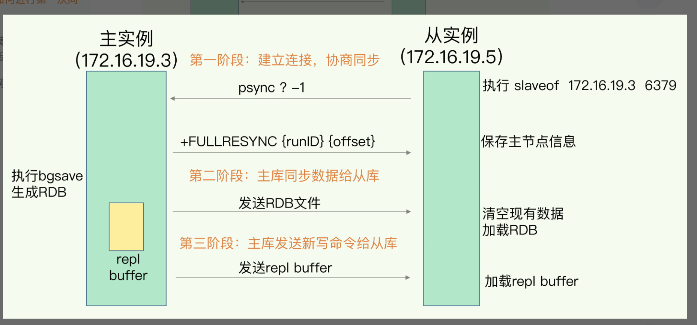
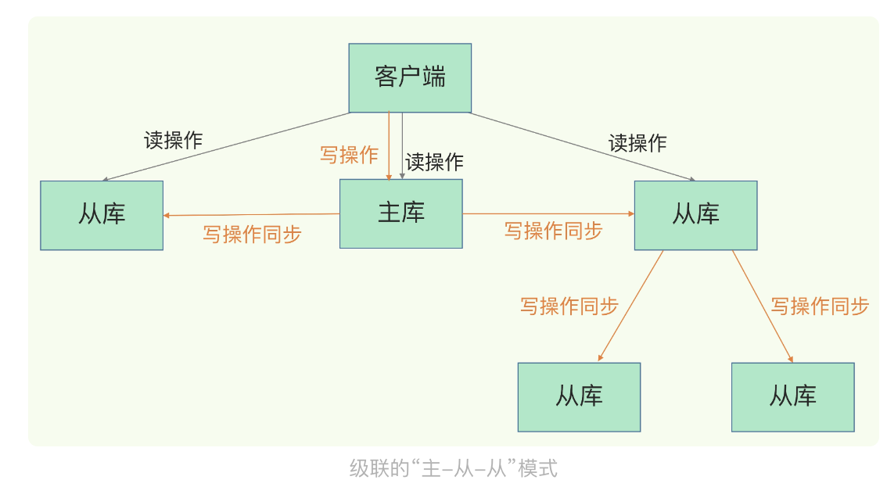

# redis
## 是什么？
- Redis 是一个开源（BSD许可）的，内存中的数据结构存储系统，它可以用作数据库、缓存和消息中间件
## redis知识全景

* 两大纬度
  - 应用纬度
  - 系统纬度
* 三大主线
  - 高性能：包括线程模型、数据结构、持久化、网络框架；
  - 高可用：包括主从复制、哨兵机制；
  - 高可拓展：包括数据分片、负载均衡

## 基本使用
* 字符串
  ```bash
    # 默认端口 6379
    # 语法：redis-cli -h hostIP -p port -a password
    redis-cli -h 127.0.0.1 -p 6379 -a xxxx
    # set get 命令
    set name 3

    # 设置6秒过期
    set name 4 EX 6 
    get name

    del name
    # 批量删除多个键名：
    del key1 key2 key3
  ```
* 集合
  > 是一种无序且不重复的数据结构，用于存储一组独立的元素。集合中的元素之间没有明确的顺序关系，每个元素在集合中只能出现一次。
  ```bash
    # 添加成员到集合
    SADD fruits "apple"
    SADD fruits "banana"
    SADD fruits "orange"

    # 移除成员
    SREM fruits "banana"

    # 获取集合中的所有成员：
    SMEMBERS fruits
    # 获取集合中的成员数量：
    SCARD fruits
    # 获取随机成员：
    SRANDMEMBER fruits

    # 检查成员是否存在于集合中：
    SISMEMBER fruits "apple"

    # 求多个集合的并集：
    SUNION fruits vegetables
    # 交集
    SINTER fruits vegetables
    # 差集：
    SDIFF fruits vegetables

  ```
* 哈希表 
  > 哈希表（Hash）是一种数据结构，也称为字典、关联数组或映射，用于存储键值对集合。在哈希表中，键和值都是存储的数据项，并通过哈希函数将键映射到特定的存储位置，从而实现快速的数据访问和查找
  ```bash
    # 设置哈希表中的字段值：
    HSET obj name "John"
    HSET obj age 25
    HSET obj email "john@example.com"

    # 设置多个字段
    HMSET obj name "John" age 25 email "john@example.com"

   # 获取哈希表中的字段值：
   HGET obj name
   # 获取多个
   HMGET obj name age email
   # 获取所有
   HGETALL obj

   # 删除哈希表中的字段：
   HDEL obj age email

   # 检查哈希表中是否存在指定字段：
   HEXISTS obj name

   # 获取所有字段
   HKEYS obj

   # 获取所有值
   HVALS obj

   # 字段的数量：
   HLEN obj
  ```
* 列表
  > 是一种有序、可变且可重复的数据结构。在许多编程语言和数据存储系统中，列表是一种常见的数据结构类型，用于存储一组元素
  ```bash

    RPUSH key element1 element2 element3  // 将元素从右侧插入列表
    LPUSH key element1 element2 element3  // 将元素从左侧插入列表

    LINDEX key index  // 获取列表中指定索引位置的元素
    LRANGE key start stop  // 获取列表中指定范围内的元素

    LINDEX key index  // 获取列表中指定索引位置的元素
    LRANGE key start stop  // 获取列表中指定范围内的元素

    LPOP key  // 从列表的左侧移除并返回第一个元素
    RPOP key  // 从列表的右侧移除并返回最后一个元素
    LREM key count value  // 从列表中删除指定数量的指定值元素

    LLEN key  // 获取列表的长度
  ```


## 应用场景
* 缓存应用

* 集群应用

* 数据结构应用

## redis 常见的坑

* CPU 使用上的“坑”，例如数据结构的复杂度、跨 CPU 核的访问；
* 内存使用上的“坑”，例如主从同步和 AOF 的内存竞争；
* 存储持久化上的“坑”，例如在 SSD 上做快照的性能抖动；
* 网络通信上的“坑”，例如多实例时的异常网络丢包。

## Redis 底层数据结构


* redis为什么快？
  - redis的数据储存在内存上，由于CPU和内存直连，所以数据存取速度很快
  - redis 采用了高效的数据结构，底层数据结构是哈希表，通过key定位value的时间复杂度为O(1)
  - 采用了多路复用机制，使其在网络 IO 操作中能并发处理大量的客户端请求，实现高吞吐率

* Redis 是单线程的吗？
  - Redis 是单线程，主要是指 Redis 的网络 IO 和键值对读写是由一个线程来完成的，这也是 Redis 对外提供键值存储服务的主要流程。但 Redis 的其他功能，比如持久化、异步删除、集群数据同步等，其实是由额外的线程执行的。

## redis 持久化机制
> 一般做缓存的场景使用，会面临 宕机了，Redis如何避免数据丢失的问题，如果从数据库恢复要面临应用程序变慢的问题。目前，Redis 的持久化主要有两大机制，即 AOF（Append Only File）日志和 RDB 快照
* AOF 日志是如何实现的？
  - redis 和数据库写前日志相反是写后日志，先把数据写入内存，然后才记录日志，可以避免出现记录错误命令的情况。
  - AOF 机制给我们提供了三个选择，也就是 AOF 配置项 appendfsync 的三个可选值。
  
* AOF 文件过大带来的性能问题
  - 一是，文件系统本身对文件大小有限制，无法保存过大的文件；
  - 二是，如果文件太大，之后再往里面追加命令记录的话，效率也会变低；
  - 三是，宕机故障恢复，如果日志文件太大，整个恢复过程就会非常缓慢，影响正常使用
  + 如何解决？
    - AOF 重写机制缩小日志文件。 会把对同一key的多次操作，取最后一次的状态的操作记录
    - 每次 AOF 重写时，Redis 会先执行一个内存拷贝，用于重写；然后，使用两个日志保证在重写过程中，新写入的数据不会丢失。而且，因为 Redis 采用额外的线程进行数据重写，所以，这个过程并不会阻塞主线程。
* RDB 快照（内存快照 默认开启）
> 和 AOF 相比，RDB 记录的是某一时刻的数据，并不是操作，所以，在做数据恢复时，我们可以直接把 RDB 文件读入内存，很快地完成恢复
  + Redis 提供了两个命令来生成 RDB 文件，分别是 save 和 bgsave。
    - save：在主线程中执行，会导致阻塞；
    - bgsave：创建一个子进程，专门用于写入 RDB 文件，避免了主线程的阻塞，这也是 Redis RDB 文件生成的默认配置。

## redis 主从复制机制
> Redis 提供了主从库模式，以保证数据副本的一致，主从库之间采用的是读写分离的方式。主库、从库都可以读操作，写操做在主库执行
* 主从读写分离这么设计的目的：防止多个实例数据不一致的的问题

* 主从库同步的原理：
  - 启动多个Redis 实例的时候，通过 replicaof（Redis 5.0 之前使用 slaveof）命令形成主库和从库的关系，之后会按照三个阶段完成数据的第一次同步
  ```bash
   # 如现在有实例 1（ip：172.16.19.3）和实例 2（ip：172.16.19.5）
   # 我们在实例 2 上执行以下这个命令后，实例 2 就变成了实例 1 的从库，并从实例 1 上复制数据：
   replicaof  172.16.19.3  6379
  ```
  
  - psync 命令包含了主库的 runID(实例启动时都会自动生成的一个随机 ID) 和复制进度 offset(设为 -1，表示第一次复制) 两个参数。

* 主从级联模式分担全量复制时的主库压力
  - 如果从库数量很多，而且都要和主库进行全量复制的话，就会导致主库忙于 fork 子进程生成 RDB 文件，进行数据全量同步。fork 这个操作会阻塞主线程处理正常请求，从而导致主库响应应用程序的请求速度变慢。此外，传输 RDB 文件也会占用主库的网络带宽，同样会给主库的资源使用带来压力
  + 解决：
    - “主 - 从 - 从”模式，主库生成 RDB 和传输 RDB 的压力，以级联的方式分散到从库上。
     ```bash
       replicaof  所选从库的IP 6379
     ```
    

* 主从库间网络断了怎么办？
  - 问题： 主从之间是基于长连接的命令传播，可以避免频繁建立连接的开销。这个过程中存在着风险点，最常见的就是网络断连或阻塞，客户端就可能从从库读到旧数据。
  - 当主从库断连后，主库会把断连期间收到的写操作命令，写入 replication buffer，同时也会把这些操作命令也写入 repl_backlog_buffer 这个缓冲区。主库会记录自己写到的位置，从库则会记录自己已经读到的位置，做增量复制
  - 注意：repl_backlog_buffer 有可能被写满导致覆盖之前写入的数据，一般设置2到4倍缓存空间的大小，降低风险

## 哨兵机制
> 哨兵机制是实现主从库自动切换的关键机制，它有效地解决了主从复制模式下故障转移的这三个问题。哨兵其实就是一个运行在特殊模式下的 Redis 进程，主从库实例运行的同时，它也在运行。哨兵主要负责的就是三个任务：
* 监控: 哨兵进程在运行时，周期性地给所有的主从库发送 PING 命令，检测它们是否仍然在线运行
* 选主（选择主库）:按照一定的规则选择一个从库实例，把它作为新的主库
* 通知: 哨兵会把新主库的连接信息发给其他从库，让它们执行 replicaof 命令，和新主库建立连接，并进行数据复制。同时，哨兵会把新主库的连接信息通知给客户端，让它们把请求操作发到新主库上。
* 如何判断下线的？
  - 在判断主库是否下线时，不能由一个哨兵说了算，只有大多数的哨兵实例，都判断主库已经“主观下线”了，主库才会被标记为“客观下线”
* 配置哨兵信息
  - 要保证所有哨兵实例的配置是一致的，尤其是主观下线的判断值 down-after-milliseconds。
  ```bash
  sentinel monitor <master-name> <ip> <redis-port> <quorum> 
  ```
* 哨兵之间通讯？
  - 通过发布订阅的形式

## 故障自动恢复

## 切片集群

## 数据结构

## Redis的使用规范建议
* 键值对使用规范
* 数据保存规范
* 命令使用规范

## Redis性能优化
* Redis单线程处理IO请求性能瓶颈主要包括2个方面：
  - 1、任意一个请求在 server 中一旦发生耗时，都会影响整个server的性能，也就是说后面的请求都要等前面这个耗时请求处理完成，自己才能被处理到。
    + 耗时的操作包括以下几种：
	  - a、操作 bigkey：写入一个bigkey在分配内存时需要消耗更多的时间，同样，删除bigkey释放内存同样会产生耗时；
	  - b、使用复杂度过高的命令：例如 SORT/SUNION/ZUNIONSTORE，或者O(N)命令，但是N很大，例如lrange key 0 -1一次查询全量数据；
	  - c、大量key集中过期：Redis的过期机制也是在主线程中执行的，大量key集中过期会导致处理一个请求时，耗时都在删除过期key，耗时变长；
	  - d、淘汰策略：淘汰策略也是在主线程执行的，当内存超过Redis内存上限后，每次写入都需要淘汰一些key，也会造成耗时变长；
	  - e、AOF 刷盘开启 always 机制：每次写入都需要把这个操作刷到磁盘，写磁盘的速度远比写内存慢，会拖慢Redis的性能；
	  - f、主从全量同步生成 RDB：虽然采用fork子进程生成数据快照，但fork这一瞬间也是会阻塞整个线程的，实例越大，阻塞时间越久；
  - 2、并发量非常大时，单线程读写客户端IO数据存在性能瓶颈，虽然采用IO多路复用机制，但是读写客户端数据依旧是同步IO，只能单线程依次读取客户端的数据，无法利用到CPU多核。
  + 解决方案：
    - 针对问题1，一方面需要业务人员去规避，一方面 Redis在 4.0 推出了 lazy-free 机制，把bigkey释放内存的耗时操作放在了异步线程中执行，降低对主线程的影响。
    - 针对问题2，Redis在6.0推出了多线程，可以在高并发场景下利用CPU多核多线程读写客户端数据，进一步提升server性能，当然，只是针对客户端的读写是并行的，每个命令的真正操作依旧是单线程的。

## Redis 5 6 7 三个版本的差异
* Redis 5: ACL支持、IO 调度程序、Lua 脚本性能改进等。
* Redis 6: 模块系统、Stream 数据类型、更多的 Redis Cluster改进等。
* Redis 7: 重构内存管理、RDB的改进、新的过期策略等。
