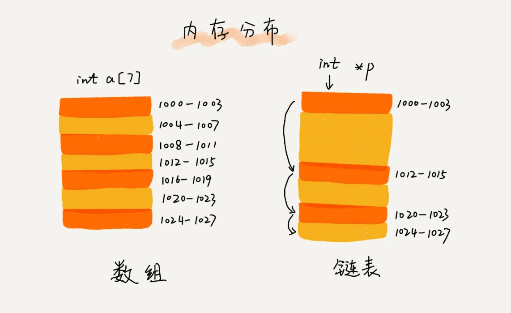
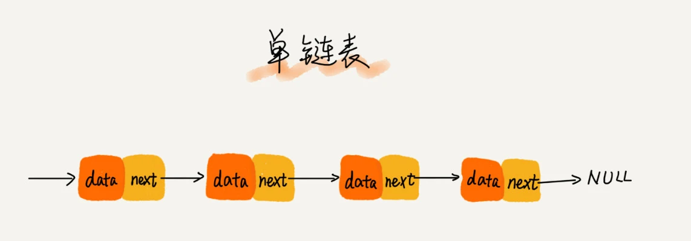
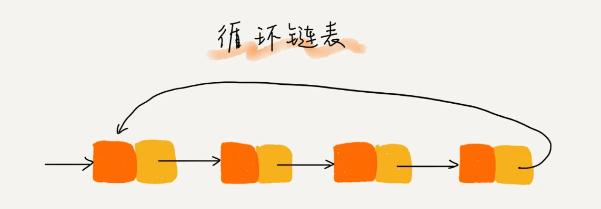
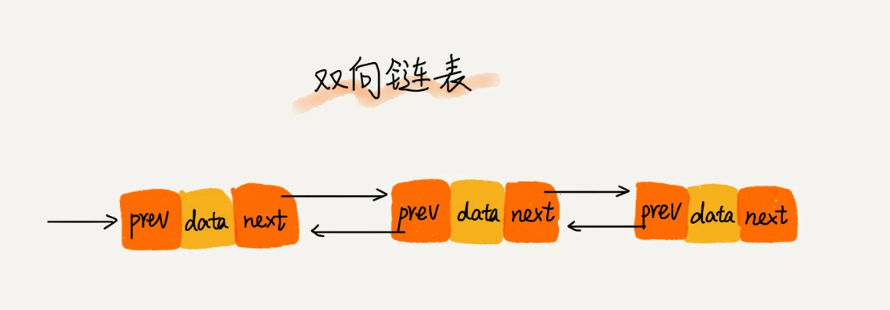

# 链表
和数组相似，链表通过指针将一组零散的内存块串联在一起，有三种最常见的链表结构。链表也支持数据的查找、插入和删除操作。

## 单链表

## 循环链表

* 跟单链表唯一的区别就在尾结点。单链表的尾结点指针指向空地址，表示这就是最后的结点了。而循环链表的尾结点指针是指向链表的头结点
* 循环链表的优点是从链尾到链头比较方便。当要处理的数据具有环型结构特点时，就特别适合采用循环链表。比如著名的约瑟夫问题

## 双向链表

* 在实际的软件开发中，更加常用的链表结构

## 数组的对比
* 随机访问元素的性能不如数组，数组时间复杂度O(1),链表O(n)
* 插入删除优于数组，但需额外消耗一个存储下一个节点的指针存储空间
* 链表本身没有大小的限制，天然地支持动态扩容，我觉得这也是它与数组最大的区别。