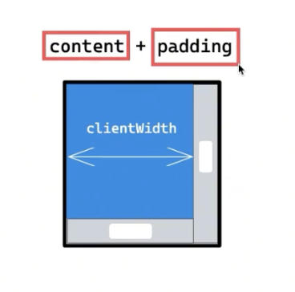
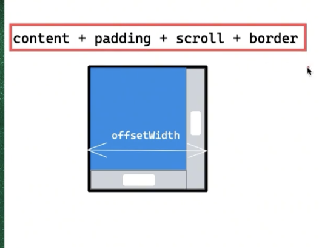
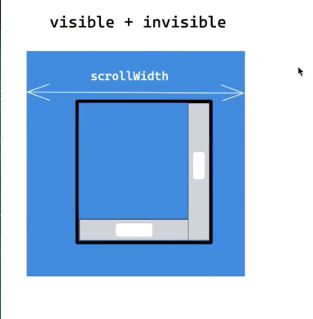

# DOM 
## 什么是 DOM，如何访问
- 文档对象模型 (DOM) 是HTML和XML文档的编程接口，简单来就是用代码来描述html。
- 通过 js 中的 document 和 window 元素的 api 来操作或者获取文档信息

## DOM 节点类型
* nodeType属性表示节点类型
  + 元素节点（Element）：
    - nodeType = 1
    - 示例：<div>, <span>, <p> 等 HTML 元素。
  + 属性节点（Attr）：
    - nodeType = 2
    - 示例：id="myElement", class="myClass" 等 HTML 属性
  + 文本节点（Text）：
    - nodeType = 3
    - 示例：元素中的文本内容，如 <p>Hello, world!</p> 中的 "Hello, world!"。
  + 注释节点（Comment）：
    - nodeType = 8
    - 示例：<!-- 这是一个注释 -->
  + 文档节点（Document）：
   - nodeType = 9
   - 示例：整个 HTML 或 XML 文档。
  + 文档片段节点（DocumentFragment）：
    - nodeType = 11
    - 示例：用于临时存储和操作一组节点，通常用于优化 DOM 操作。
  ```js
    // 获取元素节点
    const element = document.getElementById('myElement');
    console.log(element.nodeType); // 输出: 1

    // 创建文本节点
    const textNode = document.createTextNode('Hello, world!');
    console.log(textNode.nodeType); // 输出: 3

    // 创建注释节点
    const commentNode = document.createComment('这是一个注释');
    console.log(commentNode.nodeType); // 输出: 8

    // 获取文档节点
    const documentNode = document;
    console.log(documentNode.nodeType); // 输出: 9

    // 创建文档片段节点
    const fragmentNode = document.createDocumentFragment();
    console.log(fragmentNode.nodeType); // 输出: 11
  ```


## DOM 操作
* 创建节点
  - document.createElement('li') 创建一个元素节点
  - document.createTextNode(text) 创建一个文本节点
  - document.createComment(comment) 创建一个注释节点
  - document.crateDocumemntFragment() 创建一个文档碎片节点
      > 文档片段存在于内存中，并不在DOM树中，所以将子元素插入到文档片段时不会引起页面回流(reflow)(对元素位置和几何上的计算),起到优化性能的效果
  * 创建svg 图标的特殊案例
      ```js
        createSvgIcon(icon, style = {}) {
            const svgNS = 'http://www.w3.org/2000/svg'
            const xlinkNS = 'http://www.w3.org/1999/xlink'
            const element = document.createElementNS(svgNS, 'svg')
            element.setAttribute('aria-hidden', true)
            const useEl = document.createElementNS(svgNS, 'use')
            useEl.setAttributeNS(xlinkNS, 'href', `#${icon}`)
            element.appendChild(useEl)
            element.classList.add('svg-icon')
            Object.entries(style).forEach(([key, value]) => {
                element.style[key] = value
            })

            return element
        }
      ```
* 添加
  - 父级.appendChild('li') 在父级的末尾加
  - 父级.insertBefore(newchild,rechild) 在已有的字节点前中插入一个新的子节点
* 删除
  - 父级.removeChild(要删除的元素)
* 替换
  - 父级.replaceChild(新节点，被替换的节点)
* 克隆
  - 要克隆的元素.cloneNode(false) 只克隆元素本身，不需要元素中的内容
  - 要克隆的元素.cloneNode(true) 两个都要
* 包含
  - 父元素是否包含子元素
  ```js
    // 方法一
    const parentElement = document.getElementById('parent');
    const childElement = document.getElementById('child');

    if (parentElement.contains(childElement)) {
        console.log('childElement 是 parentElement 的子元素');
    } else {
        console.log('childElement 不是 parentElement 的子元素');
    }
    // 方法二
    const parentElement = document.getElementById('parent');
    const childElement = document.getElementById('child');
    let currentElement = childElement;
    let isChild = false;
    while (currentElement) {
        if (currentElement === parentElement) {
            isChild = true;
            break;
        }
        currentElement = currentElement.parentElement;
    }
    if (isChild) {
        console.log('childElement 是 parentElement 的子元素');
    } else {
        console.log('childElement 不是 parentElement 的子元素');
    }
  ```
  
## 获取和设置节点内容
* innerHTML:获取或设置元素的 HTML 内容
  + 注意:
    - 安全性：XSS（跨站脚本攻击）漏洞。确保不要插入不可信的内容。
    - 性能：频繁使用 innerHTML 进行 DOM 操作可能会导致性能问题，因为每次设置 innerHTML 都会导致元素的重新解析和渲染
    - 事件处理：使用 innerHTML 设置内容时，会移除元素上绑定的事件处理程序。如果需要保留事件处理程序，建议使用其他方法（如 createElement 和 appendChild）进行 DOM 操作。
  ```js
    // 获取元素
    const element = document.getElementById('myElement');

    // 获取元素的 HTML 内容
    const htmlContent = element.innerHTML;
    console.log(htmlContent);

    // 设置元素的 HTML 内容
    element.innerHTML = '<p>这是新的内容</p>';
  ```
* textContent 获取或设置元素的文本内容。

## DOM 元素选择
* 常用选择
  - document.querySelector() 参数css选择器， 返回匹配的第一项
  - document.querySelectorAll() 参数css选择器，返回一个匹配的伪数组
  - getElementById

  - getElementsByName
  - getElementsByTagName
  - getElementsByClassName

* 子节点
    + children(推荐使用)
      - 元素节点的集合
    + childNodes（ie只获取元素节点）
        - 用法：元素.childNodes  元素所有的子节点，包含文本和元素节点
        - 元素.childNodes[0] 第一个节点 包含文本和元素节点
    + 首个子节点
        - firstChild
        - firstElementChild
        - 兼容写法:let nodeFirst=el.firstChild||el.firstElementChild
    + 最后一个子节点
        - lastChild
        - lastElementChild
        - 兼容写法:let nodeLast=el.lastChild||el.lastElementChild

* 兄弟节点
    + 上一个
        - previousSibling
        - previousElementSibling
        - 兼容写法:let nodePre=el.previousSibling||el.previousElementSibling
    + 下一个
        - nextSibling
        - nextElementSibling
        - 兼容写法:let nodeNext=el.nextSibling||el.nextElementSibling

* 父节点
  - parentNode

## DOM 属性操作
* 获取和设置属性
  - getAttribute：获取指定属性的值。
  - setAttribute：设置指定属性的值。
  - removeAttribute：移除指定属性。
  ```js
    // 获取元素
    const element = document.getElementById('myElement');

    // 获取属性值
    const className = element.getAttribute('class');
    console.log(className);

    // 设置属性值
    element.setAttribute('class', 'newClass');

    // 移除属性
    element.removeAttribute('class');
  ```
* 直接操作属性
  ```js
    // 获取元素
    const element = document.getElementById('myElement');

    // 获取属性值
    const id = element.id;
    console.log(id);

    // 设置属性值
    element.id = 'newId';

    // 获取和设置 class 属性
    const className = element.className;
    element.className = 'newClass';

    // 获取和设置表单元素的值
    const value = inputElement.value;
    inputElement.value = 'newValue';

    // 获取和设置内联样式
    const color = element.style.color;
    element.style.color = 'red';

  ```
* h5新增特性：classList
  - 是一个用于操作元素的类名集合的属性。它提供了一些方法来添加、移除、切换和检查类名。
  ```html
    <!DOCTYPE html>
    <html lang="en">
    <head>
        <meta charset="UTF-8">
        <meta name="viewport" content="width=device-width, initial-scale=1.0">
        <title>classList 示例</title>
        <style>
            .highlight { color: red; }
            .bold { font-weight: bold; }
        </style>
    </head>
    <body>
        <div id="myElement" class="highlight">Hello, world!</div>
        <button onclick="manipulateClassList()">操作 classList</button>
        <script>
            function manipulateClassList() {
                const element = document.getElementById('myElement');

                // 添加类名
                element.classList.add('bold');

                // 移除类名
                element.classList.remove('highlight');

                // 切换类名
                element.classList.toggle('highlight');

                // 检查类名
                console.log(element.classList.contains('bold')); // true

                // 替换类名
                element.classList.replace('bold', 'italic');
            }
        </script>
    </body>
    </html>
  ```
* h5新增特性：dataset 用法
  - 用于访问元素上自定义数据属性（data-* 属性）的对象
  ```html
    <!DOCTYPE html>
    <html lang="en">
    <head>
        <meta charset="UTF-8">
        <meta name="viewport" content="width=device-width, initial-scale=1.0">
        <title>dataset 示例</title>
    </head>
    <body>
        <div id="myElement" data-name="John" data-age="30">Hello, world!</div>
        <button onclick="manipulateDataset()">操作 dataset</button>
        <script>
            function manipulateDataset() {
                const element = document.getElementById('myElement');

                // 获取自定义数据属性
                console.log(element.dataset.name); // John
                console.log(element.dataset.age); // 30

                // 设置自定义数据属性
                element.dataset.name = 'Jane';
                element.dataset.age = '25';

                // 输出修改后的属性值
                console.log(element.dataset.name); // Jane
                console.log(element.dataset.age); // 25
            }
        </script>
    </body>
    </html>
  ```


## DOM 事件处理
* 页面事件的加载顺序
  - DOMCententLoaded 事件：页面的文档结构（DOM树）加载完之后就会触发
  - document.onload 是在结构和样式加载完才执行js
  - window.onload   不仅结构和样式加载完，还要执行完所有的外部样式、图片这些资源文件，全部加载完才会触发 

* 事件监听 addEventListener
  + 语法：domEl.addEventListener(enventType,fn，useCapture)
    - 第三参数为bool类型,默认值为 false(冒泡) ，决定注册的事件是捕获事件还是冒泡事件
    - 注意：ie9 以下不支持 false
  + 事件移除
    ```js
        function fun{}

        btn.addEventListener("click",fun)
        // 移除事件监听(参数必须一致)
        btn.removeEventListener("click",fun)
            
        // ie-6-10(enventType 加on)
        btn.attachEvent(enventType,fn)
        btn.detachEvent(enventType,fn)
    ```

  + 如何阻止事件冒泡:(一般来说，如果我们只希望事件只触发在目标上)
    ```js
        function fn(e){
          // 阻止事件冒泡,也可以阻止捕获事件
          e.stopPropagation() 
          // 同样也能实现阻止事件，但是还能阻止该事件目标执行别的注册事件。
          e.stopImmediatePropagation()
        }

       btn.addEventListener('click',fn,false)
    ```

* 事件的对象(event)
  + event:记录当前事件触发时的一些信息  
    - target 真正触发事件的元素
    - type="click"
    - clinetX|clinetY 
    - currentTarget 返回绑定事件的元素
  + 鼠标事件对象的位置信息（click,mousemove、mousedown、mouseup）
    - pageX   距离网页左边缘的距离（可能有滚动）
    - clinetX 距离视口的距离
    - offsetX 点击位置到事件源元素左边的距离
    - movementX

* 事件传播：包括事件捕获、目标阶段和事件冒泡。
  - 事件冒泡：从内向外执行，遇到相同的事件及执行
  - 事件捕获：执行顺序与冒泡相反（不推荐使用，因为ie使用 attachEvent 没有第三个参数）

* 事件代理
   > 本质就是利用事件冒泡的原理，将事件绑定在父容器中，让父容器代为触发
   - 应用的场景：动态生成的子节点要注册事件，那么子节点需要注册事件的话应该注册在父节点上
   + 好处：
      1. 减少了事件的注册，内存开销减少了
      2. 元素的增减不会影响事件的绑定
      3. js和DOM节点之间的关联变少了，减少了因循环引用(GC中引用计数法的缺陷)而带来的内存泄漏发生的概率。
   + jq 早期 bind 绑定事件会出现一个问题及新创建的元素没有事件，后来用 delegate 解决 1.7 版本后统一用on
   + 注意：
      - 不是所有的事件都有冒泡（blur、focus、load 和 unload），所以事件委托不是所有的事件都可用。
      - 例如 mouseover 由于事件对象 target 频繁改动会有性能问题

* 事件触发(标准浏览器)：dispatchEvent
  - 创建: document.createEvent() 返回新创建的Event对象
    + 参数：
        - HTMLEvents：包括 'abort', 'blur', 'change', 'error', 'focus', 'load', 'reset', 'resize', 'scroll', 'select', 'submit', 'unload'. 事件
        - UIEvents ：包括 'DOMActivate', 'DOMFocusIn', 'DOMFocusOut', 'keydown', 'keypress', 'keyup'. 间接包含 MouseEvents. 
        - MouseEvents：包括 'click', 'mousedown', 'mousemove', 'mouseout', 'mouseover', 'mouseup'. 
        - MutationEvents:包括 'DOMAttrModified', 'DOMNodeInserted', 'DOMNodeRemoved', 'DOMCharacterDataModified', 'DOMNodeInsertedIntoDocument','DOMNodeRemovedFromDocument', 'DOMSubtreeModified'
  - 初始化: initEvent(eventName, canBubble, preventDefault) 用于初始化通过 DocumentEvent 接口创建的Event的值。
  - 示例
    ```js
        // 监听 alert事件
        document.addEventListener('alert', function (event) {
            console.log(event)
        }, false);
        
        // 1. 创建
        const evt = document.createEvent("HTMLEvents");
        // 2. 初始化
        evt.initEvent("alert", false, false);
        // 3. 手动触发
        window.dispatchEvent(evt);

        // 自定义事件的函数: Event、CustomEvent 和 dispatchEvent

        // 向 window 派发一个 resize 内置事件
        window.dispatchEvent(new Event('resize'))
            
        // 直接自定义事件，使用 Event 构造函数：
        var event = new Event('build');
        var elem = document.querySelector('#id')
        // 监听事件
        elem.addEventListener('build', function (e) { ... }, false);
        // 触发事件
        elem.dispatchEvent(event);
    ```
    
## DOM 尺寸和位置
* getComputedStyle
  - 直接获取到样式上的宽高,获取的是CSSOM树
  - 除非特殊情况，不推荐获取，因为可能获取不是界面上的尺寸如设置了padding、border、或者弹性布局被压缩拉伸了等
  ```js
    getComputedStyle(DOM).width
  ```
* DOM.style.width 
  - 获取的是DOM树的尺寸，只能获取到行内样式
* 一般使用如下几种
  > 获取的是布局树的尺寸（layout tree）
   - clientWidth/clientHeight 
   
   - offsetWidth/offsetHeight
   
  - scrollWidth/scrollHeight
    
* getBoundingClientRect
  - 获取变换后的尺寸、如经过 tranform 变换后
  - 返回元素的大小以及相对于浏览器可视窗口的位置
  ```js
   const rect=DOM.getBoundingClientRect()
   // rect.width
  ````

## DocumentFragment
[DocumentFragment](./documentFragment.md)

## ResizeObserver
TODO

## 判断 DOM 元素是否在可视区域内 
* IntersectionObserver
  - 是一种现代浏览器提供的 API，用于检测元素是否进入或离开视口（viewport）。它可以用于实现懒加载、无限滚动、广告曝光统计等功能
  + 常用的配置选项包括：
    - root：指定用于检测可见性的根元素，默认为视口。
    - rootMargin：用于扩展或缩小根元素的边界，类似于 CSS 的 margin 属性。
    - threshold：指定触发回调的阈值，可以是单个值或数组，表示目标元素可见部分的比例
  ```html
  <!DOCTYPE html>
    <html lang="en">
    <head>
        <meta charset="UTF-8">
        <meta name="viewport" content="width=device-width, initial-scale=1.0">
        <title>IntersectionObserver 示例</title>
        <style>
            .box {
                width: 100px;
                height: 100px;
                margin: 50px;
                background-color: lightblue;
            }
        </style>
    </head>
    <body>
        <div class="box" id="box1"></div>
        <div class="box" id="box2"></div>
        <div class="box" id="box3"></div>
        <script>
            document.addEventListener("DOMContentLoaded", function() {
                const boxes = document.querySelectorAll('.box');
                const observer = new IntersectionObserver((entries) => {
                    entries.forEach(entry => {
                        if (entry.isIntersecting) {
                            console.log(`${entry.target.id} is in the viewport`);
                        } else {
                            console.log(`${entry.target.id} is out of the viewport`);
                        }
                    });
                },{
                root: container,
                rootMargin: '0px',
                threshold: 0.5
            });
                boxes.forEach(box => {
                    observer.observe(box);
                });
            });
        </script>
    </body>
    </html>

  ```
