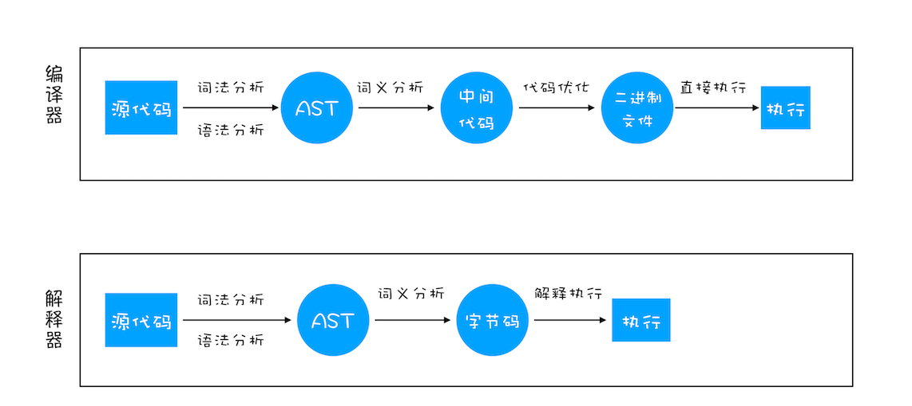
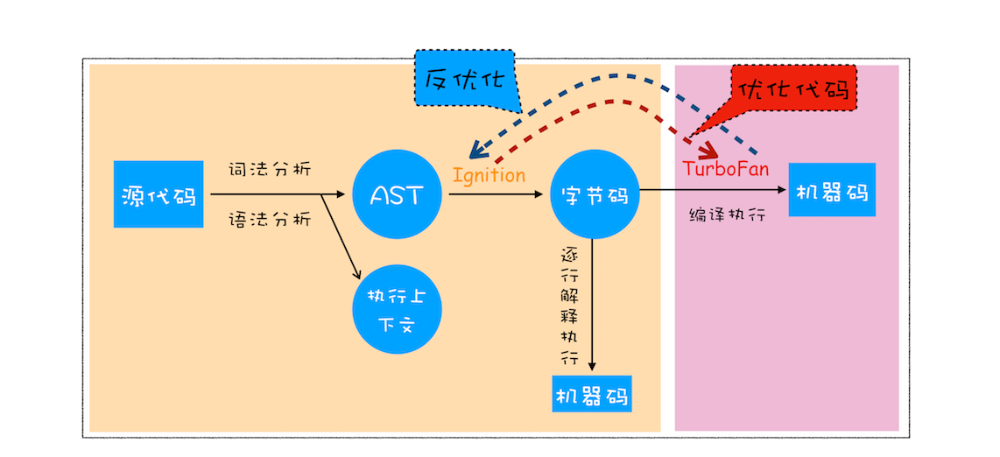

# 浏览器
## 宏观角度下的浏览器
* Chrome架构(当前)：仅仅打开了1个页面，为什么有4(至少)个进程？
  + 进程
    - 一个进程就是一个程序运行的实例，每一个应用程序都至少有一个进程
    - 进程是用来给应用程序体用一个执行的环境，给应用程序分配资源的一个单位

  + 线程
    - 用来执行应用程序中的代码
    - 在一个进程内部，有很多的线程

  + 最新的 Chrome 浏览器包括：
    - 1 个浏览器（Browser）主进程：负责界面显示、用户交互、子进程管理，同时提供存储等功能
    - 1 个 GPU 进程：Chrome 刚开始发布是没有 GPU 进程的。为了实现 3D CSS 的效果出的，是随后网页、Chrome 的 UI 界面都选择采用 GPU 来绘制，Chrome 在其多进程架构上引入了GPU 进程。
    - 1 个网络（NetWork）进程：负责页面的网络资源加载
    - 多个渲染进程：核心任务是将 HTML、CSS 和 JavaScript 转换为用户可以与之交互的网页，排版引擎 Blink 和 JavaScript 引擎 V8 都是运行在该进程中，默认情况下，Chrome 会为每个 Tab 标签创建一个渲染进程。出于安全考虑，渲染进程都是运行在沙箱模式下
    - 多个插件进程：主要是负责插件的运行，因插件易崩溃，所以需要通过插件进程来隔离，以保证插件进程崩溃不会对浏览器和页面造成影响。

  + 当前多进程架构的优缺点
    - 优点：多进程模型提升了浏览器的稳定性、流畅性和安全性
    - 缺点：更高的资源占用、更复杂的体系架构

    >针对当前的问题谷歌提出了面向服务的架构

    >也就是说 Chrome 整体架构会朝向现代操作系统所采用的“面向服务的架构” 方向发展，原来的各种模块会被重构成独立的服务（Service），每个服务（Service）都可以在独立的进程中运行，访问服务（Service）必须使用定义好的接口，通过 IPC 来通信，从而构建一个更内聚、松耦合、易于维护和扩展的系统

* TCP协议：如何保证页面文件能被完整送达浏览器？
  + tcp 和 udp 的区别？
    - UDP 不能保证数据可靠性，但是传输速度却非常快，所以 UDP 会应用在一些关注速度、但不那么严格要求数据完整性的领域，如在线视频、互动游戏等。
    + tcp 是一种面向连接的、可靠的、基于字节流的传输层通信协议，
      - 数据包丢失的情况，TCP 提供重传机制；
      - 引入了数据包排序机制，用来保证把乱序的数据包组合成一个完整的文件

  + tcp 连接的生命周期：
    - 建立连接阶段：通过“三次握手”来建立客户端和服务器之间的连接。所谓三次握手，是指在建立一个 TCP 连接时，客户端和服务器总共要发送三个数据包以确认连接的建立
    - 传输数据阶段：接收端在接收到数据包之后，需要发送确认数据包给发送端。当发送端发送了一个数据包之后，在规定时间内没有接收到接收端反馈的确认消息，则判断为数据包丢失，并触发发送端的重发机制。同样，一个大的文件在传输过程中会被拆分成很多小的数据包，这些数据包到达接收端后，接收端会按照 TCP 头中的序号为其排序，从而保证组成完整的数据。
    - 断开连接阶段：数据传输完毕之后，就要终止连接了，涉及到最后一个阶段“四次挥手”来保证双方都能断开连接。

* HTTP请求流程：为什么很多站点第二次打开速度会很快？
  - DNS 缓存和页面资源缓存这两块数据是会被浏览器缓存的

* 导航流程：从输入URL到页面展示，这中间发生了什么？
  > 输入URL到页面展示需要经历的几个主要的阶段
  + 用户发出 URL 请求到页面开始解析的这个过程，就叫做导航
    - 首先，浏览器进程接收到用户输入的 URL 请求，浏览器进程便将该 URL 转发给网络进程。
    - 然后，在网络进程中发起真正的 URL 请求。
    - 接着，网络进程接收到了响应头数据，便解析响应头数据，并将数据转发给浏览器进程。
    - 浏览器进程接收到网络进程的响应头数据之后，发送“提交导航 (CommitNavigation)”消息到渲染进程；
    - 渲染进程接收到“提交导航”的消息之后，便开始准备接收 HTML 数据，直接和网络进程建立数据管道；
    - 最后渲染进程会向浏览器进程“确认提交”，这是告诉浏览器进程：“已经准备好接受和解析页面数据了”。
    - 浏览器进程接收到渲染进程“提交文档”的消息之后，便开始移除之前旧的文档，然后更新浏览器进程中的页面状态。

* 渲染流程：HTML、CSS、JS 是如何变成页面的？
  - 渲染流程的前三个阶段：DOM 生成、样式计算和布局

+ 完整的渲染流程：
  - 渲染进程将 HTML 内容转换为能够读懂的 DOM 树结构。
  - 渲染引擎将 CSS 样式表转化为浏览器可以理解的 styleSheets，计算出 DOM 节点的样式。
  - 创建布局树，并计算元素的布局信息。
  - 对布局树进行分层，并生成分层树。
  - 为每个图层生成绘制列表，并将其提交到合成线程。
  - 合成线程将图层分成图块，并在光栅化线程池中将图块转换成位图。
  - 合成线程发送绘制图块命令 DrawQuad 给浏览器进程。
  - 浏览器进程根据 DrawQuad 消息生成页面，并显示到显示器上。

* 三个和渲染流水线相关的概念——“重排”“重绘”和“合成”
  + 重排:更新了元素的几何属性,重排需要更新完整的渲染流水线，所以开销也是最大的。
  + 重绘：更新元素的绘制属性，重绘省去了布局和分层阶段，所以执行效率会比重排操作要高一些。
  + 合成：更改既不要布局也不要绘制的属性，渲染引擎将跳过布局和绘制，只执行后续的合成操作，例如：使用了 CSS 的 transform 来实现动画效果，这可以避开重排和重绘阶段，直接在非主线程上执行合成动画操作

* 如何减少重绘、重排？
  - 使用 class 操作样式，而不是频繁操作 style
  - 避免使用 table 布局
  - 批量dom 操作，例如 createDocumentFragment，或者使用框架React
  - Debounce window resize 事件
  - 对 dom 属性的读写要分离
  - will-change: transform 做优化

## 浏览器中的js执行机制
* 变量提升：JavaScript代码是按顺序执行的吗？
  + js预解析阶段
    - 语法分析：保证js代码符合语法规则，能被正确的执行。
    - 变量名以及函数名提升
    - 确定变量的作用域。
    >先扫描整个函数体的语句，把所有申明的变量“提升”到函数顶部
    ```js
     'use strict';
     function foo() {
        var x = 'Hello, ' + y;
        alert(x);
        var y = 'Bob';
     }
     foo();
     // 虽然是strict模式，但语句var x = 'Hello, ' + y;并不报错，原因是变量y在稍后申 明了。
     // 但是alert显示Hello, undefined，说明变量y的值为undefined。
     // 这正是因为JavaScript引擎自动提升了变量y的声明，但不会提升变量y的赋值。
 
     // 变量提升后代码：
     function foo() {
         var y; // 提升变量y的申明
         var x = 'Hello, ' + y;
         alert(x);
         y = 'Bob';
     }     
     // 函数内变量的怪异声明模式:
     function fun(){
        num=10   //没写var 就相当于全局变量
     }
     fun()
     console.log(num) //10
    ```

* var 的缺陷为什么要引入let和const？
  + 什么叫作用域：
    - 指在程序中定义变量的区域，该位置决定了变量的生命周期。作用域就是变量与函数的可访问范围，即作用域控制着变量和函数的可见性和生命周期
    - ES6 以前：只有2中作用域全局和函数作用域，全局代码中任意位置都可以访问，函数只能在内部被访问，执行完销毁
  + 变量提升带来的问题：
    - 变量容易在不被察觉的情况下被覆盖掉
    - 本应销毁的变量没有被销毁
     ```js
      function foo(){
        for (var i = 0; i < 7; i++) {
        }
        console.log(i); 
        // 如果你使用 C 语言或者其他的大部分语言实现类似代码，在 for 循环结束之后，i 就已经被销毁了，但是在 JavaScript 代码中，i 的值并未被销毁，所以最后打印出来的是 7

        // 为了解决这些问题，ES6 引入了 let 和 const 关键字，从而使 JavaScript 也能像其他语言一样拥有了块级作用域
      }
      foo()
     ```

* ES6 是如何解决变量提升带来的缺陷
  - 函数内部通过 var 声明的变量，在编译阶段全都被存放到变量环境里面了
  - 通过 let 声明的变量，在编译阶段会被存放到词法环境（Lexical Environment）中
  - 在函数的作用域 块内部，通过 let 声明的变量没有被存放到词法环境中

* Var Let Const区别 
   - var 在浏览器预解析时存在变量提升，未声明可以使用
   - let 不存在变量提升,未声明就使用，会报错（暂时性死区),只在代码块内有效
   - const 声明一个只读的常量。一旦声明常量的值就不能改变。
    (对于简单类型的数据（数值、字符串、布尔值），值就保存在变量指向的那个内存地址，因此等同于常量。但对于复合类型的数据（主要是对象和数组），变量指向的内存地址，保存的只是一个指向实际数据的指针，const只能保证这个指针是固定的（即总是指向另一个固定的地址），至于它指向的数据结构是不是可变的，就完全不能控制了)
    
   - 综合示例考察
    ``` js
        for (var index = 0; index < 10; index++) {
                setTimeout(() => {
                    console.log(index)
                },0 ); 
        }
        // 涉及到js 执行机制 执行栈同步执行完，把异步队列拿到栈执行10 次 
        // 输出10 次10 

        // 报错
        for (let index = 0; index < 10; index++) {
            setTimeout(fucntion(){
                console.log(index)
            },0 );
        }

        // 块级作用域
        // 输出的结果 0一直到9，也可以用闭包来实现
        for (var index = 0; index < 10; index++) {
            (function(index){
                setTimeout(fucntion(){
                    console.log(index)
                },0 );
            })(index);
        }

    ```

* 调用栈：为什么JavaScript代码会出现栈溢出？
  + 执行上下文： 当一段代码被执行时，js引擎先会对其进行编译，并创建执行上下文
    - 当 JavaScript 执行全局代码的时候，会编译全局代码并创建全局执行上下文，而且在整个页面的生存周期内，全局执行上下文只有一份。
    - 当调用一个函数的时候，函数体内的代码会被编译，并创建函数执行上下文，一般情况下，函数执行结束之后，创建的函数执行上下文会被销毁。
    - 当使用 eval 函数的时候，eval 的代码也会被编译，并创建执行上下文。

  + 什么是调用栈（）
    - 栈结构：特点是后进先出
    - 调用栈就是用来管理函数调用关系的一种栈结构
    - JavaScript 引擎追踪函数执行的一个机制
    - 开发中的使用：在浏览器soucre中打上一个断点，当执行该函数时，通过call stack 查看当前调用栈的情况 anonymous 是全局的函数入口 或者通过 console.trace() 打印出当前函数的调用关系

  + 为什么会出现栈溢出的问题
    - 调用栈是有大小的，当入栈的执行上下文超过了，js 引擎就会报栈溢出的错误
    - 使用递归不当会导致该问题，所以要明确终止条件

* 作用域链
  - 示例引出
    ```js
    function bar() {
        console.log(myName)
    }
    function foo() {
        var myName = "极客邦"
        bar()
    }
    var myName = "极客时间"
    foo()
    ```
  - 作用域链：通过作用域查找变量的链条称为作用域链。作用域链是由词法作用域决定的
  - 词法作用域：指作用域是由代码中函数声明的位置来决定的，由代码编译阶段就决定好的，和函数是怎么调用的没有关系。
  - 变量查找的过程：先在当前的执行上下文中查找，没有就去外部引用的执行上下文查找

* 闭包　
  - 写法示例：
    ```js
    function foo() {
        var myName = "极客时间"
        let test1 = 1
        var innerBar = {
            getName(){
                console.log(test1)
                return myName
            },
            setName(newName){
                myName = newName
            }
        }
        return innerBar
    }
    var bar = foo()
    bar.setName("极客邦")
    bar.getName()
    console.log(bar.getName())
      
    ```  
    ```js
      var bar = {
            myName:"time.geekbang.com",
            printName: function () {
                console.log(myName)
            }    
        }
        function foo() {
            let myName = "极客时间"
            return bar.printName
        }
        let myName = "极客邦"
        let _printName = foo()
        _printName()
        bar.printName()
    ```
  - 定义：根据词法作用域的规则，内部函数总是可以访问其外部函数中声明的变量，当通过调用一个外部函数返回一个内部函数后，即使该外部函数已经执行结束了，但是内部函数引用外部函数的变量依然保存在内存中，我们就把这些变量的集合称为闭包

  + 闭包使用中的问题：
    - 本质上就是让数据常驻内存。如此，使用闭包就增大内存开销，使用不当就会造成内存泄漏。
    - 应用：1. 保护私有变量 2. 维持内部私有变量的状态
    - 如何解决：
      1. 如果该闭包会一直使用，那么它可以作为全局变量而存在；但如果使用频率不高，而且占用内存又比较大的话，那就尽量让它成为一个局部变量。
      2. 使用完闭包后，及时清除。（将闭包变量 赋值为 null）

* this指向（执行上下文的视角）
  + 执行上下文：
    - 包含变量环境、词法环境、outer(外部环境)、this(和执行上下文是绑定的，每个执行上下文都有个this)
    - 分为：全局执行上下文、函数..、eval..三种，对应的this也有三种

  + 全局执行上下文 this 指向为 window

  + 函数执行上下文
    1. call|apply|bind
       - fn.call(thisObj, [arg1~argN])
       - fn.apply(thisObj, [数组]);
       - bind 方法创建一个新的函数, 当被调用时，将其this关键字设置为提供的值
       > 这三都是改变this的指向,方法的第一参数即为 函数fn内的this指向   
       > fun.bind(thisArg[, arg1[, arg2[, ...]]])
       > 返回值：返回由指定的this值和初始化参数改造的原函数拷贝
    2. 通过对象调用方法设置
       - 将一个函数 赋值给 某个对象的属性，然后通过该对象去执行函数,该方法的 this 是指向对象本身
       ```js
        var myObj = {
            name : "极客时间", 
            showThis: function(){
                console.log(this)
            }
        }
        myObj.showThis()
       ```
    3. 构造函数模式
       - 函数内部的this指向为 当前创建出来的实例。
       - 构造函数的执行过程
         1. 创建一个空对象obj
         2. 将上面的创建的空对象obj赋值给this
         3. 执行代码块（给属性赋值等等）
         4. 隐式返回 return this   

    4. 箭头函数
       - 函数并不会创建其自身的执行上下文
       - 箭头函数中的 this 只取决包裹箭头函数的第一个普通函数的 this

## v8 工作原理（js中的内存机制）
* 栈空间和堆空间：数据是如何存储的？
  - 原始类型存储的是值存在栈中，对象类型在栈中存储的是堆空间值的
 地址（指针），实际是存在堆空间
  - 示例：
   ```js
        function test(person) {
            person.age = 26
            person = {
                name: 'yyy',
                age: 30
            }
            return person
        }
        const p1 = {
            name: 'yck',
            age: 25
        }
        const p2 = test(p1)
        console.log(p1) // -> ? {name:yck,age:26}
        console.log(p2) // -> ? {name:yyy,age:30}
        // 解析：
        // 1. 传入的参数是p1的地址拷贝a1，age 赋值时，p1与a1指向的地址值已经被改了，此时age为26,p1的值为name:yck,age:26

        // 2. 之后重新把a1的指向地址改成了新的对象地址，所以，p1的值为name:yck,age:26,p2的值为name:yyy,age:30

    ```
  - 如何解决外部对象参数的值被修改？(如何拷贝一个对象，使两对象各自独立互不影响？)
  + 深拷贝、浅拷贝
    - 浅拷贝：只拷贝了基本类型的数据，对于引用的类型数据，复制后也是会发生引用
     ```js
        // 实现方式1:Object.assign
        const a = {
            age: 1
        }
        const b = Object.assign({}, a)
        a.age = 2
        console.log(b.age) // 1

        // 实现方式2:展开运算符 ... 
        let a = {
            age: 1
        }
        let b = { ...a }
        a.age = 2
        console.log(b.age) // 1

     ```
    + 深拷贝:
        - 利用递归，逐个拷贝对象的属性，属性中的对象到新对象上
        - 简易的实现：JSON.parse(JSON.stringify(object)) 但存在一些缺陷
          - 会忽略 undefined
          - 会忽略 symbol
          - 不能序列化函数
          - 不能解决循环引用的对象

* GC
  > 通常情况下，垃圾数据回收分为手动回收(C/C++)和自动回收(js/java/c#)两种策略

  > 由于数据是存储在栈和堆两种内存空间中的，所以分为 栈中的垃圾数据 和“堆中的垃圾数据”是如何回收的
  + 栈中的垃圾数据如何回收？
    - 首先是调用栈中的数据，当一个函数执行结束之后，JavaScript 引擎会通过向下移动 ESP【记录当前执行状态的指针】 来销毁该函数保存在栈中的执行上下文。

  + 堆中的数据是如何回收的？
    > 代际假说：这是垃圾回收领域中一个重要的术语,有两个特点：1. 大部分对象在内存中存在的时间很短，就是很多对象一经分配内存，很快就变得不可访问 2. 不死的对象，会活得更久

    > 垃圾回收算法有很多种,为了能胜任多种场景，需要共用不同的算法

    + 垃圾回收器的工作流程：
      - 第一步是标记空间中活动对象和非活动对象。所谓活动对象就是还在使用的对象，非活动对象就是可以进行垃圾回收的对象。
      - 第二步是回收非活动对象所占据的内存。其实就是在所有的标记完成之后，统一清理内存中所有被标记为可回收的对象。
      - 第三步是做内存整理。一般来说，频繁回收对象后，内存中就会存在大量不连续空间，我们把这些不连续的内存空间称为内存碎片。当内存中出现了大量的内存碎片之后，如果需要分配较大连续内存的时候，就有可能出现内存不足的情况。所以最后一步需要整理这些内存碎片，但这步其实是可选的，因为有的垃圾回收器不会产生内存碎片，比如接下来我们要介绍的副垃圾回收器。

    > V8 中会把堆分为新生代和老生代两个区域
    + 新生代:
      - 存放的是生存时间短的对象,副垃圾回收器负责回收
      - 用 Scavenge 算法来处理，所谓 Scavenge 算法，是把新生代空间对半划分为两个区域，一半是对象区域，一半是空闲区域
      - 新加入的对象都会存放到对象区域，当对象区域快被写满时，就需要执行一次垃圾清理操作。
      - 在垃圾回收过程中，首先要对对象区域中的垃圾做标记；标记完成之后，就进入垃圾清理阶段，副垃圾回收器会把这些存活的对象复制到空闲区域中，同时它还会把这些对象有序地排列起来，所以这个复制过程，也就相当于完成了内存整理操作，复制后空闲区域就没有内存碎片了。
      - 完成复制后，对象区域与空闲区域进行角色翻转，角色翻转的操作还能让新生代中的这两块区域无限重复使用下去。

      > 由于新生代中采用的 Scavenge 算法，所以每次执行清理操作时，都需要将存活的对象从对象区域复制到空闲区域。但复制操作需要时间成本，如果新生区空间设置得太大了，那么每次清理的时间就会过久，所以为了执行效率，一般新生区的空间会被设置得比较小

      >正是因为新生区的空间不大，所以很容易被存活的对象装满整个区域。为了解决这个问题，JavaScript 引擎采用了对象晋升策略，也就是经过两次垃圾回收依然还存活的对象，会被移动到老生区中。

    + 老生代: 活得长，占用空间大 2特点
      - 除了新生区中晋升的对象，一些大的对象会直接被分配到老生区，主垃圾回收器负责回收
      - 由于Scavenge 算法复制这些大的对象耗时较长，因此主垃圾回收器是采用标记 - 清除（Mark-Sweep）的算法进行垃圾回收的
      - 标记阶段就是从一组根元素开始，递归遍历这组根元素，在这个遍历过程中，能到达的元素称为活动对象，没有到达的元素就可以判断为垃圾数据。
      - 对一块内存多次执行标记 - 清除算法后，会产生大量不连续的内存碎片。而碎片过多会导致大对象无法分配到足够的连续内存，于是又产生了另外一种算法——标记 - 整理（Mark-Compact）
      - 为了降低老生代的垃圾回收大对象而造成的卡顿，V8 将标记过程分为一个个的子标记过程，同时让垃圾回收标记和 JavaScript 应用逻辑交替进行，直到标记阶段完成，我们把这个算法称为增量标记（Incremental Marking）算法

    > 由于引用计数法容易产生循环引用，导致内存泄漏，现在主流gc 已经不再使用了

* 编译器和解释器：V8是如何执行一段JavaScript代码的？
  > 之所以存在编译器和解释器，是因为机器不能直接理解我们所写的代码，所以在执行程序之前，需要将我们所写的代码“翻译”成机器能读懂的机器语言

  > 按语言的执行流程，可以把语言划分为编译型语言和解释型语言。

  + 编译器（Compiler）:
    - 编译型语言在程序执行之前，需要经过编译器的编译过程，并且编译之后会直接保留机器能读懂的二进制文件，这样每次运行程序时，都可以直接运行该二进制文件，而不需要再次重新编译了。比如 C/C++、GO 等都是编译型语言。
  + 解释器（Interpreter）:
    - 而由解释型语言编写的程序，在每次运行时都需要通过解释器对程序进行动态解释和执行。比如 Python、JavaScript 等都属于解释型语言。
  + 编译器和解释器“翻译”代码
  
  
  + 抽象语法树（AST）
   > 通常，生成 AST 需要经过两个阶段
   - 第一阶段是分词（tokenize），又称为词法分析，其作用是将一行行的源码拆解成一个个 token。所谓 token，指的是语法上不可能再分的、最小的单个字符或字符串。Babel/ESLint 等应用了ast
    
    - 第二阶段是解析（parse），又称为语法分析，其作用是将上一步生成的 token 数据，根据语法规则转为 AST
  + 字节码（Bytecode）
    - 字节码就是介于 AST 和机器码之间的一种代码。但是与特定类型的机器码无关，字节码需要通过解释器将其转换为机器码后才能执行
  + 即时编译器（JIT）
    - 在 解释器 执行字节码的过程中，如果发现有热点代码（HotSpot），比如一段代码被重复执行多次，这种就称为热点代码，那么后台的编译器 TurboFan 就会把该段热点的字节码编译为高效的机器码，然后当再次执行这段被优化的代码时，只需要执行编译后的机器码就可以了，这样就大大提升了代码的执行效率。比如 Java 和 Python 的虚拟机也都是基于这种技术实现的，我们把这种技术称为即时编译（JIT）
  + V8是如何执行一段JavaScript代码的?
    - 依据 js 代码生成 AST 和执行上下文
    - 再基于 AST 生成字节码
    - 通过解释器执行字节码，编译器来优化编译字节码

## 浏览器中的页面循环系统（重要）
  > 每个渲染进程都有一个主线程，并且主线程非常繁忙，既要处理 DOM，又要计算样式，还要处理布局，同时还需要处理 JavaScript 任务以及各种输入事件。要让不同类型的任务在主线程中有条不紊地执行，需要一个系统来统筹调度这些任务
* 页面使用单线程的缺点

## Event Loop
* brower
    1. 所有同步任务都在主线程上执行，形成一个执行栈（execution context stack）。

    2. 主线程之外，还存在一个"任务队列"（task queue）。只要异步任务有了运行结果，就在"任务队列"之中放置一个事件。

    3. 一旦"执行栈"中的所有同步任务执行完毕，系统就会读取"任务队列"，放入执行栈，开始执行。

    4. 主线程不断重复上面的第三步。
    主线程的执行过程就是一个 tick，而所有的异步结果都是通过 “任务队列” 来调度。 消息队列中存放的是一个个的任务（task）。

* 规范中规定 task 分为两大类:我们把宿主发起的任务称为宏观任务，把js引擎发起的任务称为微观任务
  + macro task（宏任务）
      - script 
      - setTimeout 
      - setInterval
      - setImmediate 
      - I/O 
      - UI rendering

  + micro task（微任务）
      - process.nextTick（Node 独有）
      - promise 
      - MutationObserver

## promise 
   * what?
        - Promise 是异步编程的一种解决方案,用同步的书写方式开发异步的代码，解决回调地狱的问题
        - ES6规定，Promise对象是一个构造函数，用来生成Promise实例。
        - Promise 新建后就会立即执行
   * 有三种状态：Pending（进行中）、Resolved（已完成，又称 Fulfilled）和Rejected（已失败）
      ```js
            // 基本用法
            var promise = new Promise(function(resolve, reject) {
                if (/* 异步操作成功 */){
                    resolve(value);
                } else {
                    reject(error);
                }
            });
            //  用promise 封装一个ajax
                const getJSON = function (url) {
                    const promise = new Promise(function (resolve, reject) {
                    const handler = function () {
                        if (this.readyState !== 4) {
                        return
                        }
                        if (this.status === 200) {
                        resolve(this.response)
                        } else {
                        reject(new Error(this.statusText))
                        }
                    }
                    const client = new XMLHttpRequest()
                    client.open('GET', url)
                    client.onreadystatechange = handler
                    client.responseType = 'json'
                    client.setRequestHeader('Accept', 'application/json')
                    client.send()
                    })
                    return promise
                }

            getJSON("/posts.json")
            .then(function(json) {
                console.log('Contents: ' + json);
            })
            .catch(error=>{
                console.error('出错了', error);
            })

        ```
   * Promise.prototype.then() 
   * Promise.prototype.catch()
   * Promise.prototype.finally()
     - then resolve 的回调 
     - catch reject的回调 
     - finally Promise 对象最后状态如何，都会执行的操作
   * promise.all 和 promise.race 
    - Promise.all方法用于将多个 Promise 实例，包装成一个新的 Promise 实例
    - promise.race
   * 使用场景
   * 区别
 * async
    - 表示这是一个async函数,一个函数如果加上 async ，那么该函数就会返回一个 Promise
 * await 
    - 表示在这里等待promise返回结果了，再继续执行。
    - await 后面跟着的应该是一个promise对象（其他返回值也没关系，只是会立即执行，不过那样就没有意义）
    - await 命令就是内部then命令的语法糖。
 * 问题?
    - Promise里的代码为什么比setTimeout先执行？
    - vue 异步更新是包装成macro task还是micro task(为什么)？
 * 事件循环每一次循环都是一个这样的过程
    <image src='framework/vue/vue2.x/images/event-loop-queue.png'>
    + 根据上图的执行过程，分析如下
        1. setTimeout 是一个宏任务，所以推入了宏任务队列
        2. 由于script 也是一个宏任务，也会被放入队列，由于该队列是一个一个执行的，所以本次循环，setTimeout 中不会被渲染，下次循环执行
        3. 如果异步更新包装在micro task 中，队列中先执行script ，微任务是一对对执行的，所以Promise在本次循环被执行了，也就是渲染了

## 安全
 * xss
    - 一般通过一段代码注入到网页中
    - 场景：在评论中如果前后端不做处理，输入<script>alert('操')</script>
    + 防御：
        - 简单的通过转义字符对于引号、尖括号、斜杠进行转义
        - ```js
            function escape(str) {
                str = str.replace(/&/g, '&amp;')
                str = str.replace(/</g, '&lt;')
                str = str.replace(/>/g, '&gt;')
                str = str.replace(/"/g, '&quto;')
                str = str.replace(/'/g, '&#39;')
                str = str.replace(/`/g, '&#96;')
                str = str.replace(/\//g, '&#x2F;')
            return str
            }
            ```
        - 对于富文本通常用白名单、黑名单方式
        - ```js
            const xss = require('xss')
            let html = xss('<h1 id="title">XSS Demo</h1><script>alert("xss");</script>')
            // -> <h1>XSS Demo</h1>&lt;script&gt;alert("xss");&lt;/script&gt;
            console.log(html)
            // 以上示例使用了 js-xss 来实现，可以看到在输出中保留了 h1 标签且过滤了 script 标签。
           ```
        - csp 本质上就是建立白名单，开发者明确告诉浏览器哪些外部资源可以加载和执行
        - 开启csp:
            1. 设置 HTTP Header 中的 Content-Security-Policy
            ```html
                <!-- 只允许加载本站资源 -->
                Content-Security-Policy: default-src ‘self’
                <!-- 只允许加载 HTTPS 协议图片 -->
                Content-Security-Policy: img-src https://*
                <!-- 更多规则参考mdn -->
            ```
            2. 设置 meta 标签的方式 <meta http-equiv="Content-Security-Policy">
 * CSRF
    - 中文名为跨站请求伪造,原理就是攻击者构造出一个后端请求地址，诱导用户点击或者通过某些途径自动发起请求
    - 场景：假设网站中有一个通过 GET 请求提交用户评论的接口，那么攻击者就可以在钓鱼网站中加入一个图片，图片的地址就是评论接口
    防御：
        - Get 请求不对数据进行修改
        - 不让第三方网站访问到用户 Cookie
        - 阻止第三方网站请求接口
        - 请求时附带验证信息，比如验证码或者 Token
        - 对于需要防范 CSRF 的请求，我们可以通过验证 Referer 来判断该请求是否为第三方网站发起的。
 * 点击劫持
    - 攻击者将需要攻击的网站通过 iframe 嵌套的方式嵌入自己的网页中，并将 iframe 设置为透明，在页面中透出一个按钮诱导用户点击。
    - 防御：X-FRAME-OPTIONS  是一个 HTTP 响应头，在现代浏览器有一个很好的支持。这个 HTTP 响应头 就是为了防御用 iframe 嵌套的点击劫持攻击。
    - DENY，表示页面不允许通过 iframe 的方式展示
    - SAMEORIGIN，表示页面可以在相同域名下通过 iframe 的方式展示
    - ALLOW-FROM，表示页面可以在指定来源的 iframe 中展示
 * 中间人攻击 
    - 通常来说不建议使用公共的 Wi-Fi，中间人攻击拦截得到敏感信息
    - 通常使用https建立安全的通道

## 资料来源
* [浏览器工作原理与实践](https://time.geekbang.org/column/intro/216)