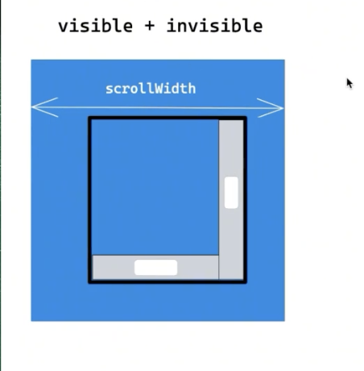

# 获取元素尺寸
## getComputedStyle
  - 直接获取到样式上的宽高
  - 获取的是CSSOM树
  - 除非特殊情况，不推荐获取，因为可能获取不是界面上的尺寸如设置了padding、border、或者弹性布局被压缩拉伸了等
  ```js
    getComputedStyle(dom).width
  ```
## dom.style.width 
  - 获取的是dom树的尺寸
  - 只能获取到行内样式
## 一般使用如下几种
  > 获取的是布局树的尺寸（layout tree）
   - clientWidth/clientHeight 
   
   - offsetWidth/offsetHeight
   
  - scrollWidth/scrollHeight
    
## getBoundingClientRect
  - 获取变换后的尺寸、如经过tranform变换后
  - 返回元素的大小以及相对于浏览器可视窗口的位置
  ```js
   const rect=dom.getBoundingClientRect()
   // rect.width
  ````