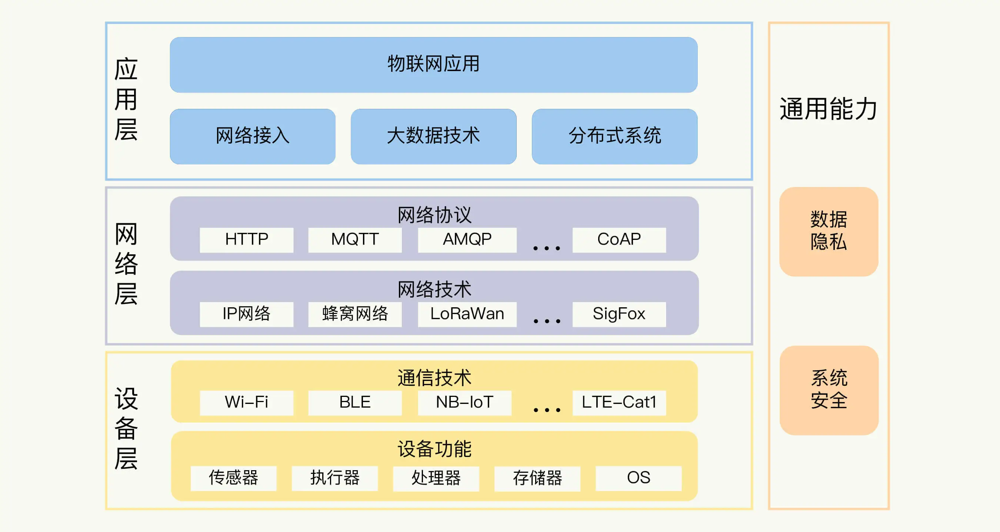
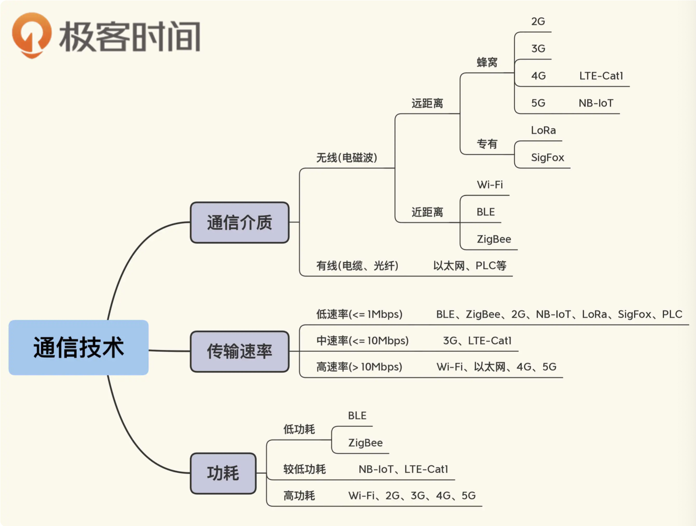
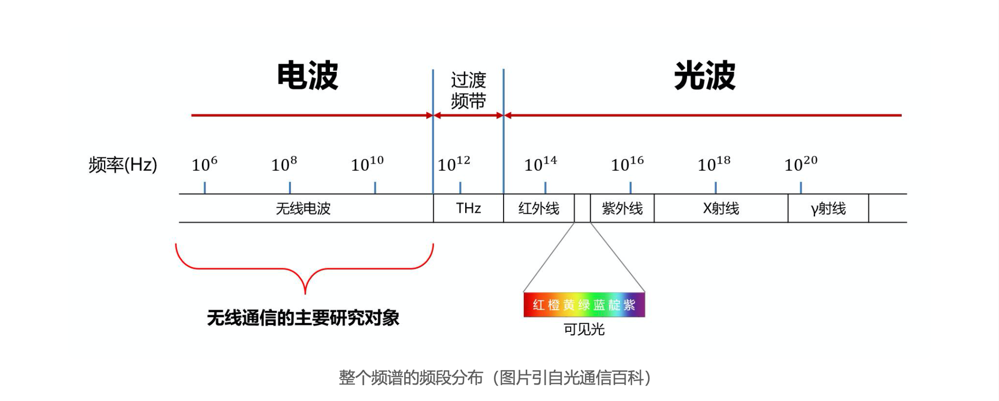
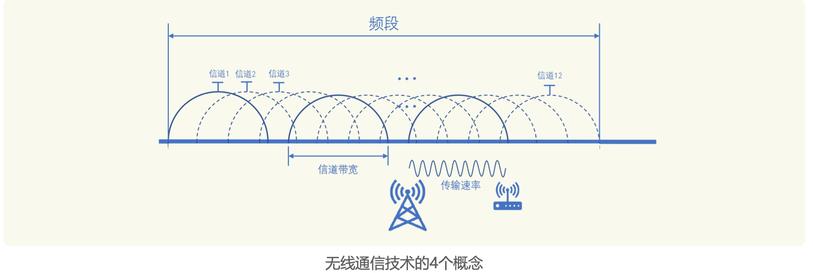
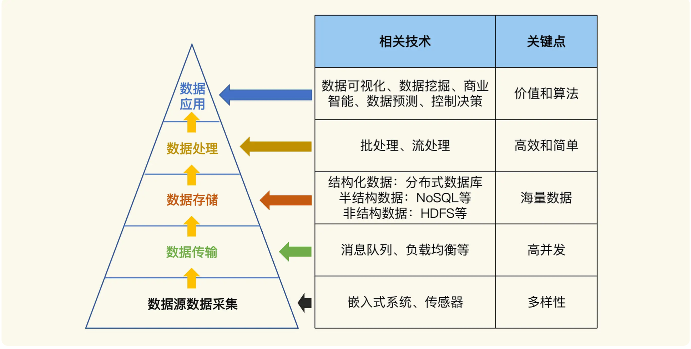

# 物联网
## 物联网体系结构
* 第一是设备层，也就是各种硬件设备。
  - 设备组件有传感器，比如测量温度、湿度、光照强度等参数的设备；也有执行器，比如控制电路通断的继电器、实现物体移动的马达等。
* 第二是网络层，主要关注的是设备与物联网平台的通信协议（Wi-Fi、蓝牙和蜂窝网络）
  - 底层还是 TCP/IP 协议， 在做物联网系统设计的时候，你得搞清楚这些协议的适用场景（HTTP、MQTT 和 AMQP）
* 第三是应用层，也就是实现具体业务逻辑的地方。
  > 物联网系统首先需要处理的就是海量的数据。这又可以分为三个方面：
  - 数据存储，比如 NoSQL 数据库和时序数据库的选择。
  - 数据处理，比如 Spark、Flink 等大数据处理框架的不同特点，批处理和流处理的适用场景等。
  - 数据分析，如各类机器学习算法，甚至 AI 的应用。
* 知识体系图

## 通信技术
### 设备接入网络的方式

### 无线通信重要参数
* 频段
  - 无线通信当然用的是电磁波，在实际应用中，电磁波是按照频段来使用的，频段是指电磁波频率的一个范围，对应到频谱中就像是一段一段切割开
  - 
  - Wi-Fi 的频段是 2.412GHz-2.484GHz。这是一个非授权频段，其他的通信 技术也可以使用。蓝牙技术也基本是这个频率范围。所以 Wi-Fi 路由器和蓝牙耳机、键鼠，在某些情况下会相互干扰。
* 信道
  > 基于信道的跳频技术，可以解决通信干扰
  - 它是信息通过无线电波传送的具体通道介质。每种通信技术的频段会被划分、规划成多个信道来使用。
  - Wi-Fi 的频段被分为 14 个信道(中国可用的是 13 个信道，信道 14 排除在外).注意相邻信道的频段是存在重叠的
* 信道带宽
  - 信道频段的最大值和最小值之差，就是信道覆盖的范围大小，也叫信道带宽
  - 如，Wi-Fi 信 道 1 的带宽是 22MHz，它是由 2.423GHz 减去 2.401GHz 得到的。
  - 需要注意的是，22MHz 是信道 1 的实际带宽，而它的有效带宽只有 20MHz，因为其中有 2MHz 是隔离频带。隔离频带主要是起保护作用的，就像高速公路上的隔离带。
* 传输速率
  - 传输速率 就是我们需要关注的重要指标。它是指数据传输的快慢，单位是比特 / 秒(bit per second， 简记为 bps)。
  - 传输速率受信道带宽和频率的影响。一般来说，带宽越大，传输速率就越大，就像路面越宽可以承载的通行车辆越多一样，频率比较高时，电磁环境相对比较干净、干扰少，传输速率会更高，就像道路更平坦自然可以通行更多车辆一样。
* 
### wifi
> Wi-Fi 是 IEEE 802.11 无线网络标准的商品名。所以，支持 Wi-Fi 功能的设备上，都会标注 “兼容 IEEE 802.11b/g/n 2.4GHz” 之类的说明。其中，802.11b、802.11g、802.11n 就 是 Wi-Fi 的不同版本。版本命名方式当然不够直观，所以 Wi-Fi 联盟从 2018 年开始推进数字版本号，比如， Wi-Fi 5、Wi-Fi 6
* 适宜场景：连接电源线、不需要关心功耗的设备往往优先考虑 Wi-Fi
* [wifi版本对应关系图](./imgs/wifi版本对应关系图.png)
* Wi-Fi的配网:
> 完成这两步之后，设备才可以联网使用。
  - Wi-Fi 设备需要连接上路由器(Wi-Fi 热点或者 AP)实现数据上传和远程控制，即获取到 Wi-Fi 热点的名称(称为 SSID)和密码。
  - 获取到 Wi-Fi 设备的 MAC 地址，或者设备生产时预存的信息，并与用户账号一起上传服务器完成绑定。
### BLE
> 它是 Bluetooth Low Energy 的缩写，也叫低功耗 蓝牙，是对 Bluetooth 4.0 / 4.1 / 4.2 的统称,现在它已经成为低功耗物联网设备的首选，仅依靠一颗纽扣电池供电就可以工作数年。
* BLE 的数据通信主要基于广播包和 GATT 协议
  - 连接参数的调节对于 BLE 设备的扫描和连接等影响很大，参数包括广播间隔、最大连接间隔、最小连接间隔和连接监听时间等
  - 如果扫描连接体验需要非常流畅迅速，你可以选择 20ms 的间隔，但是这会增加设备的功耗， 减少待机时间;如果你能够容忍一定的扫描等待时间，那么可以选择 1-2 秒的广播间隔来降 低功耗。
* 测试兼容性：不同品牌 Android 手机的芯片解决方案往往是不同的，它们的蓝牙协议栈实现也存在很大的差异，要在不同的设备上测试
* 基于 BLE 可以进行地理位置定位，Android 6.0 开始，进行 BLE 开发时需要 请求位置权限
### LTE-Cat1 & NB-IoT
> 2G的替代原则,NB-IoT 模组的价格已经和 2G 模组基本持平;LTE-Cat1 的模组相比要贵一 些，但是也要远低于 4G 模组的价格。
* LTE-Cat1:
  - 有一个独特优势是网络覆盖，它属于 4G 网络的低速类别，可以直接使用我们国家 完善的 4G 的网络设施
  - 带宽是 20MHz，上行速率 5Mbps，下行速率 10Mbps
  - 它适合可穿戴设备、ATM 机、自助售货机和无人机等场景
* NB-IoT
  - 的带宽是 180KHz，上行速率 16.9Kbps，下行速率是 26Kbps，
  - 功耗很低
  - 适合智能抄表、智能灯杆和烟感报警器等低数据速率的场景
### 5g
* uRLLC
  - 应用的场景是无人驾驶、远程手术等，所以强调的是极低时延，而且是稳定的时延和速率
* mMTC
  - 可以支持大规模设备的连接上网，适合智能门锁、烟感传感器、路灯等低速率、低成本、低功耗的物联网设备。
## 网络协议
* 物联网通信的特点
  > 基于以下特点，物联网系统在选择网络通信的协议时，一般采用发布 - 订阅的通信模式。
  - 物联网设备很大可能工作在不可靠、高延迟的网络环境
  - 设备数量多，而且交互非常复杂。
  - 设备经常需要根据实际使用环境做增加、减少等调整。
* 发布订阅模式
  1. 发布者负责生产数据。发布者发送某个主题的数据给经纪人，发布者不知道订阅者。
  2. 订阅者订阅经纪人管理的某个或者某几个主题。
  3. 当经纪人接收到某个主题的数据时，将数据发送给这个主题的所有订阅者。
* MQTT 协议
  > 是 IBM 公司在 1999 年开发的轻量级网络协议，它有三个主要特点:MQTT 协议非常适合计算能力有限、网络 带宽低、信号不稳定的远程设备，所以它成为了物联网系统事实上的网络协议标准
  1. 采用二进制的消息内容编码格式，所以二进制数据、JSON 和图片等负载内容都可以方便传输。
  2. 协议头很紧凑，协议交互也简单，保证了网络传输流量很小。
  3. 支持 3 种 QoS(Quality of Service，服务质量)级别，便于应用根据不同的场景需求灵活选择。
  + 什么是 QoS
    > 指通信双方关于消息传送可靠程度的协商。
    - QoS 0:消息 只发送一次，消息可能丢失;
    - QoS 1:发送方会接收反馈，保证消息的送达，但是可能消息会重复。
    - QoS 2:通过发送方和接收方的多次交互，保证消息有且只有一次。
* AMQP
  > 除了 MQTT 协议以外，也有其他采用发布 - 订阅模式的网络协议，比如 AMQP 协议，在分布式系统中应用广泛的 RabbitMQ 消息中间件软件，就是基于 AMQP 实现的。
  + 特点：
    - AMQP 协议拥有庞大的特性集，比较重，不适合计算资源有限、对功耗要求严苛的物联网设备
    - 它可以满足后台系统对于可靠性和可扩展性的要求
    - AMQP 和 MQTT 一样，也是基于 TCP 协议，采用二进制消息格式，也支持 3 个 QoS 级别
* CoAP
  > 轻量级的请求响应模式的协议，跟 HTTP 协议一样，CoAP 协议同样有 GET、POST、PUT、DELETE 等方法和响应状态码， 同样使用 URI 而不是 Topic 来标识资源。
  - CoAP 的消息采用二进制格式
  - 支持可确认消息和不可确认消息两种 QoS 级别。可确认消息 (Confirmable Message)与 MQTT 协议的 QoS 1 类似，不可确认消息(Non- confirmable Message)对应 MQTT 协议的 QoS 0 级别。
  - CoAP 协议基于的传输层协议是 UDP，对于设备的计算资源要求更低
  - CoAP 协议适合电池供电的传感器设备。一般只需要上传数据，不用随时接收服务器的控制命令
* LwM2M
  > LwM2M 协议定义在 CoAP 协议之上，不过它在消息传输的基础上更进一步。因为它基于 IPSO (IP-base Smart Object)对设备模型进行了标准化，提供了一组轻量级设备管理和交互接口协议。
  - CoAP 协议的应用场景同样适合 LwM2M 协议，如果你希望在 CoAP 协议的基础上更方便地实现设备的管理，可以考虑 LwM2M 协议
* 通信模式的共存
  - MQTT 5.0 中 增加了请求 - 响应模式的新特性
  - AMQP 1.0 版本也定义了请求 - 响应模式
  - 而 CoAP 协议 呢，在新的初稿版本(Draft)中也增加了发布 - 订阅模式特性。
## 数据分析

* 数据采集
  - 依赖传感器
* 数据传输
  - 数据上报到云平台，难点是实现高并发，借助分布式的架构设计，同时使用负载均衡、消息队列和缓存
* 数据存储
  >数据传输完成之后，你要面对问题是海量数据的存储。
  - 结构化数据：比如用户和设备的关系，用户信息、设备参数等，可以采用分布式数据库。
  - 半结构化数据：比如 JSON 结构的数据，日志记录等。这些数据的存储一般采用 NoSQL 数据库产品
  - 非结构化数据：比如视频、音频等数据。它们一般采用文件的形式存储，Hadoop 体系中 应用广泛的分布式文件系统 HDFS 是常用的选项
* 数据处理：
   > 数据处理阶段，非常考验你对海量数据的处理能力，你需要用到大数据计算引擎,从应用场景划分的话，可以分成两个大类:
   - 批处理:对批量的数据进行统一处理的方法
   - 流处理:是对数据流做及时的处理计算,相比批处理，它具有低延时的特点,比如温 度、湿度数据基于高、低阈值的实时判断，就需要采用流处理的方式。
* 数据应用
  > 数据应用处于整个体系的最顶端，是物联网系统的最终目的。我们关注的核心点是通过数据创 造价值，而实现的基础是各种算法。
  - 数据产生价值的方法，概况来说，可以分为 4 种:
    1. 可视化 
    2. 挖掘
    3. 预测
    4. 控制决策
  + 数据分析可以使用的算法:
    - 监督学习算法：明确告诉它“什么是正确的”，“什么是错误 的”，算法有决策树和 SVM(支持向量机)算法等
    - 非监督学习算法：需要自己将数据中的“异常值”区分出来，有 K-means 算法等。K-means 算法是聚类算法
## 芯片架构
* x86
* ARM
* RISC-V
