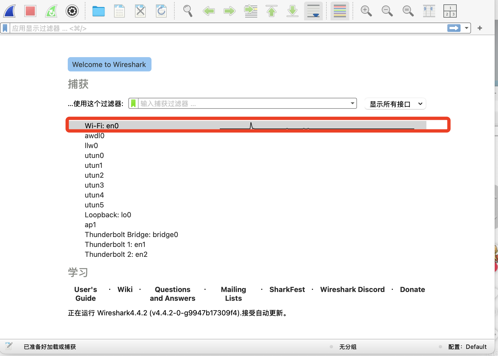

# wireshark

## 安装
* [官网](https://www.wireshark.org/download.html)
* 注意：
  - 安卓抓包选择 andrioddump
  - windows系统选择 Npcap
  
## 使用介绍
* 选择一个需要抓包的网卡，如本机使用的wifi上网选择 WiFi



* 过滤器
  - 显示过滤器：由于捕获到数据包太多，为方便查询调试，需要根据条件进行筛选显示
  - 捕获过滤器：只捕获符合条件的数据包
* 显示过滤器语法：
  ```bash
    # IP 过滤器是最重要的一个
    ip.addr==192.168.1.1  
    # 加上协议
    ip.addr==192.168.1.1 && http  
    # 加上端口
    ip.addr==192.168.1.1 && http && tcp.port==80
  ```
* 捕获过滤器 提前设置好捕获规则，性能要比显示过滤器好
 
