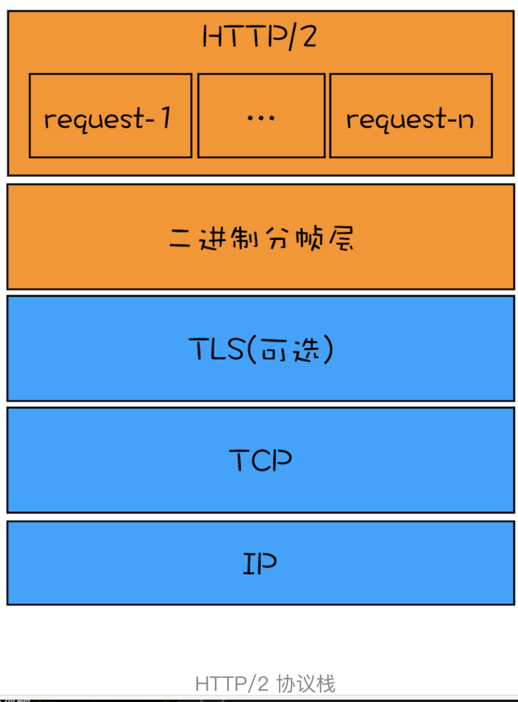

# http
> http 是什么？对 http的认识，有什么特点，优缺点是什么，是如何工作的？
## http详解
* 基本概念
  - http:超文本传输协议，是一个客户端和服务器端请求和应答的标准（TCP），用于从WWW服务器传输超文本到本地浏览器的传输协议
  - DNS 是将域名解析出真实IP地址的系统
  - URI 是统一资源标识符，标定了客户端需要访问的资源所处的位置，如果URI中的主机名使用域名，则需要使用DNS来讲域名解析为IP。
  - URL：统一资源定位符
  - 四层模型：应用层、传输层、网际层、链接层
  - IP 协议主要解决寻址和路由问题
  - ipv4，地址是四个用“.”分隔的数字，总数有 2^32 个，大约42亿个可以分配的地址
  - ipv6，地址是八个用“:”分隔的数字，总数有 2^128 个

  - TCP 协议位于IP协议之上，基于IP协议提供可靠的(数据不丢失)、字节流(数据完整)形式的通信，是 HTTP 协议得以实现的基础
  - SSL/TLS：建立在TCP/IP之上的负责加密通信的安全协议，是可靠的传输协议，可以被用作 HTTP 的下层

* TCP/IP 网络分层模型(从下往上)
  - 链接层（link layer）:在以太网、wifi 底层网络发送原始的数据包，工作在网卡，使用 MAC 地址标记网络上的设备，又叫 mac 层
  - 网际层（Internet layer）:ip 协议处于该层，在链接层的基础上，使用 ip 地址取代 MAC 地址，把各种局域网，广域网，连接成一个巨大的网络，在该网络里，找设备把 ip 地址翻译成 mac 地址就可以了。
  - 传输层（transport layer）：是 tcp 工作的层次，保证数据在 ip 地址标记的两点之间可靠的传输，还有一个 UDP
  - 应用层(application layer): 由于下面三层基础打得好，所以有各种面向具体应用的协议：telnet、ssh、ftp、smtp、http

* osi 分为七层
  - 第一层：物理层，例如电缆、光纤、网卡
  - 第二层:数据链路层，相当于tcp/ip的链接层
  - 第三层：网络层、相当于tcp/ip 的网际层
  - 第四层：传输层、相当于tcp/ip 的传输层

  - 第五层：会话层、维护网络中的连接状态
  - 第六层：表示层、把数据转换为合适可理解的语法何语义
  - 第七层：应用层，面向具体的应用传输数据
  > 后三层相当于 tcp/ip 的应用层

* dns 解析的过程
  1. 检查本地浏览器的dns缓存，操作系统缓存
  2. 查找本地 hosts 文件内是否有对应的固定记录
  3. hosts文件没有，就根据本地网卡被分配的 dns server ip 来解析
  4. 本身 dns server 也会缓存，如果没有缓存失效，就去顶级域名查找比如com 如果没有告诉浏览器，域名解析错误

* http 请求的过程
  1. 浏览器从地址栏的输入中获得服务器的 IP 地址和端口号；
  2. 浏览器用 TCP 的三次握手与服务器建立连接；
  3. 浏览器向服务器发送拼好的报文；
  4. 服务器收到报文后处理请求，同样拼好报文再发给浏览器；
  5. 浏览器解析报文，渲染输出页面。

* 各层传输的单位：统称为数据包
  - mac 帧（frame）
  - ip  包（packet）
  - tcp 段（segment）
  - http 报文（message）

* http 的请求报文组成
  1. 请求行：描述请求响应的基本消息,有三部分组成
    - 请求方法：如GET/POST 表示对资源的操作
    - 请求目标：通常是一个URI 标记了请求方法要操作的资源
    - 版本号：报文使用的HTTP 协议版本
  2. 头部字段结合：key value 的形式更详细的说明报文
  3. 消息正文：实际传输的数据
  > 前两部分合称为请求头或响应头,消息正文被称为 body 

* http method（如何理解请求方法）
  - GET 读取或下载数据
  - POST 写入或上传数据
  - PUT DELETE 分别表示添加资源和删除资源，但是实际上这只是语义上的一种约定

  - HEAD 获取资源的元信息
  - CONNECT  建立特殊的连接隧道
  - OPTIONS 列出可对资源实行的方法
  - TRACE 追踪请求-响应的传输路径

* request header
  - referer 表示请求文件的网址，请求时会携带(设置防盗链)
  - Accept: text/html,application/xml,image/webp,image/png
  - Accept-Encoding: gzip, deflate, br 告诉服务端可接受的数据格式
  - Accept-Language: zh-CN, zh, en
  - Accept-Charset: gbk, utf-8
  
  - Cache-Control 与 Expires 强制缓存的值为 public, max-age=xxx 表示在xxx秒内再次访问该资源，均使用本地的缓存，不再向服务器发起请求
  - Cookie

* Content-Type 表示请求头或响应头的内容类型（一般post会带上）
  - application/json
  - application/x-www-form-urlencoded 原始表单提交
  - multipart/form-data 文件上传

  - text/xml
  - text/html
  - image/png

* http status（常用的）
  + 1xx: 提示信息，表示协议处理的中间状态，需要后续操作
  + 2xx 请求成功，报文收到并被正确处理
    - 201
    - 200 请求成功
  + 3xx 重定向，资源位置发生变动，需要客户端重新发请求
    - 301&302：永久性与临时性跳转。（重要）
    - 304:客户端缓存没更新（重要）
  + 4xx 客户端请求错误
    - 401: 未授权
    - 403: 无权限
    - 404: 请求的页面不存在
  + 5xx 服务端错误
    - 500 服务端错误
    - 503 服务端暂时错误，稍后再试

* http 有哪些特点？
  - 灵活可拓展，可以添加任意头
  - 可靠性强，基于 tcp/ip 协议
  - 对比其他协议，通用性强
  - 无状态
  - 明文传输

* http 连接管理
  - 短连接：早期(0.9/1.0)每次发送请求前要先建立与服务器的连接，收到响应报文立即关闭连接，整个过程很短暂，不会与服务器保持长时间的连接状态，就称为短连接
   缺点：建立连接和关闭连接都是耗时的操作，tcp 建立连接要经历三次握手
  - 长连接:也叫持久连接，或者连接复用是针对短连接的缺点提出的，由于长连接对性能改善比较明显，http1.1默认采用长连接
   缺点：因为 TCP 连接长时间不关闭，服务器必须在内存里保存它的状态，这就占用了服务器的资源。如果有大量的空闲长连接只连不发，就会很快耗尽服务器的资源，所以要适时关闭
  - 对头阻塞：
   因为 HTTP 规定报文必须是“一发一收”，这就形成了一个先进先出的“串行”队列。队列里的请求没有轻重缓急的优先级，只有入队的先后顺序，排在最前面的请求被最优先处理。如果队首的请求因为处理的太慢耽误了时间，那么队列里后面的所有请求也不得不跟着一起等待，可以使用并发连接和域名分片技术缓解

* Cookie
  - cookie 就是服务器委托浏览器存储在客户端里的一些数据
  - 响应报文使用 Set-Cookie 字段发送“key=value”形式的 Cookie 值；
  - 请求报文里用 Cookie 字段发送多个 Cookie 值；
  - Cookie 最基本的用途是身份识别，实现有状态的会话事务。  
  + 常见的属性
    - Expires 俗称“过期时间”，用的是绝对时间点，可以理解为“截止日期”（deadline）。
    - Max-Age 用的是相对时间，单位是秒，收到报文的时间点加上 Max-Age，就得到失效的绝对时间。
    > 不指定 Expires 或 Max-Age 属性,只会在浏览器运行时有效，关闭就失效了，称为会话 cookie 在 chrome 中过期时间会显示“Session”或“N/A”
    - Expires 和 Max-Age 可同时出现，两者失效时间可以一致，也可以不一致，浏览器优先用 Max-Age 计算失效期。
    - HttpOnly 此 Cookie 只能通过浏览器 HTTP 协议传输，禁止其他方式访问，浏览器的 JS 引擎就会禁用 document.cookie 等一切相关的 API
    - Secure 表示这个 Cookie 仅能用 HTTPS 协议加密传输

* 缓存控制（cache-control）：如 web 静态站点的缓存配置（两种都设置，以强制缓存为主）
  + 强制缓存 Cache-Control:max-age=3000,public
    - max-age=3000 表示 3000 秒内再次访问该资源，均使用本地的缓存，不再向服务器发起请求
    - public 允许代理服务器缓存
    - private 禁止代理服务器缓存,只能浏览器缓存
    - no-store：不允许缓存，用于某些变化非常频繁的数据，例如秒杀页面
    - no-cache：可以缓存，使用之前必须要去服务器验证是否过期，是否有最新的版本
    ```js
        // 静态资源强缓存
        app.use(express.statice('./static',{
            maxAge:1000*60*5,
            lastModified:true;
        }))

        // 动态资源接口
        // 强缓存
        app.get('/api',(req,res)=>{
            res.setHeader('Cache-Control','max-age=3000,public')
            res.send()
        })
    ```

  + 协商缓存
    > 第一种缓存在 3000 秒内有更新，则客户端还是老的资源，不符合我们的需求
    - Etag 它是被请求资源的 hash 值，一旦被请求的资源在服务端发生了改变，这个值也会跟着变化
    - Last-Modified 被请求资源的最后修改时间，精确到秒
    ```js
        import express from 'express'
        import cors from 'cors'
        import fs from 'node:fs'
        import crypto from 'node:crypto'
        const getFileHash = () => {
            return crypto.createHash('sha256').update(fs.readFileSync('index.js')).digest('hex')
        }
        const getModifyTime = () => {
            return fs.statSync('./index.js').mtime.toISOString() //获取文件最后修改时间
        }
        const app = express()
        app.use(cors())
        app.get('/api', (req, res) => {
            // 协商缓存-Last-Modified
            res.setHeader('Cache-Control', 'no-cache, max-age=2592000') // 表示走协商缓存
            const ifModifiedSince = req.headers['if-modified-since']    // 获取浏览器上次修改时间
            res.setHeader('Last-Modified', getModifyTime())
            if (ifModifiedSince && ifModifiedSince === getModifyTime()) {
                console.log('304')
                res.statusCode = 304
                res.end()
                return
            } else {
                console.log('200')
                res.end('value')
            }

            // 协商缓存-ETag
            const etag = getFileHash()
            const ifNoneMatch = req.headers['if-none-match']
            if(ifNoneMatch === etag) {
                res.sendStatus(304)
                return
            }
            res.setHeader('ETag', etag)
            res.send('Etag')

        })


        app.listen(3000, () => {
            console.log('Example app listening on port 3000!')
        })
    ```

  + Last-Modified、Etag 区别？
    - Etag 主要为了解决 Last-Modified 无法解决的一些问题,一些文件也许会周期性的更改，但是他的内容并不改变(仅仅改变的修改时间)，这个时候我们并不希望客户端认为这个文件 修改了，而重新GET;
    
* 代理服务(代理能干什么，有什么好处？)
  + 负载均衡
    - 面向客户端时屏蔽了源服务器，客户端看到的只是代理服务器，源服务器究竟有多少台、是哪些 IP 地址都不知道。于是代理服务器就可以掌握请求分发的“大权”，决定由后面的哪台服务器来响应请求

  - 健康检查： 使用“心跳”等机制监控后端服务器，发现有故障就及时“踢出”集群，保证服务高可用
  - 安全防护：保护被代理的后端服务器，限制 IP 地址或流量，抵御网络攻击和过载
  - 加密卸载：对外网使用 SSL/TLS 加密通信认证，而在安全的内网不加密，消除加解密成本
  - 数据过滤：拦截上下行的数据，任意指定策略修改请求或者响应
  - 内容缓存：暂存、复用服务器响应
  + 代理相关头字段
    - Via 是一个通用字段，解决了客户端和源服务器判断是否存在代理的问题
    - X-Forwarded-For 字面意思是“为谁而转发”，形式上和“Via”差不多，每经过一个代理节点追加的是请求方的 IP 地址，via 追加的是域名或者代理主机名
    - X-Real-IP 是另一种获取客户端真实 IP 的手段，记录客户端 IP 地址，没有中间的代理信息，相当于是“X-Forwarded-For”的简化版。如果客户端和源服务器之间只有一个代理，那么这两个字段的值就是相同的。

## HTTPS
* https:相当于 HTTP+SSL/TLS，为 HTTP 套了一个安全的外壳
* ssl/tls 发展历程:
  - ssl3.0后叫 TLS 目前应用的最广泛的 TLS 是 1.2，
  - 之前的协议（TLS1.1/1.0、SSLv3/v2）都已经被认为是不安全的,
  - 2018年发布1.3
* ssl/tls 是如何给 http 加密的？
  > 通信安全必须同时具备 机密性、完整性、身份认证和不可否认这四个特性
  + 机密性：
    - 实现机密的手段是加密,就是把消息用某种方式转换成谁也看不懂的乱码，只有“钥匙”的人才能再转换出原始文本,钥匙”就叫做“密钥”（key）
    - 加密前的消息叫“明文”（plain text/clear text）, 加密后的乱码叫“密文”（cipher text）,使用密钥还原明文的过程叫“解密”（decrypt）加密解密的操作过程就是“加密算法”
    - 对称：加密和解密时使用的密钥都是同一个，是“对称”的，目前常用的只有 AES 和 ChaCha20。
    - [非对称](./加密/非对称加密原理.png),一般应用中通常采用混合加密解决性能问题
  + 完整性
    - 实现完整性的手段主要是摘要算法（Digest Algorithm），也就是常说的散列函数、哈希函数（Hash Function）
    - 目前 TLS 推荐使用的是 SHA-1 的后继者：SHA-2。
    - SHA-2 实际上是一系列摘要算法的统称，总共有 6 种，常用的有 SHA224、SHA256、SHA384，分别能够生成 28 字节、32 字节、48 字节的摘要。
  + 身份认证
    - 数字证书和CA
  + 不可否认
* OpenSSL
  > 开源密码学程序库和工具包，几乎支持所有公开的加密算法和协议，已经成为了事实上的标准，许多应用软件都会使用它作为底层库来实现 TLS 功能，包括常用的 Web 服务器 Apache、Nginx 
* 区别:
  + 底层传输协议不同：
    - http 依赖 tcp/ip 信息是明文传输
    - https 依赖 ssl、tls 安全的传输协议
  + https 协议需要 ca 证书
  + 默认端口也不同
    - http协议的端口为 80
    - https的端口为 443
* https协议的工作原理
  - 客户使用 https url访问服务器，则要求 web 服务器建立ssl链接。
  - web 服务器接收到客户端的请求之后，会将网站的证书（证书中包含了公钥），返回或者说传输给客户端。
  - 客户端和web服务器端开始协商SSL链接的安全等级，也就是加密等级。
  - 客户端浏览器通过双方协商一致的安全等级，建立会话密钥，然后通过网站的公钥来加密会话密钥，并传送给网站。
  - web服务器通过自己的私钥解密出会话密钥。
  - web服务器通过会话密钥加密与客户端之间的通信。

## http2
* HTTP/1.1 的主要问题？
  > HTTP/1.1对带宽的利用率并不理想，这也是 HTTP/1.1 的一个核心问题，主要是由以下三个原因导致的。
  1. 第一个原因，TCP 的慢启动。 
     - 一旦一个 TCP 连接建立之后，就进入了发送数据状态，刚开始 TCP 协议会采用一个非常慢的速度去发送数据，然后慢慢加快发送数据的速度，直到发送数据的速度达到一个理想状态，我们把这个过程称为慢启动。慢启动是 TCP 为了减少网络拥塞的一种策略，我们是没有办法改变的
  2. 第二个原因，同时开启了多条 TCP 连接，当带宽不足时，那么这些连接会竞争固定的带宽。
  3. 第三个原因，HTTP/1.1 队头阻塞的问题
    - 在 HTTP/1.1 中使用持久连接时，虽然能公用一个 TCP 管道，但是在一个管道中同一时刻只能处理一个请求，在当前的请求没有结束之前，其他的请求只能处于阻塞状态。这意味着我们不能随意在一个管道中发送请求和接收内容。
* HTTP/2：如何提升网络速度(如何解决HTTP/1.1的问题)？
  > 总结起来就一句话 一个域名只使用一个 TCP 长连接和消除队头阻塞问题
  1. 二进制协议（Binary Protocol）
    - HTTP/2 使用二进制格式来传输数据，而 HTTP/1.x 使用文本格式。二进制协议更加高效，能够更好地进行解析和传输。
  2. 多路复用（Multiplexing）
    - HTTP/2 允许多个请求和响应在同一个Tcp连接上同时进行，而不会相互阻塞。这解决了 HTTP/1.x 中的“队头阻塞”（Head-of-Line Blocking）问题。只需要一次Tcp慢启动，同时也避免了多个 TCP 连接竞争带宽所带来的问题
    - 在 HTTP/1.x 中，每个请求需要等待前一个请求的响应完成，才能发送下一个请求。而 HTTP/2 通过 流（Stream） 的概念，让请求和响应可以同时并行进行，避免了这种延迟。HTTP/2 添加了一个二进制分帧层 如下图,请求和响应数据经过二进制分帧层后会，被转换为一个个带有请求 ID 编号的帧。这些数据帧按照次序组装起来就是 HTTP/1 里的请求报文和响应报文。“流”的层面上看，消息是一些有序的“帧”序列，而在“连接”的层面看，消息却是乱序收发的“帧”。多个请求 / 响应之间没有了顺序关系，不需要排队等待，降低延迟，大幅度提高了连接的利用率。
    
  3. 头部压缩：HTTP/2 引入了 HPACK 压缩算法来压缩 HTTP 头部。这可以显著减少传输头部数据的大小，尤其是在客户端和服务器之间有多个重复请求时。
  4. 单一连接（Single Connection）
    - 在 HTTP/1.x 中，每个请求/响应都需要一个独立的 TCP 连接（或者长时间保持一个连接）。而 HTTP/2 使用 单一的持久连接 来传输所有的请求和响应。这减少了 TCP 连接的开销，特别是在高延迟网络中，减少了连接建立和拆除的时间。
* 基于二进制分帧层，HTTP/2 还附带实现了很多其他功能
  - HTTP/2 允许客户端指定请求的优先级，以帮助服务器在多个请求中优先处理重要的请求。
  - 服务器推送：如下场景，当用户请求一个 HTML 页面之后，服务器知道该 HTML 页面会引用几个重要的 JavaScript 文件和 CSS 文件，那么在接收到 HTML 请求之后，附带将要使用的 CSS 文件和 JavaScript 文件一并发送给浏览器，这样当浏览器解析完 HTML 文件之后，就能直接拿到需要的 CSS 文件和 JavaScript 文件，这对首次打开页面的速度起到了至关重要的作用。

## http3
> HTTP/3 基于 QUIC 协议，完全解决了 Tcp“队头阻塞”问题，弱网环境下的表现会优于 HTTP/2；
* 前http版本的缺点
  - TCP 上的队头阻塞：在 TCP 传输过程中，由于单个数据包的丢失而造成的阻塞称为 TCP 上的队头阻塞。
  - TCP 建立连接的延时，网络延迟又称为 RTT（Round Trip Time），在建立 TCP 连接的时候，需要和服务器进行三次握手来确认连接成功，也就是说需要在消耗完 1.5 个 RTT 之后才能进行数据传输
  - 进行 TLS 连接，TLS 有两个版本——TLS1.2 和 TLS1.3，每个版本建立连接所花的时间不同，大致是需要 1～2 个 RTT

* 优点
  - QUIC 是一个新的传输层协议，建立在 UDP 之上，它提供了数据包重传、拥塞控制以及其他一些 TCP 中存在的特性。实现了可靠传输
  - 实现了 HTTP/2 中的多路复用功能,和 TCP 不同，QUIC 实现了在同一物理连接上可以有多个独立的逻辑数据流,实现了数据流的单独传输
  - QUIC 内含了 TLS1.3，只能加密通信，支持 0-RTT 快速建连；