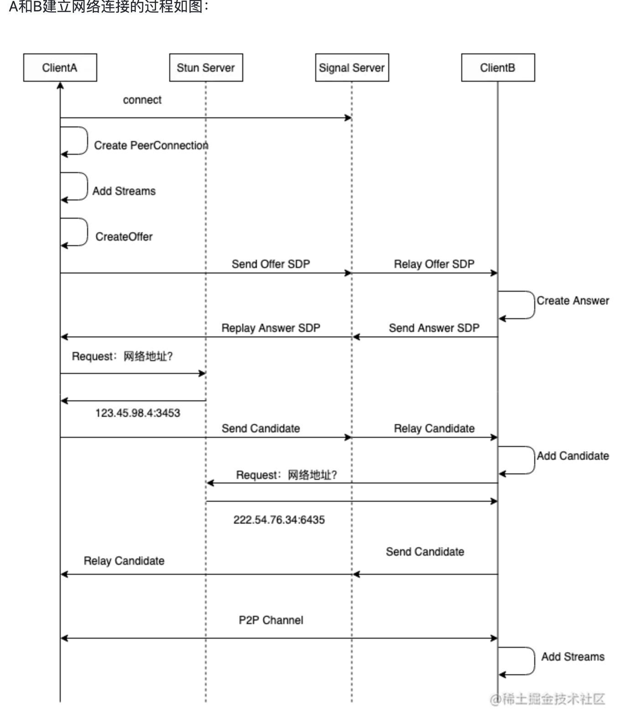
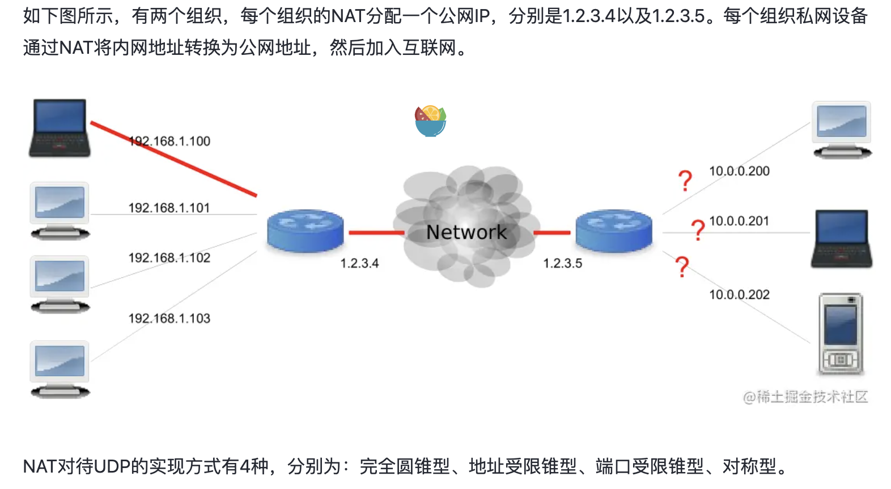
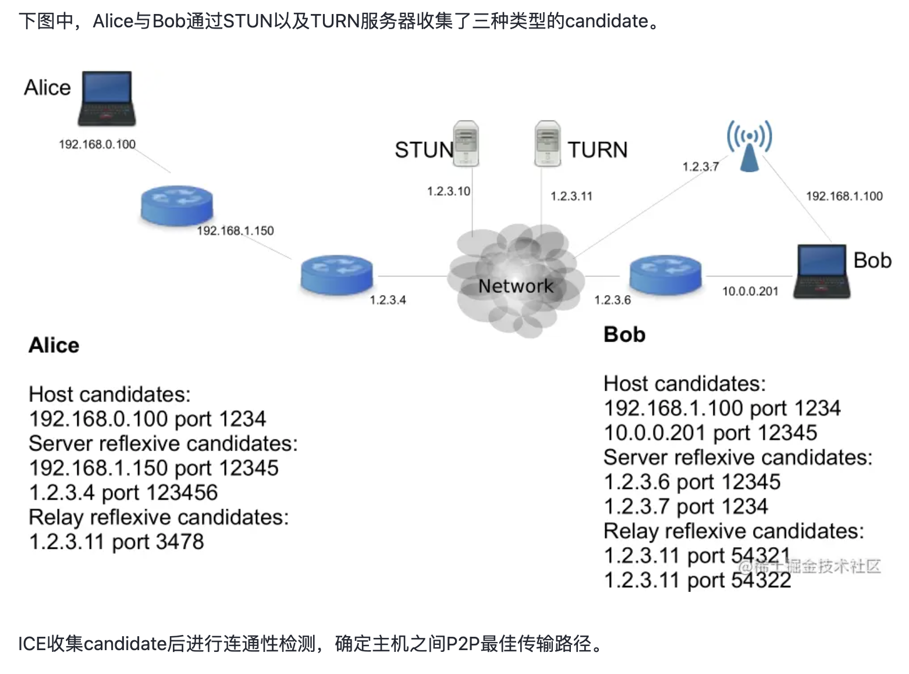

# webRTC

## 组成
* getUserMedia 获取桌面上捕获的多媒体数据（视频、音频）
* RTCPeerConnection 建立 P2P连接，传输多媒体数据
* RTCDataChannel 传输数据
## 捕获音视频(getUserMedia)
  ```js
    function handleStream (stream) {
        const video = document.querySelector('#video')
        video.srcObject = stream
        video.onloadedmetadata = (e) => video.play()
    }

    function handleError (e) {
        console.log(e)
    }
     
    async function getUserMedia(sourceId){
       try {
            const stream = await navigator.mediaDevices.getUserMedia({
                audio: false,
                // audio: {
                //     mandatory: {
                //         chromeMediaSource: 'desktop'
                //     }
                // },
                video: {
                    mandatory: {
                        chromeMediaSource: 'desktop',
                        // 获取整个桌面不要传
                        // chromeMediaSourceId: sourceId,
                        
                        width: 1280,  // 视频的宽度
                        height: 720,  // 视频高度
                        // facingMode:   // 镜像模式
                        // resizeMode    // 大小模式
                        // aspectRatio:	比例

                        // frameRate:{ max:30 } // 帧率
                        // frameRate:15, 

                        // facingMode: 'enviroment', // 设置为后置摄像头 

                    }
                }
            })
            handleStream(stream)
        } catch (e) {
            handleError(e)
        }

    }
  ```
## 建立 P2P 连接(RTCPeerConnection)
> RTCPeerConnection 是 WebRTC 实现网络连接、媒体管理、数据管理的统一接口。建立P2P连接需要用到 RTCPeerConnection 中的几个重要类：SDP、ICE、STUN/TURN。
* SDP:会话描述信息 RTCSessionDescription
  - SDP是各端的能力，包括音频编解码器类型、传输协议等。这些信息是建立连接是必须传递的，双方知道视频是否支持音频、编码方式是什么，都能通过SDP获得。
  - SDP 描述分为两部分，分别是会话级别的描述（session level）和媒体级别的描述（media level）
    ```ini
        Session description（会话级别描述） 
        v= (protocol version) 
        o= (originator and session identifier)
        s= (session name) 
        c=* (connection information -- not required if included in all media) One or more Time descriptions ("t=" and "r=" lines; see below) 
        a=* (zero or more session attribute lines) Zero or more Media descriptions 
        
        Time description 
            t= (time the session is active) 

        Media description（媒体级别描述）, if present 
            m= (media name and transport address) 
            c=* (connection information -- optional if included at session level) 
            a=* (zero or more media attribute lines)

            alert(pc.remoteDescription.sdp);

        # 具体的案例
        v=0
        o=alice 2890844526 2890844526 IN IP4 host.anywhere.com
        s=
        c=IN IP4 host.anywhere.com
        t=0 0

        // 下面的媒体描述，在媒体描述部分包括音频和视频两路媒体
        m=audio 49170 RTP/AVP 0
        a=fmtp:111 minptime=10;useinbandfec=1 // 对格式参数的描述
        a=rtpmap:0 PCMU/8000 // 对RTP数据的描述
        
        ... 
        // 上面是音频媒体描述，下面是视频媒体描述
        m=video 51372 RTP/AVP 31
        a=rtpmap:31 H261/90000
        ... 
        m=video 53000 RTP/AVP 32
        a=rtpmap:32 MPV/90000


    ```
* 通常需要经历以下步骤：
  1. 获取用户媒体设备权限,使用 getUserMedia() 方法来请求用户的媒体设备权限。
  2. 创建 RTCPeerConnection 对象
    - 每个端点都要创建一个 RTCPeerConnection 对象，用于管理连接、发送和接收媒体数据。
    ```js
        const pc = new RTCPeerConnection(configuration);
    ```
  3. 添加本地流到连接
    - 通过 getUserMedia() 获取本地媒体流，并将其添加到 RTCPeerConnection 对象中。
    ```js
        navigator.mediaDevices.getUserMedia({ video: true, audio: true })
        .then(stream => {
            stream.getTracks().forEach(track => pc.addTrack(track, stream));
        });
    ```
  4. 创建和交换 SDP（Session Description Protocol）
    - 每个对等方都会创建一个 Session Description（SDP），包含本地媒体信息等，并通过信令服务器进行交换。
    ```js
        const pcConfig = {
            // 这里使用了几个公共的stun协议服务器
           'iceServers': [{ 'url': 'stun:stun.services.mozilla.com' }, { 'url': 'stun:stunserver.org' }, { 'url': 'stun:stun.l.google.com:19302' }]
        };
        pc = new RTCPeerConnection(pcConfig);


        // API：pc.createOffer
        // 参数：无
        // 返回：SDP Offer

        // API：pc. setLocalDescription
        // 参数：offer
        // 返回：Promise<null>

        function sendMessage(roomid, data) {
            if (!socket) {
                console.log("socket is null");
            }
            socket.emit("message", roomid, data);
        }

        const offer = await pc.createOffer()
        await pc.setLocalDescription(offer).catch(handleOfferError);
        message.log(`传输发起方本地SDP`);
        sendMessage(roomid, offer);

    ```
  5. 建立 ICE 候选
    - WebRTC点对点连接最方便的方法是双方 IP 直连，但是在实际的应用中，双方会隔着 NAT 设备给获取地址造成了麻烦。
    - 使用 ICE（Interactive Connectivity Establishment）框架来收集网络信息，找到最佳的连接路径。为开发者者屏蔽了复杂的技术细节
    - 原理：两个节点交换 ICE 候选来协商他们自己具体如何连接，一旦两端同意了一个互相兼容的候选，该候选的 SDP 就被用来创建并打开一个连接，通过该连接媒体流就开始运转。
    + 两个 api: onicecandidate、addIceCandidate
      - A端 pc.setLocalDescription(offer)创建后，一个 icecandidate 事件就被发送到 RTCPeerConnection，onicecandidate 事件会被触发。B端接收到一个从远端页面通过信令发来的新的 ICE 候选地址信息，本机可以通过调用RTCPeerConnection.addIceCandidate() 来添加一个ICE代理。
      ```js
        // A端
        pc.onicecandidate = (event) => {
            if (!event.candidate) return;
            // 通过信令服务发给b端
            sendMessage(roomid, {
                type: "candidate",
                label: event.candidate.sdpMLineIndex,
                id: event.candidate.sdpMid,
                candidate: event.candidate.candidate,
            });
        };

        // B端
        socket.onmessage = e => {
            if (e.data.hasOwnProperty("type") && e.data.type === "candidate") {
                var candidate = new RTCIceCandidate({
                    sdpMLineIndex: data.label,
                    candidate: data.candidate,
                });
                // 添加一个ICE代理。
                pc.addIceCandidate(candidate)
                    .then(() => {
                        console.log("Successed to add ice candidate");
                    })
                    .catch((err) => {
                        console.error(err);
                    });
                }
            }

      ```
      - A 作为呼叫方获取本地媒体流，调用 addtrack 方法将音视频流流加入 RTCPeerConnection 对象中传输给另一端，加入时另一端触发 ontrack 事件。
      ```js
        // 媒体流加入媒体轨道
        // API：stream.getTracks
        // 参数：无
        // 返回：媒体轨道对象数组

        const pc = new RTCPeerConnection();
        stream.getTracks().forEach((track) => {
            pc.addTrack(track, stream); 
        });

        const remoteVideo = document.querySelector("#remote-video");
        pc.ontrack = (e) => {
            if (e && e.streams) {
                message.log("收到对方音频/视频流数据...");
                remoteVideo.srcObject = e.streams[0];
            }
        };

      ```
      - B 作为呼叫方，从信令服务器收到A发过来的会话信息，调用 setRemoteDescription 方法将提案传递到 ICE 层，调用 addTrack 方法加入 RTCPeerConnction
      - B 调用 createAnswer 方法创建应答，调用 setLocalDeacription 方法应答设置为本地会话并传递给ICE层。
      ```js
        socket.onmessage = e => {
            message.log("接收到发送方SDP");
            await pc.setRemoteDescription(new RTCSessionDescription(e.data));
            message.log("创建接收方（应答）SDP");
            const answer = await pc.createAnswer();
            message.log(`传输接收方（应答）SDP`);
            sendMessage(roomid, answer);
            await pc.setLocalDescription(answer);
        }

      ```
      - AB 都有了自己和对方的 SDP，媒体交换方面达成一致，收集的ICE完成连通性检测建立最连接方式，P2P连接建立，获得对方的音视频媒体
      流。
      ```js
        pc.ontrack = (e) => {
            if (e && e.streams) {
                message.log("收到对方音频/视频流数据...");
                remoteVideo.srcObject = e.streams[0];
            }
        };

      ```

  6. 建立信令服务器
    - WebRTC 的 SDP 和 ICE 信息需要依赖信令服务器进行消息传输与交换、建立P2P连接，之后才能进行音视频通话、传输文本信息。
    - 通常使用 socket.io 实时通信的能力来构建信令服务器。socket.io 跨平台、跨终端、跨语言，方便我们在各个端上去实现信令的各个端，去与我们的服务端进行连接。
* p2p建立连接过程
  
  + 通话建立流程简单描述
    - A、B 都连接信令服务器（ws）；
    - A 创建本地视频，并获取会话描述对象（offer sdp）信息；
    - A 将 offer sdp 通过 ws 发送给 B；
    - B 收到信令后，B 创建本地视频，并获取会话描述对象（answer sdp）信息；
    - B 将 answer sdp 通过 ws 发送给 A；
    - A 和 B 开始打洞，收集并通过 ws 交换 ice 信息；
    - 完成打洞后，A 和 B 开始为安全的媒体通信协商秘钥；
    - 至此， A 和 B 可以进行音视频通话。
## webRTC 原理
  - 由于网络环境复杂，两点之间建立连接可能会不成功，这时需要公网服务器上的 sturn/turn服务器协助建立连接。具体的过程是通过 sturn/turn 可以获得两个设备映射在公网上的ip和端口号，然后通过信令服务器告知双方。这个过程叫 p2p 打洞。Coturn 是一个实现 sturn/turn 协议的开源服务器

  涉及到信令服务器用于协调连接的建立和 SDP 交换。在实际应用中，还需要考虑 NAT 穿透
## 传输数据 (RTCDataChannel)
* RTCDataChannelton 通过 RTCPeerConnection API可以建立点对点 P2P 互联，不需要中介服务器，延迟更低。
    ```js
        // API：pc.createDataChannel
        // 参数： label  通道名
            // options?  通道参数
        // 返回：RTCDataChannel

        function receivemsg(e) {
            var msg = e.data;
            if (msg) {
                message.log("-> " + msg + "\r\n");
            } else {
                console.error("received msg is null");
            }
        }

        const dc = pc.createDataChannel("chat");
        dc.onmessage = receivemsg;
        dc.onopen = function () {
            console.log("datachannel open");
        };

        dc.onclose = function () {
            console.log("datachannel close");
        };

        pc.ondatachannel = e => {
            if(!dc){
                dc = e.channel;
                dc.onmessage = receivemsg;
                dc.onopen = dataChannelStateChange;
                dc.opclose = dataChannelStateChange;
            }
        }; // 当对接创建数据通道时会回调该方法。

    ```
## NAT及ICE框架
> ICE 集成了多种 NAT 穿越技术，比如 STUN、TURN，可以实现 NAT 穿透，在主机之间发现 P2P 传输路径机制。
* 网络地址转换（ NAT）
  - NAT常部署在一个组织的网络出口位置。网络分为私网和公网两个部分，NAT 网关设置在私网到公网的路由出口位置，私网与公网间的双向数据必须都要经过NAT网关。组织内部的大量设备，通过 NAT 就可以共享一个公网IP地址，解决了 IPv4 地址不足的问题。

* STUN:Session Traversal Utilities for NAT 
  - STUN 允许位于 NAT（或多重NAT）后的客户端找出自己的公网地址，查出自己位于哪种类型的 NAT 之后以及 NAT 为某一个本地端口所绑定的公网端端口。
* TURN: traversal Using Relay NAT
  - TURN是一种数据传输协议。允许通过TCP或UDP方式穿透NAT或防火墙。TURN是一个Client/Server协议。TURN 的NAT穿透方法与STUN 类似，都是通过取得应用层中的公网地址达到NAT穿透
* ICE收集
  + ICE两端并不知道所处的网络的位置和NAT类型，通过ICE能够动态的发现最优的传输路径。ICE端收集本地地址、通过STUN服务收集NAT外网地址、通过TURN收集中继地址，所以会有三种候选地址：
    - host 类型，即本机内网的 IP 和端口；
    - srflx 类型, 即本机 NAT 映射后的外网的 IP 和端口；
    - relay 类型，即中继服务器的 IP 和端口。
    ```yaml
    { 
        IP: xxx.xxx.xxx.xxx, 
        port: number, 
        type: host/srflx/relay, 
        priority: number, 
        protocol: UDP/TCP, 
        usernameFragment: string 
        ...
    }
    ```
  - 