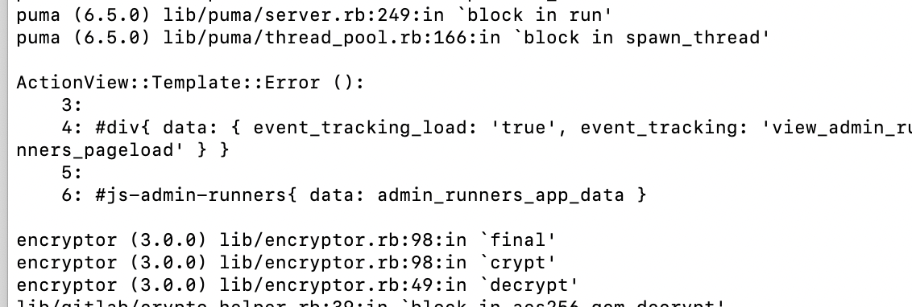

# 自建 Git 服务（GitLab）

## 版本
> 推荐使用清华镜像下载Gitlab-community edition
* 社区版 Gitlab-ce 免费
* 企业版 GitLab-ee 收费 

## 环境要求
* CPU：2 核以上
* 内存：4GB+（GitLab 官方推荐至少 4GB，实际建议 8GB+）
* 存储：50GB+（根据项目规模调整）
* 操作系统：Ubuntu/CentOS 等主流 Linux 发行版
* 端口开放
  - 80/HTTP 或 443/HTTPS（Web 访问）
  - 22/SSH（Git 克隆/推送）

## 服务器安装 GitLab 
  ```bash
    # 安装依赖
    # Ubuntu/Debian postfix是邮件服务
    sudo apt install -y curl openssh-server ca-certificates postfix
    # CentOS/RHEL
    sudo yum install -y curl openssh-server postfix
    sudo systemctl enable sshd postfix
    sudo systemctl start sshd postfix

    # 镜像参考 https://mirror.tuna.tsinghua.edu.cn/help/gitlab-ce/

    # 官方脚本安装
    # Ubuntu/Debian
    curl https://packages.gitlab.com/install/repositories/gitlab/gitlab-ce/script.deb.sh | sudo bash
    sudo apt install gitlab-ce

    # CentOS/RHEL
    # 新建 /etc/yum.repos.d/gitlab-ce.repo，内容为以下

    # [gitlab-ce]
    # name=Gitlab CE Repository
    # baseurl=https://mirrors.tuna.tsinghua.edu.cn/gitlab-ce/yum/el$releasever/
    # gpgcheck=0
    # enabled=1

    yum makecache
    yum install gitlab-ce

  ```

## 离线安装：手动下载安装包
* 访问 GitLab CE 下载页面，选择对应系统的安装包。
* 上传到服务器，执行安装：
  ```bash
    # Ubuntu/Debian
    sudo dpkg -i gitlab-ce-<version>.deb

    # CentOS/RHEL
    sudo rpm -i gitlab-ce-<version>.rpm

    # yum 会解决依赖关系(推荐)
    yum localinstall *.rpm
  ```

## docker 安装部署
1. mac|windows 安装 Docker Desktop 安装后启动,服务器使用命令行安装
2. 拉取 GitLab CE 镜像
  ```bash
    docker pull gitlab/gitlab-ce:latest
  ```
3. 运行 GitLab 容器（按需调整参数）
  ```bash
      # --restart always: 容器随 Docker 自动重启
      # -p 2222:22 避免影响本地的 ssh 的端口,gitlab 配置也要改

      # 创建专用数据卷,绕过文件系统同步开销，提升性能
      docker volume create gitlab_config
      docker volume create gitlab_logs
      docker volume create gitlab_data

      docker run \
       -d \
       --name gitlab \
       --restart always \
       --cpus 2 \
       --memory 8g \
       -p 443:443 \
       -p 80:80 \
       -p 2222:22 \
       -v gitlab_config:/etc/gitlab:delegated \
       -v gitlab_logs:/var/log/gitlab:delegated \
       -v gitlab_data:/var/opt/gitlab:delegated \
       -e GITLAB_OMNIBUS_CONFIG="
        gitlab_rails['gitlab_shell_ssh_port'] = 2222;
        prometheus_monitoring['enable'] = false;
        sidekiq['max_concurrency'] = 10;
        logging['logrotate_frequency'] = 'daily';
        logging['logrotate_size'] = '100M';
       " \
       gitlab/gitlab-ce:latest

       docker logs -f gitlab  # 查看安装日志，当看到 GitLab Shell self-check successful 表示启动成功
  ```

## docker compose 安装部署
  - 如未安装先安装 docker compose
  - 本机环境：mac 16g内存 2.6 GHz 六核Intel Core i7
  ```bash

    # 在项目根目录下创建一个 docker-compose.yml 配置文件，在当前目录下运行
    docker compose down	      # 停止并删除所有容器、网络（-v 同时删除卷）
    docker compose up -d      # 根据 docker-compose.yml 文件 创建镜像启动服务

    # 查看实时日志
    docker compose logs -f gitlab

    # 版本升级，修改 Compose 文件中的镜像版本
    # 如：image: gitlab/gitlab-ce:16.0.0-ce.0

    docker compose up -d --force-recreate     # 重新部署

    docker exec -it gitlab /bin/bash

    docker exec gitlab gitlab-ctl status  # 查看服务状态

    docker exec -it gitlab gitlab-ctl show-config      # 查看最终的配置

    docker stats gitlab      # 查看容器资源使用

    curl -I http://localhost:8090  # 在容器内测试

  ```

## 配置 GitLab
  - 编辑配置文件 /etc/gitlab/gitlab.rb
  ```ruby
    # 设置内网访问地址（HTTP/HTTPS）
    external_url 'http://192.168.1.100'  # 或 'https://192.168.1.100'（需配置 SSL）

    # 服务器资源少， 把下面3个取消注释，工作进程减少，最低为2 降低cpu使用率
    puma['worker_processes'] = 2
    puma['min_threads'] = 2
    puma['max_threads'] = 2

    # 关闭 Prometheus 监控（可选）
    prometheus_monitoring['enable'] = false
    # 禁用不必要的服务（如 Mattermost）
    mattermost['enable'] = false
  ```
  - 配置生效的方式
  ```bash
    # 方式一：通过 GITLAB_OMNIBUS_CONFIG 环境变量修改，更新容器配置
    docker-compose down  # 停止并删除旧容器
    docker-compose up -d # 重新创建容器（自动应用新配置）

    # 方式二：直接修改宿主机上的 gitlab.rb 文件（通过 Docker 卷挂载的配置文件）
    # 进入容器执行重载命令
    docker exec -it gitlab gitlab-ctl reconfigure

    # 部分服务重启（可选）：如果仅修改了特定组件（如 Puma/Nginx），可单独重启服务
    docker exec -it gitlab gitlab-ctl reconfigure

    docker exec -it gitlab gitlab-ctl restart puma
    docker exec -it gitlab gitlab-ctl restart nginx
    docker exec -it gitlab gitlab-ctl restart postgresql
    docker exec -it gitlab gitlab-ctl restart mailroom  # 邮件服务

    # 方式三：完全重启容器
    docker-compose restart gitlab

  ```

## GitLab 命令
  ```bash
    gitlab-ctl reconfigure   # 配置修改，执行重载
    gitlab-ctl status        # 检查服务状态

    # 启动/停止服务
    gitlab-ctl restart       # 重启
    gitlab-ctl start
    gitlab-ctl stop

    # 查看日志（如排查 Nginx 或数据库问题）
    gitlab-ctl tail nginx
    gitlab-ctl tail postgresql
  ```

## 首次访问与初始化
* 浏览器访问(如宿主机ip) http://192.168.1.100，首次登录需设置管理员密码。
  ```bash
    # 进入容器 查看密码 首次的管理员密码存在文件中
    docker exec -it gitlab /bin/bash
    grep 'Password:' /etc/gitlab/initial_root_password

    # 点击右上角用户头像 → Preferences → Password

    # 找不到 initial_root_password 文件,可重置密码
    docker exec -it gitlab gitlab-rake "gitlab:password:reset[root]"
  ```
* 登录进入设置 关闭容许注册
* 创建用户和项目，通过 Web 界面管理仓库
* 克隆项目

## 灾备恢复
  ```bash
    # 恢复备份（需先停止 GitLab）
    docker compose down
    docker run --rm -it \
      -v gitlab_data:/var/opt/gitlab \
      -v /backups:/backups \
      gitlab/gitlab-ce:latest \
      bash -c "cp /backups/gitlab-secrets.json /etc/gitlab/ && gitlab-backup restore BACKUP=备份文件名"
    docker compose up -d
  ```

## 常见问题
* 端口冲突：修改 -p 参数中的主机端口（如 8080:80）
* 文件权限问题：确保挂载的本地目录（如 C:/GitLab）有写入权限
* Docker Desktop CPU 占满的问题
  - 观察进程监视器发现是 com.docker.backend.exe（Docker后端服务）占用大量cpu。经过分析原因是绑定挂载的目录包含大量文件（如 Git 仓库、日志）或 频繁文件变动（如代码编译、日志写入），会触发 Docker 后端持续监控和同步文件，导致 CPU 占用飙升
  - 使用 docker 数据卷，不使用绑定挂载
* gitlab 初始化成功后，cicd 页面报500错误
  ```bash
    # 在容器终端内运行
    tail -f /var/log/gitlab/gitlab-rails/production.log

    gitlab-rails dbconsole
    SELECT name, runners_token_encrypted FROM Projects WHERE Name = '你的项目名';
    # 如果存在token的话，将token清空
    update Projects set runners_token_encrypted = null where Name = '你的项目名';

  ```
* gitlab 初始化成功后，管理员页面 cicd 下的 Runner 点击报500错
  - 日志ex
  ```bash
    # 在容器终端内运行
    tail -f /var/log/gitlab/gitlab-rails/production.log # 定位问题

    # 官方说明，在操作后可能会将配置文件恢复为默认配置，建议操作前备份
    gitlab-rails console
    ApplicationSetting.first.delete
    ApplicationSetting.first
  ```
