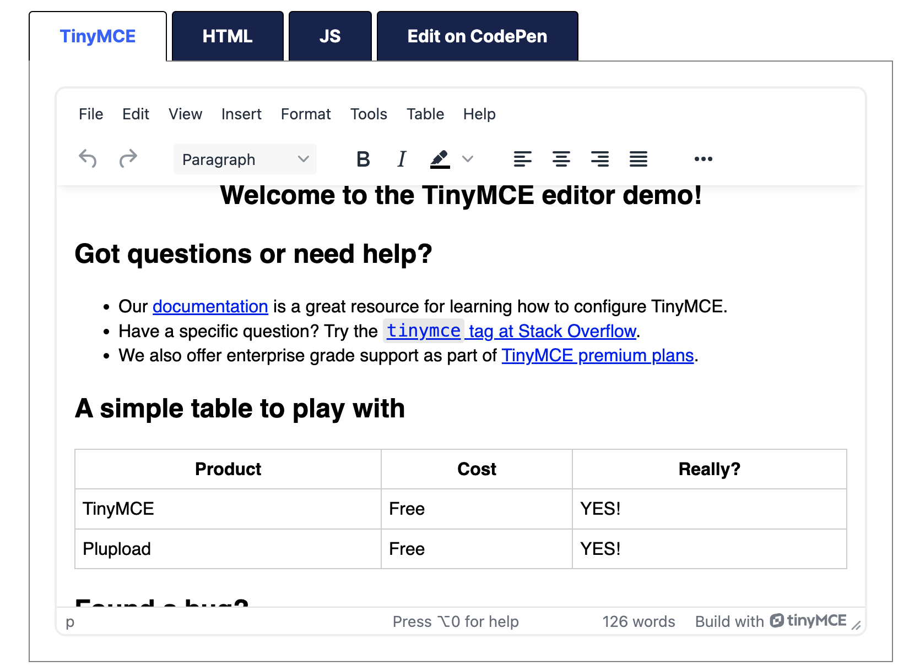
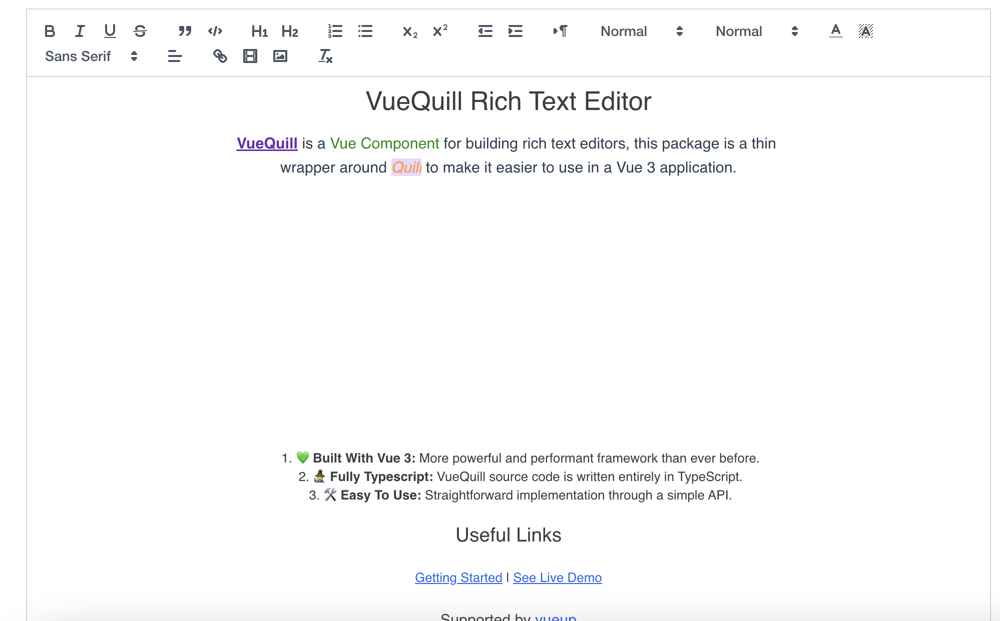

# 富文本
摘抄自[链接](https://juejin.cn/post/7434373084747333658?utm_source=gold_browser_extension) 

## 技术选型
* 考虑的功能点
  - 页面简洁美观
  - 支持从Word中复制、粘贴(word版本多变可选一个版本兼容)
  - 格式化功能丰富，尽可能的支持各种文本和段落的样式
  - 多媒体功能丰富，支持对图片大小、位置的处理
  - 支持html代码与显示切换
  - 支持并满足复杂的表格功能
  - 插件拓展
  - 多端兼容
  - 多语言支持（对于部分海外客户可能有需求）

## Tinymce
* 简介：
  - Tinymce是一个老牌做富文本的公司，文档和插件配置的自由度都不错，也支持自定义拓展。功能强大，可以完全作为用户的首选
* UI效果
  
* 优点
  - 老牌做富文本的公司，且不断保持更新和维护，值得信赖
  - 免费版功能强大，基本能满足日常需要（开源版本支持商用）
  - 功能强大：如导出，自定义插件，表格功能强大，文件上传，复制粘贴，数学方程等等
  - 对非技术用户友好: 所见所得，拖动即可完成所有
  - 支持多端，移动端友好
  - 社区丰富，文档友好，集成简单
  - 支持多种语言，如阿拉伯语也支持
* 缺点
  - 图片上传需要自定义
  - 超链接不友好并且很丑
  - UI不是很好看
  - 复杂的 word 复制过去格式会变化，需要重新编辑
  - 打开缓慢

## CKEditor
* 简介
  - CKEditor也是一个老牌做富文本的公司， 5.0版本无论是功能还是UI做的相当不错。插件最丰富
* 优点
  - 老牌做富文本的公司，且不断保持更新和维护，值得信赖,UI简洁美观
  - 功能强大：100多个插件，如导出，自定义插件，表格功能强大，文件上传，复制粘贴，数学方程等等
  - 对非技术用户友好: 所见所得，拖动即可完成所有
  - 支持多主题配置
  - 支持多端，移动端友好
  - 支持多种语言
* 缺点 
  - 价格比较贵，免费版功能太少，可能不会满足日常使用
  - API太多，文档对于国内不是很友好, 开发成本高

## Quill
* UI效果
  
* 优点
  - UI还可以
  - API和文档简单
  - 支持 word 的复制，粘贴操作（加分项）
  - 持续更新，从发布到至今，已13年之久，不用担心不维护的问题
* 缺点
  - 对图片非常不友好，不支持图片拖拽
  - 不支持表格
  - 不支持 html 与界面的切换（在文档中统一替换很困难，需要技术人员配合）
  - 适合对图片没有太多需求，并且对文档没有太大格式需求的公司

## wangEditor
* 简介
  - 国产之光，个人能做成这个样子，非常厉害
* 优点:
  - 简单易用，可以快速集成
  - 中文文档友好
  - 支持图片和表格拖拽
  - 社区友好，可以在github提交意见和反馈
  - 多语言支持
* 缺点
  - 移动端不适配，Android下有严重bug，可能会影响使用
  - 暂停维护了，用 Jodit 或 wangEditor-next 替代

## UEditor
* 简介：百度早期出品
* 优点
  - 发布之初，功能强大，但是放在现在，已经有点弱了
  - 支持从word复制粘贴
  - 中文文档友好
* 缺点
  - UI丑
  - 官方已经不维护了
  - 不支持图片和表格拖拽

## 强烈推荐
* Tinymce: 不知道怎么去选的时候，就用Tinymce！不求有功，但求无过
* CKEditor: 文档格式化内容众多，追求使用效率，并且土豪公司或者人民币玩家就用它
* Tiptap: 喜欢diy样式的，追求美观和别具一格的开发者首选
* Jodit: 一次性付款，你值得拥有

## 比较推荐
* Quill: 集成简单，小项目够用，大项目不推荐
* wangEditor: 国人之光
* wangEditor-next: wangEditor的升级版，持续迭代，持续为您服务