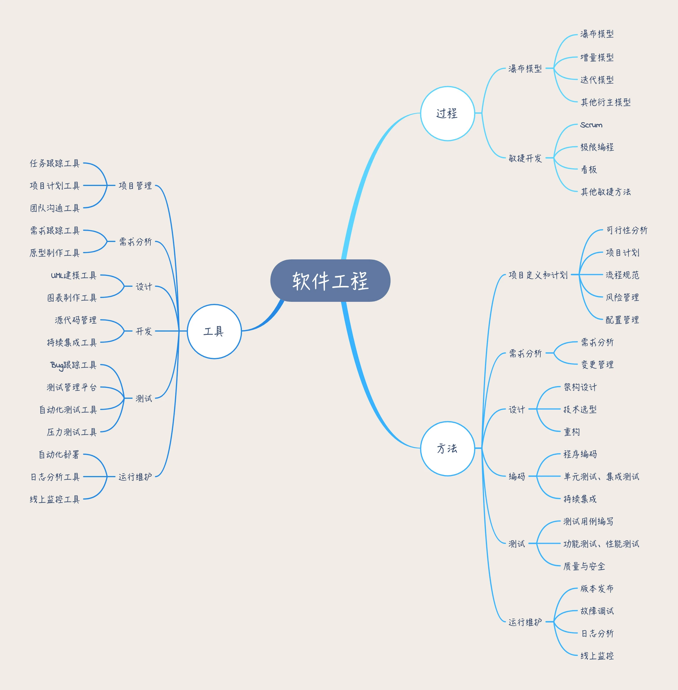

# 软件工程之美
## 基础理论
* 什么是软件工程？
  - 是软件行业知识体系的内核
  - 软件工程 = 工具 + 方法 + 过程。
  - 
* 怎么学好软件工程？
  - 做中学
  - 教中学
  - 分享：ppt、博客
* 工程思维
  - 系统化，也就是全局观，要从站在整个项目的高度去看问题
  - 结构化，也就是有步骤、有节奏得做事情的意识
* 工程方法
  - 想法：想要解决的问题，清晰的定义好问题，研究可行性，检查是否有可行的解决方案
  - 概念：用草图、模型等方式提出一些概念性的解决方案
  - 计划：如何实施计划、人员、任务、任务持续时间、任务的依赖关系，完成项目的预算
  - 设计：针对产品需求，将解决方案进一步细化。设计整体的架构和划分功能模块，作为分工合作的开发实施的依据和参考
  - 开发：根据设计方案，将解决方案构建实施。开发阶段通常是一个迭代的过程，这个阶段通常会有构建、测试、调试和重新设计的迭代
  - 发布：将最终结果包括文档发布
* 瀑布模型
  >瀑布模型把整个项目过程分成了六个主要阶段：
  1. 问题的定义及规划
    - 产出需求文档和可行性研究报告。
    - 问题的定义举例：用途是什么，什么风格、完工时间、预算多少
    - 可行性研究：根据客户提的需求，对比工期和预算，评估是不是值得做
  2. 需求分析
    - 一般需要和客户反复确认，以保证能充分理解客户需求，
    - 产出需求分析文档
  3. 软件设计
    - 对整个软件系统进行抽象和设计如系统框架设计，数据库设计等等。
    - 产出架构设计文档
  4. 程序编码
  5. 软件测试
    - 产出测试报告。
  6. 运行维护
    - 产出使用说明文档
  + 优点：
    - 简单易行，能及时发现问题、可以很好的分工协作，质量有保证
  + 缺点：
    - 难以响应需求的变更，越到后期代价越大
    - 工作量分布不均衡
    - 一直到最后阶段才能看到结果
  + 解决的问题：
    - 让软件开发过程有序可控
    - 让分工协作变成可能
    - 质量有保障
* 快速原型模型
  > 要解决客户的需求不明确和需求多变的问题
* 增量模型
  - 按模块分批次交付
  - 每个小模块的开发过程中，应用一个小瀑布模型
  - 主要适用于：需求比较清楚，能模块化的软件系统，并且可以按模块分批次交付。
* 迭代模型
  - 增量模型是按照功能模块来拆分；而迭代模型则是按照时间来拆分，看单位时间内能完成多少功能。
  - 每个迭代选择当前优先级最高的功能，但是做得比较简陋，下一个版本再进行迭代升级。
* 敏捷开发
## 项目规划
* 可行性分析
  - 经济可行性：成本收益分析
  - 技术可行性：技术成熟度、人员条件、缺陷容忍度
  - 社会可行性：法律、价值观、道德、社会影响

## 需求分析
## 系统设计
## 开发编码
## 软件测试
## 运行维护