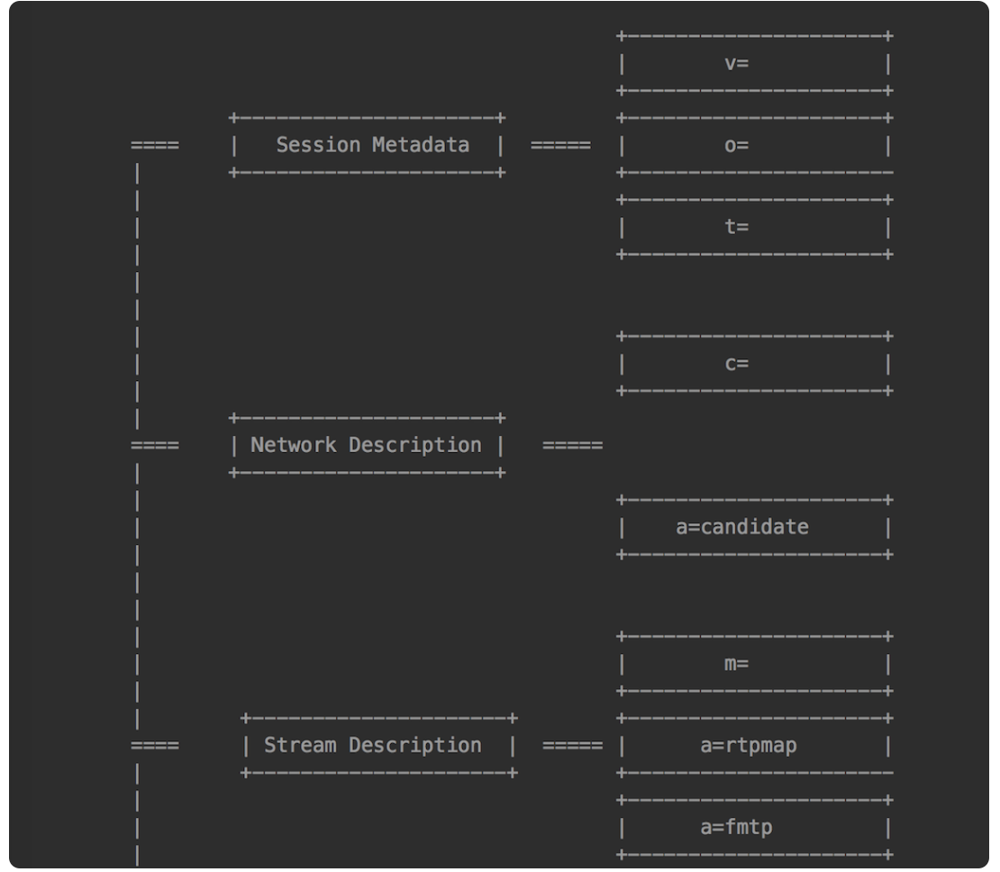
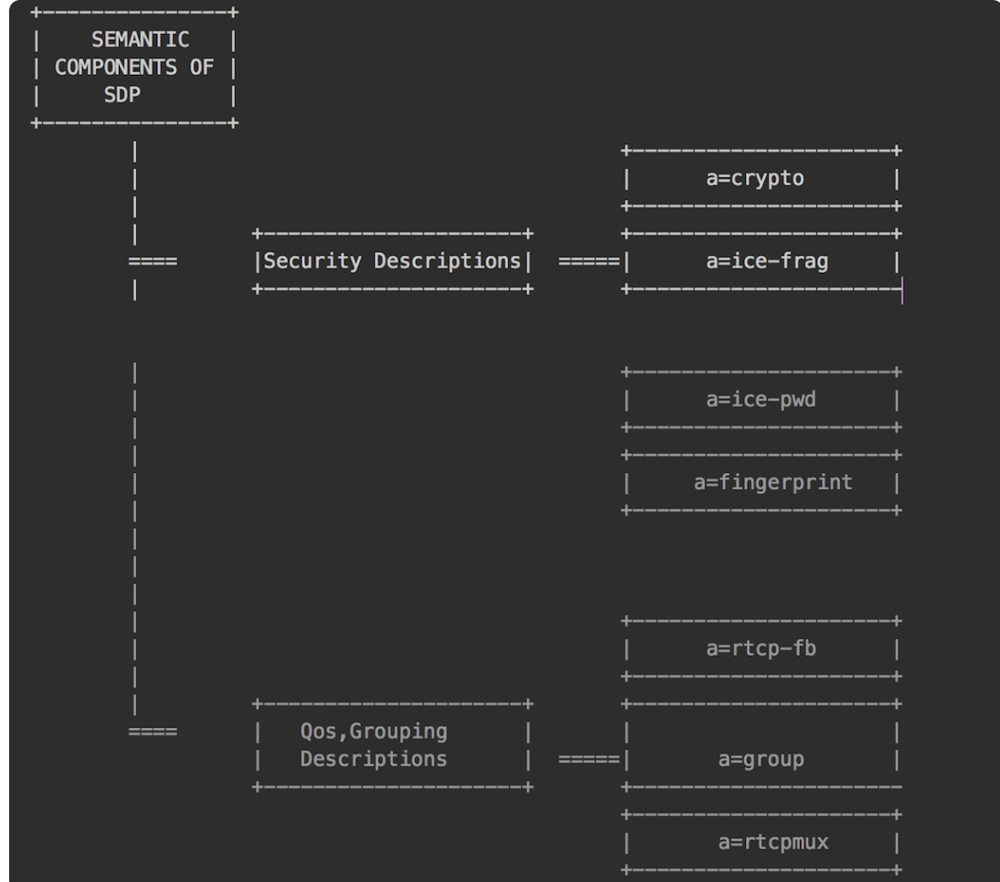

# webRTC

## 组成
* getUserMedia 获取桌面上捕获的多媒体数据（视频、音频）
* RTCPeerConnection 建立 P2P 连接，传输多媒体数据
* RTCDataChannel 传输数据

## 音视频采集(getUserMedia)
* 视频技术的相关概念参考
  - [视频技术](./视频技术.md)
* 摄像头：用于捕捉（采集）图像和视频。
* 麦克风：
   - 用于采集音频数据。它与视频一样，可以指定一秒内采样的次数，称为采样率。每个采样用几个 bit 表示，称为采样位深或采样大小。
* 轨（Track）
  - WebRTC 中的“轨”借鉴了多媒体的概念。火车轨道的特性你应该非常清楚，两条轨永远不会相交。“轨”在多媒体中表达的就是每条轨数据都是独立的，不会与其他轨相交，如 MP4 中的音频轨、视频轨，它们在 MP4 文件中是被分别存储的。
* 流（Stream）：
  - 可以理解为容器。在 WebRTC 中，“流”可以分为媒体流（MediaStream）和数据流（DataStream）。其中，媒体流可以存放 0 个或多个音频轨或视频轨；数据流可以存 0 个或多个数据轨。
* getUserMedia 方法
  ```js
    var promise = navigator.mediaDevices.getUserMedia(mediaStreamConstraints);
    // 如果 getUserMedia 调用成功，则可以通过 Promise 获得 MediaStream 对象，也就是说现在我们已经从音视频设备中获取到音视频数据了。
    // 如果调用失败，比如用户拒绝该 API 访问媒体设备（音频设备、视频设备），或者要访问的媒体设备不可用，则返回的 Promise 会得到 PermissionDeniedError 或 NotFoundError 等错误对象。
  ```
* MediaStreamConstraints 参数
  ```js
    dictionary MediaStreamConstraints {
        (boolean or MediaTrackConstraints) video = false,
        (boolean or MediaTrackConstraints) audio = false
    };

    // 还可以通过 MediaTrackConstraints 进一步对每一条媒体轨进行限制
    const mediaStreamContrains = {
        video: {
            frameRate: {min: 20},
            width: {min: 640, ideal: 1280},
            height: {min: 360, ideal: 720},
            aspectRatio: 16/9
        },
        audio: {
            // 开启回音消除、降噪以及自动增益功能。
            echoCancellation: true,
            noiseSuppression: true,
            autoGainControl: true
        }
    };

    // 其他参数
    facingMode: （h5中使用）user 前置摄头 enviroment 后置 left 前置左、right前置右 
    resizeMode: 是否允许调整图像大小
    latency:  延迟大小
    channalCount： 声道数
    deviceId:     设备id 指定用哪个输出、输入设备
    groupId:      设置组id

  ```
* 获取设备信息(设备检测):
  - 如果存在多个摄像头、多个音频设备可以获取到
    ```js
        //判断浏览器是否支持这些 API
        if (!navigator.mediaDevices || !navigator.mediaDevices.enumerateDevices) {
            console.log("enumerateDevices() not supported.");
            return;
        }

        // 枚举 cameras and microphones.
        navigator.mediaDevices.enumerateDevices()
        .then(function(deviceInfos) {
            //打印出每一个设备的信息
            deviceInfos.forEach(function(deviceInfo) {
                console.log(deviceInfo.kind + ": " + deviceInfo.label +
                            " id = " + deviceInfo.deviceId);
            });
        })
        .catch(function(err) {
            console.log(err.name + ": " + err.message);
        });
    ```
  - MediaDeviceInfo：它表示的是每个输入 / 输出设备的信息。包含以下三个重要的属性
    1. deviceID，设备的唯一标识；
    2. label，设备名称
    3. kind，设备种类，可用于识别出是音频设备还是视频设备，是输入设备还是输出设备
  - 注意：出于安全原因，除非用户已被授予访问媒体设备的权限（要想授予权限需要使用 HTTPS 请求），否则 label 字段始终为空   
  - 案例:[音视频采集.html](./case/音视频采集.html)
* 录制本地音视频
  - MediaRecorder：
  - 只能够实现一路视频和一路音视流的情况，一般在录制时一般不是录制音视频数据，而是录制桌面加音频
   ```js
    var mediaRecorder = new MediaRecorder(stream[, options]);
    // 其参数含义如下：
    // stream，通过 getUserMedia 获取的本地视频流或通过 RTCPeerConnection 获取的远程视频流。
    // options，可选项，指定视频格式、编解码器、码率等相关信息，如 mimeType: 'video/webm;codecs=vp8'
    // ondataavailable 事件。当 MediaRecoder 捕获到数据时就会触发该事件。通过它，我们才能将音视频数据录制下来。
   ```
* 抓取桌面
  ```js
    // 注意： 与 getUserMedia 采集的区别，在桌面采集的参数里却不能对音频进行限制了，也就是说，不能在采集桌面的同时采集音频
    // //只有在 PC 下才能抓取桌面
    const constraints={video: true}
    const promise = navigator.mediaDevices.getDisplayMedia(constraints)
    .then((stream)=>{
        deskVideo.srcObject = stream;
    }) .catch(handleError);
  ```

## 建立 P2P 连接(RTCPeerConnection)
> RTCPeerConnection 是 WebRTC 实现网络连接、媒体管理、数据管理的统一接口。建立 P2P 连接需要用到 RTCPeerConnection 中的几个重要类：SDP、ICE、STUN/TURN。
* rtp & rtcp
  + rtp:
    - 负责将音视频数据封装成数据包并发送。它支持多种编解码器，能够传输多种格式的数据
    - 提供时间戳和序列号，以确保数据包的顺序和同步。通过时间戳，接收方能够在播放时保持音视频的同步
    - RTP 通常运行在 UDP（用户数据报协议）之上，允许快速传输数据，但不保证数据包的交付

* 标准的SDP:
  - SDP是用文本描述的各端的能力，包括音频编解码器类型、传输协议等。这些信息是建立连接是必须传递的，双方知道视频是否支持音频、编码方式是什么，都能通过SDP获得。
  - SDP 描述分为两部分，分别是会话级别的描述（session level）和媒体级别的描述（media level）
    ```ini
        # Session description（会话级别描述） 
        v= (protocol version 必选) # 如 v=0 ，表示 SDP 的版本号，但不包括次版本号。
        o= (表示的是对会话发起者的描述 必选) # 例子：o=<username> <session id> <version> <network type> <address type> <address>
        s= (session name 必选)     # s=，该例子表示一个会话，在整个 SDP 中有且只有一个会话，也就是只有一个 s=
        t= (time the session is active 必选) 
        c=* (connection information -- not required if included in all media) One or more Time descriptions ("t=" and "r=" lines; see below) 
        a=* (zero or more session attribute lines) Zero or more Media descriptions 
        
        # Media description（媒体级别描述）transport：传输协议，有两种——RTP/AVP 和 UDP
        m= (media name and transport address 可选) # 例子：m=<media> <port> <transport> <fmt list>
        a=* (zero or more media attribute lines 可选) # 表示属性，用于进一步描述媒体信息

        # alert(pc.remoteDescription.sdp);

        # 具体的案例
        v=0
        o=alice 2890844526 2890844526 IN IP4 host.anywhere.com
        s=
        c=IN IP4 host.anywhere.com
        t=0 0

        # 下面的媒体描述，在媒体描述部分包括音频和视频两路媒体
        m=audio 49170 RTP/AVP 0
        a=fmtp:111 minptime=10;useinbandfec=1 
        a=rtpmap:0 PCMU/8000 # 对RTP数据的描述
        
        # ... 
        # 上面是音频媒体描述，下面是视频媒体描述
        m=video 51372 RTP/AVP 31
        a=rtpmap:31 H261/90000
        ... 
        m=video 53000 RTP/AVP 32
        a=rtpmap:32 MPV/90000
    ```

* webRTC 中的SDP
  + WebRTC 对标准 SDP 规范做了一些调整，它将 SDP 按功能分成几大块：
    - Session Metadata，会话元数据：
    - Network Description，网络描述
    - Stream Description，流描述
    - Security Descriptions，安全描述
    - Qos Grouping Descriptions， 服务质量描述
  + 他们的对应关系如图
    - 
    - 
    ```
        ...
        //=======安全描述============
        a=ice-ufrag:1uEe //进入连通性检测的用户名
        a=ice-pwd:RQe+y7SOLQJET+duNJ+Qbk7z//密码，这两个是用于连通性检测的凭证
        a=fingerprint:sha-256 35:6F:40:3D:F6:9B:BA:5B:F6:2A:7F:65:59:60:6D:6B:F9:C7:AE:46:44:B4:E4:73:F8:60:67:4D:58:E2:EB:9C //DTLS 指纹认证，以识别是否是合法用户
        ...
        //========服务质量描述=========
        a=rtcp-mux
        a=rtcp-rsize
        a=rtpmap:96 VP8/90000
        a=rtcp-fb:96 goog-remb //使用 google 的带宽评估算法
        a=rtcp-fb:96 transport-cc //启动防拥塞
        a=rtcp-fb:96 ccm fir //解码出错，请求关键帧
        a=rtcp-fb:96 nack    //启用丢包重传功能
        a=rtcp-fb:96 nack pli //与fir 类似
        ...
    ```

* 媒体协商
  + 什么事媒体协商？
    - 在双方通信时，双方必须清楚彼此使用的编解码器是什么，也必须知道传输过来的音视频流的信息
    - 媒体协商的作用就是让双方找到共同支持的媒体能力，如双方都支持的编解码器，从而最终实现彼此之间的音视频通信
  + 如何协商的（协商的过程）？
    - 首先，通信双方将它们各自的媒体信息，如编解码器、媒体流的 SSRC、传输协议、IP 地址和端口等，按 SDP 格式整理好。
    - 然后，通信双方通过信令服务器交换 SDP 信息，并待彼此拿到对方的 SDP 信息后，找出它们共同支持的媒体能力。
    - 最后，双方按照协商好的媒体能力开始音视频通信。
    
    + RTCPeerConnection
      - 它表示的就是端与端之间建立的连接，端到端之间的媒体协商，就是基于 RTCPeerConnection 对象实现的
      - 该类是整个 WebRTC 库中最关键的一个类，通过它创建出来的对象可以做很多事情，如 NAT 穿越、音视频数据的接收与发送，甚至它还可以用于非音视频数据的传输等等
      ```js
        // 创建 RTCPeerConnection 对象
        // 在通讯双方都创建好 RTCPeerConnection 对象后,就可以开始进行媒体协商了
        const pcConfig = null;
        const pc = new RTCPeerConnection(pcConfig);
      ```

    + Offer 与 Answer
      - 对于 1 对 1 通信的双方来说，我们称首先发送媒体协商消息的一方为呼叫方，而另一方则为被呼叫方
      - Offer:在双方通讯时，呼叫方发送的 SDP 消息称为 Offer。
      - Answer:在双方通讯时，被呼叫方发送的 SDP 消息称为 Answer。

    + 协商的具体过程
      - 呼叫方创建 Offer 类型的 SDP 消息。创建完成后，调用 setLocalDescriptoin 方法将该 Offer 保存到本地 Local 域，然后通过信令将 Offer 发送给被呼叫方
      - 被呼叫方收到 Offer 类型的 SDP 消息后，调用 setRemoteDescription 方法将 Offer 保存到它的 Remote 域。作为应答，被呼叫方要创建 Answer 类型的 SDP 消息，Answer 消息创建成功后，再调用 setLocalDescription 方法将 Answer 类型的 SDP 消息保存到本地的 Local 域。最后，被呼叫方将 Answer 消息通过信令发送给呼叫方。至此，被呼叫方的工作就完部完成了。
      - 接下来是呼叫方的收尾工作，呼叫方收到 Answer 类型的消息后，调用 RTCPeerConnecton 对象的 setRemoteDescription 方法，将 Answer 保存到它的 Remote 域。至此，整个媒体协商过程处理完毕

    + 代码实现上述过程
      + 浏览器提供了几个非常方便的 API，这些 API 是对底层 WebRTC API 的封装，用来实现上述功能
        - createOffer ，创建 Offer；
        - createAnswer，创建 Answer；
        - setLocalDescription，设置本地 SDP 信息；
        - setRemoteDescription，设置远端的 SDP 信息。
      ```js
        // 1. 呼叫方创建 Offer
        function setLocalAndSendMessage(sessionDescription) {
            pc.setLocalDescription(sessionDescription);
            sendMessage(sessionDescription);
        }
        function doCall() {
          console.log('Sending offer to peer');
          pc.createOffer(setLocalAndSendMessage, handleCreateOfferError);
        }  
      
        // 2. 被呼叫方收到 Offer
        // 调用 setRemoteDescription 方法设置呼叫方发送给它的 Offer 作为远端描述
        socket.on('message', function(message) {
            ...
            } else if (message.type === 'offer') {
                pc.setRemoteDescription(new RTCSessionDescription(message));
                doAnswer();
            } else if (...) {
                ...
            }
            ....
        });

        // 3. 被呼叫方创建 Answer
        // 被呼叫方调用 RTCPeerConnection 对象的 createAnswer 方法，它会生成一个与远程会话兼容的本地会话，并最终将该会话描述发送给呼叫方。
        function doAnswer() {
            pc.createAnswer().then(
                setLocalAndSendMessage,
                onCreateSessionDescriptionError
            );
        }

        // 4. 呼叫方收到 Answer
        // 呼叫方得到被呼叫方的会话描述，即 SDP 时，调用 setRemoteDescription 方法，将收到的会话描述设置为一个远程会话
        socket.on('message', function(message) {
            ...
            } else if (message.type === 'answer') {
                pc.setRemoteDescription(new RTCSessionDescription(message));
            } else if (...) {
                ...
            }
            ....
        });
        // 此时，媒体协商过程完成。紧接着在 WebRTC 底层会收集 Candidate，并进行连通性检测，最终在通话双方之间建立起一条链路来
        // Webrtc 底层收集的candidate 是他自己的地址信息，需要通过信令服务器交换给对端双方才能通信
        // 注意：通信双方链路的建立是在设置本地媒体能力，即调用 setLocalDescription 函数之后才进行的
      ```

* WebRTC建立连接
  + 什么是 Candidate？
    - ICE Candidate （ICE 候选者）。它表示 WebRTC 与远端通信时使用的协议、IP 地址和端口,它的结构如下
    - 端对端的建立更主要的工作是 Candidate 的收集
    ```js
    {
        IP: xxx.xxx.xxx.xxx,
        port: number,
        type: host/srflx/relay, // host 表示本机候选者，srflx 表示内网主机映射的外网的地址和端口，relay 表示中继候选者
        priority: number,
        protocol: UDP/TCP,
        usernameFragment: string
        ...
    }
    ```
  + Candidate 的收集
    - host 类型的 Candidate 是最容易收集的，因为它们都是本机的 IP 地址和端口。优先走这个这是最高效的
    - srflx 类型的 Candidate收集需要在公网上架设一台服务器，并向这台服务器发个请求，就可以知道自己的公网 IP，次选这个
  + STUN 协议
    - srflx 类型的 Candidate收集过程，已经被定义成了一套规范，即 RFC5389 ，也就是 STUN 协议，我们只要遵守这个协议就可以拿到自己的公网 IP 了
    - relay 型候选者的获取也是通过 STUN 协议完成的，只不过它使用的 STUN 消息类型与获取 srflx 型候选者的 STUN 消息的类型不一样而已
  + NAT 打洞 /P2P 穿越 
    - 当收集到 Candidate 后，WebRTC 就开始按优先级顺序进行连通性检测了
    - 首先会判断两台主机是否处于同一个局域网内，如果双方确实是在同一局域网内，那么就直接在它们之间建立一条连接
    - 如果两台主机不在同一个内网，WebRTC 将尝试 NAT 打洞，即 P2P 穿越
  + WebRTC 将 NAT 分类为 4 种类型
    > 注意： 对称型 NAT 与对称型 NAT 是无法进行 P2P 穿越的；而对称型 NAT 与端口限制型 NAT 也是无法进行 P2P 连接的
    - 完全锥型 NAT
    - IP 限制型 NAT
    - 端口限制型 NAT
    - 对称型 NAT
  + ICE
    - ICE 就是上面所讲的获取各种类型 Candidate 的过程，也就是：在本机收集所有的 host 类型的 Candidate，通过 STUN 协议收集 srflx 类型的 Candidate，使用 TURN 协议收集 relay 类型的 Candidate

* WebRTC NAT穿越原理
  + NAT 随处可见，而它的出现主要是出于两个目的
    - 第一个是解决 IPv4 地址不够用的问题,让多台主机共用一个公网 IP 地址，然后在内部使用内网 IP 进行通信
    - 第二个是解决安全问题,也就是主机隐藏在内网，外面有 NAT 挡着，这样的话黑客就很难获取到该主机在公网的 IP 地址和端口，从而达到防护的作用。
  + 所谓的“打洞”就是在 NAT 上建立一个内外网的映射表

* WebRTC 中控制传输速率
  > 在网络不好场景下，为了提高音视频服务质量，要对传输速率进行控制
  + 物理链路质量
    - 丢包:如果物理链路不好，经常出现丢包，这样就会造成接收端无法组包、解码，从而对音视频服务质量产生影响
    - 延迟:指通信双方在传输数据时，数据在物理链路上花费的时间比较长。对于实时通信来说，200ms 以内的延迟是最好的；500 ms 以内，通话双方的体验也还不错，有点像打电话的感觉；达到 800ms，还能接受，但有明显的迟滞现像；延迟超过 1 秒，那就不是实时通话了！
    - 抖动:指的是数据一会儿快、一会儿慢，很不稳定。如果不加处理的话，你看到的视频效果就是一会儿快播了、一会儿又慢动作，给人一种眩晕的感觉，时间长了会非常难受。对于 WebRTC 来讲，它通过内部的 JitterBuffer（可以简单地理解为一块缓冲区）就能很好地解决该问题。
  + 带宽大小
    - 带宽大小指的是每秒钟可以传输多少数据,比如 1M 带宽，它表达的是每秒钟可以传输 1M 个 bit 位，换算成字节就是 1Mbps/8 = 128KBps
  + 传输速率
    > 在实时通信中，与传输速率相关的有两个码率：音视频压缩码率和传输控制码率
    - 音视频压缩码率:指的是单位时间内音视频被压缩后的数据大小
    - 传输码率:是指对网络传输速度的控制,假设你发送的每个网络包都是 1500 字节，如果每秒钟发 100 个包，它的传输码率是多少呢？即 100*1.5K = 150K 字节，再换算成带宽的话就是 150KB * 8 = 1.2M。但如果你的带宽是 1M，那每秒钟发 100 个包肯定是多了
  + 具体在webRTC中如何做
    - 注意：由于 WebRTC 是实时传输，当它发现音视频数据的延迟太大，且数据又不能及时发出去时，它会采用主动丢数据的方法，以达到实时传输的要求。
    - 因此 WebRTC 只允许我们使用第一种压缩码率的方式来主动控制速率
    ```js
      var vsender = null; //定义 video sender 变量
      var senders = pc.getSenders(); //从RTCPeerConnection中获得所有的sender

      //遍历每个sender
      senders.forEach( sender => {
        if(sender && sender.track.kind === 'video'){ //找到视频的 sender
            vsender = sender; 
        }
      });

      var parameters = vsender.getParameters(); //取出视频 sender 的参数
      if(!parameters.encodings){ //判断参数里是否有encoding域
          return;
      }

      //通过 在encoding中的 maxBitrate 可以限掉传输码率
      parameters.encodings[0].maxBitrate = bw * 1000;

      //将调整好的码率重新设置回sender中去，这样设置的码率就起效果了。
      vsender.setParameters(parameters) 
            .then(()=>{
                console.log('Successed to set parameters!');
            }).catch(err => {
                console.error(err);
            })
    ```

## 如何打开或关闭音视频
* 场景一：将远端的声音静音
  > 可以通过在播放端控制和发送端控制两种方式实现
  + 播放端控制：在播放端控制的优点是实现简单；缺点是虽然音频没有被使用，但它仍然占用网络带宽，造成带宽的浪费。
    1. 不让播放器播出来 
      ```html
      <video id="remote" autoplay muted playsinline/>
      <script>
        var remotevideo = document.querySelector('video#remote');
        remotevideo.muted = false;
      </script>

      ```
    2. 不给播放器喂数据，将收到的音频流直接丢弃
    ```js
    var remoteVideo = document.querySelector('video#remote');

    //....
    {
        //创建与远端连接的对象
        pc = new RTCPeerConnection(pcConfig);
      // ...
        //当有远端流过来时，触发该事件
        pc.ontrack = getRemoteStream;
       // ...
    }

    function getRemoteStream(e){
        //得到远端的音视频流
      remoteStream = e.streams[0];
        //找到所有的音频流
      remoteStream.getAudioTracks().forEach((track)=>{
          if (track.kind === 'audio') { // 判断 track 是类型
            //从媒体流中移除音频流    
            remoteStream.removeTrack(track);
          }
        }); 
        // 显示视频 
      remoteVideo.srcObject = e.streams[0];
    }
    ```
  + 发送端控制
    1. 停止音频的采集和停止音频的发送（1对应1）
    ```js
      // 通过信令通知
      // 获得采集音视频数据时限制条件
      function getUserMediaConstraints() { 
          var constraints = { 
            "audio": false, 
            "video": {
              "width": { "min": "640", "max": "1280" },
              "height": { "min": "360", "max": "720" }
            } 
        }; 
        return constraints;
      }

      // 方法一： 采集音视频数据
      function captureMedia() { 
        if (localStream) { 
          localStream.getTracks().forEach(track => track.stop()); 
        } 
        // 采集音视频数据的 API 
        navigator.mediaDevices.getUserMedia(getUserMediaConstraints())

        // 方法二：关闭通道
        // peerconnection 与 track 进行绑定 
        function bindTrack() { 
          // add all track into peer connection 
          localStream.getTracks().forEach((track)=>{ 
            if(track.kink !== 'audio') { 
              pc.addTrack(track, localStream); 
            } 
          }); 
        }

        // 方法三：通过获取音频轨道并设置其 enabled 属性来切换麦克风的状态：
        // 关了就不推送数据了
        const audioTracks = localStream.getAudioTracks()
        if (audioTracks.length > 0) {
          const isEnabled = audioTracks[0].enabled
          audioTracks[0].enabled = !isEnabled // 切换麦克风状态
          console.log(`麦克风已${isEnabled ? '关闭' : '开启'}`)
        }

    ```
    2. 停止向某个用户发送音频流（多对多）
* 场景二：将自己的声音静音
  - 停止对本端音频数据的采集
* 场景三：关闭远端的视频
  - 从播放端控制只能使用不给播放器喂数据这一种方法
  - 从发送端控制是通过停止向某个用户发送视频数据这一种方法来实现的
  - 和静音类似 做类型判断时，需要将 ‘audio’ 修改为 ‘video’ 就好了
* 场景四：关闭自己的视频
  ```js
  const videoTracks = localStream.getVideoTracks()
  if (videoTracks.length > 0) {
    const isEnabled = videoTracks[0].enabled
    videoTracks[0].enabled = !isEnabled // 切换摄像头状态
    console.log(`摄像头已${isEnabled ? '关闭' : '开启'}`)
  }
  ```

## webRTC 中的数据统计
* 必须有页面创建了 RTCPeerConnection 对象之后，在浏览器输入 chrome://webrtc-internals
* getStats: RTCPeerConnection 对象的方法获取所有的统计信息，除收发包的统计信息外，还有候选者、证书、编解码器等其他类型的统计信息
  ```js
    //获得速个连接的统计信息
    pc.getStats().then( 
        // 在一个连接中有很多 report
        reports => {
            //遍历每个 report
            reports.forEach( report => {
                // 将每个 report 的详细信息打印出来
                console.log(report);
            });

        }).catch( err=>{
          console.error(err);
        });
    );
  ```
* RTCRtpSender 对象的 getStats 方法只统计与发送相关的统计信息。
* RTCRtpReceiver 对象的 getStats 方法则只统计与接收相关的统计信息

## 传输数据 (RTCDataChannel)
* RTCDataChannel：
   - WebRTC 的数据通道是专门用来传输除了音视频数据之外的任何数据
* 应用场景
  - 应用非常广泛，如实时文字聊天、文件传输、远程桌面、游戏控制、P2P 加速等都是它的应用场景
* 支持数据类型
  - 字符串、Blob、ArrayBuffer 以及 ArrayBufferView
* 传输协议为 SCTP，即 Stream Control Transport Protocol
  + RTCDataChannel 既可以在可靠的、有序的模式下工作，也可在不可靠的、无序的模式下工作
    - 可靠有序模式（TCP 模式）：在这种模式下，消息可以有序到达，但同时也带来了额外的开销，所以在这种模式下消息传输会比较慢。
    - 不可靠无序模式（UDP 模式）：在此种模式下，不保证消息可达，也不保证消息有序，但在这种模式下没有什么额外开销，所以它非常快。
    - 部分可靠模式（SCTP 模式）：在这种模式下，消息的可达性和有序性可以根据业务需求进行配置。
* 配置 RTCDataChannel
  ```js
   const pc = new RTCPeerConnection(); 
   const dc = pc.createDataChannel("dc", options); // 创建 RTCDataChannel对象

   // 第一个参数是一个标签（字符串），相当于给 RTCDataChannel 起了一个名字；
   // 第二个参数是 options，其形式如下：
   //  var options = {
   //     ordered: false, // 消息的传递是否有序
   //     maxPacketLifeTime: 3000  // 重传消息失败的最长时间
   //     maxRetransmits：         // 重传消息失败的最大次数,与 maxPacketLifeTime 是互斥的
   //  };

  ```
* RTCDataChannel 事件
    ```js
        const dc = pc.createDataChannel("chat");

        dc.onopen = function () {
            console.log("datachannel open");
        };

        dc.onclose = function () {
            console.log("datachannel close");
        };

        dc.onerror = (error)=> { 
            // 出错 ..
        };

        // 收到消息
        dc.onmessage = function (e) {
            var msg = e.data;
            if (msg) {
                message.log("-> " + msg + "\r\n");
            } else {
                console.error("received msg is null");
            }
        };
    ```
* RTCDataChannel对象的创建主要有 In-band 协商和 Out-of-band 协商两种方式
  + In-band(是默认方式)
    - 假设通信双方中的一方调用 createDataChannel 创建 RTCDataChannel 对象时，将 options 参数中的 negotiated 字段设置为 false
    - 则通信的另一方就可以通过它的 RTCPeerConnection 对象的 ondatachannel 事件来得到与对方通信的 RTCDataChannel 对象了，这种方式就是 In-band 协商方式
    - 优势: RTCDataChannel 对象可以在需要时自动创建，不需要应用程序做额外的逻辑处理。
  + Out-of-band
    - 两端都调用 createDataChannel 方法创建 RTCDataChannel 对象，再通过 ID 绑定来实现双方的数据通信
    - 不需等待有消息发送来再创建 RTCDataChannel 对象，所以双方发送数据时不用考虑顺序问题，即谁都可以先发数据，这是与 In-band 方式的最大不同
  - 注意:RTCDataChannel 对象的创建要在媒体协商（offer/answer） 之前创建

## 数据传输的安全
* WebRTC 引入了 DTLS，通过 DTLS 协议就可以有效地解决 A 与 B 之间交换公钥时可能被窃取的问题

## NAT 及 ICE 框架
> ICE 集成了多种 NAT 穿越技术，比如 STUN、TURN，可以实现 NAT 穿透，在主机之间发现 P2P 传输路径机制。
* 网络地址转换（ NAT）
  - NAT常部署在一个组织的网络出口位置。网络分为私网和公网两个部分，NAT 网关设置在私网到公网的路由出口位置，私网与公网间的双向数据必须都要经过NAT网关。组织内部的大量设备，通过 NAT 就可以共享一个公网IP地址，解决了 IPv4 地址不足的问题。

* STUN:Session Traversal Utilities for NAT 
  - STUN 允许位于 NAT（或多重NAT）后的客户端找出自己的公网地址，查出自己位于哪种类型的 NAT 之后以及 NAT 为某一个本地端口所绑定的公网端端口。
* TURN:traversal Using Relay NAT
  - TURN是一种数据传输协议。允许通过TCP或UDP方式穿透NAT或防火墙。TURN是一个Client/Server协议。TURN 的NAT穿透方法与STUN 类似，都是通过取得应用层中的公网地址达到NAT穿透
* ICE收集
  + ICE两端并不知道所处的网络的位置和NAT类型，通过ICE能够动态的发现最优的传输路径。ICE端收集本地地址、通过STUN服务收集NAT外网地址、通过TURN收集中继地址，所以会有三种候选地址：
    - host 类型，即本机内网的 IP 和端口；
    - srflx 类型, 即本机 NAT 映射后的外网的 IP 和端口；
    - relay 类型，即中继服务器的 IP 和端口。
    ```yaml
    { 
        IP: xxx.xxx.xxx.xxx, 
        port: number, 
        type: host/srflx/relay, 
        priority: number, 
        protocol: UDP/TCP, 
        usernameFragment: string 
        ...
    }
    ```
  - 

## TURN 服务器的搭建
* 作用
  - 一是提供 STUN 服务，客户端可以通过 STUN 服务获取自己的外网地址；
  - 二是提供数据中继服务。
* 目前最著名的 TURN 服务器是由 Google 发起的开源项目 coturn
  - 从 https://github.com/coturn/coturn 下载 coturn 代码；
  - 执行 ./configure --prefix=/usr/local/coturn 生成 Makefile；
  - 执行 make 来编译 coturn；
  - 执行 sudo make install 进行安装。
* 配置
   - 只需要修改 4 项内容就可以将 coturn 服务配置好了
   ```
    listening-port=3478         # 指定侦听端口
    external-ip=xxx.xxx.xxx.xx  # 主机公网ip
    user=xxxx:xxx               # 访问 stun/turn服务的用户名和密码
    realm=stun.xxx.cn           # 域名，这个一定要设置

   ```
* 连接配置参数
```js
    var pcConfig = {
    'iceServers': [{ //指定 ICE 服务器信令
        'urls': 'turn:stun.al.learningrtc.cn:3478', //turn服务器地址
        'credential': "passwd", //turn服务器密码，你要用自己的 
        'username': "username"  //turn服务器用户名，你要用自己的
    }]
    };

    function createPeerConnection(){
        if(!pc){
            pc = new RTCPeerConnection(pcConfig); //创建peerconnection对象
            pc.ontrack = getRemoteStream; //当远端的track到来时会触发该事件
        }else {
            console.log('the pc have be created!');
        }
        return;
    }

```

## 多方通信架构的三种方案
* Mesh 方案
  - 如 A、B、C 三个终端进行多对多通信，当 A 想要共享媒体（比如音频、视频）时，它需要分别向 B 和 C 发送数据，依次类推
  - 这种方案对各终端的带宽要求比较高。
* MCU（Multipoint Conferencing Unit）方案
  - 各终端将自己要共享的音视频流发送给服务器，服务器端会将在同一个房间中的所有终端的音视频流进行混合，最终生成一个混合后的音视频流再发给各个终端
  - 这种方案服务器的压力会非常大。
  - MCU 技术在视频会议领域出现得非常早，目前技术也非常成熟，主要用在硬件视频会议领域
* SFU（Selective Forwarding Unit）方案
  - 该方案也是由一个服务器和多个终端组成，但与 MCU 不同的是，SFU 不对音视频进行混流，收到某个终端共享的音视频流后，就直接将该音视频流转发给房间内的其他终端
  - WebRTC 普及以后。支持 WebRTC 多方通信的媒体服务器基本都是 SFU 结构
  - SFU 像是一个媒体流路由器，接收终端的音视频流，根据需要转发给其他终端
  + 优势
    - 由于是数据包直接转发，不需要编码、解码，对 CPU 资源消耗很小
    - 直接转发也极大地降低了延迟，提高了实时性。
    - 带来了很大的灵活性，能够更好地适应不同的网络状况和终端类型。
  + 劣势
    - 由于是数据包直接转发，参与人观看多路视频的时候可能会出现不同步，画面不一致
    - 同时观看多路视频，在多路视频窗口显示、渲染等会带来很多麻烦。录制和回放也有困难
    
## 常见的流媒体服务器
[流媒体服务器](./流媒体服务器/流媒体服务器.md)

## 播放器开源项目
* Ijkplayer
* vlc
