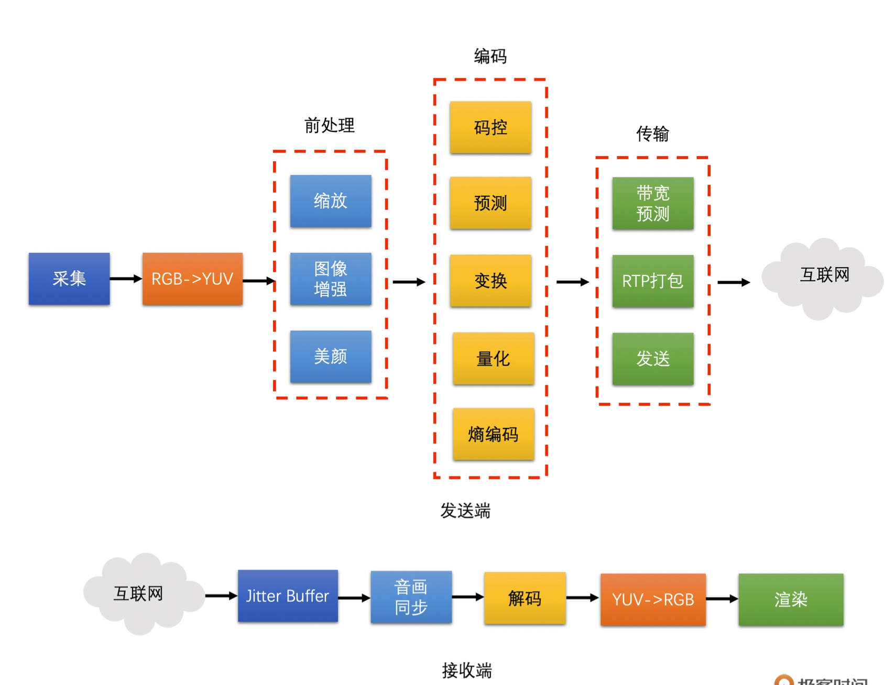
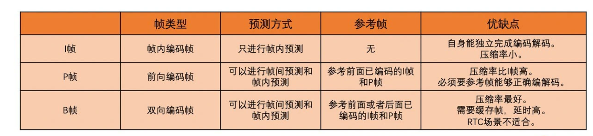
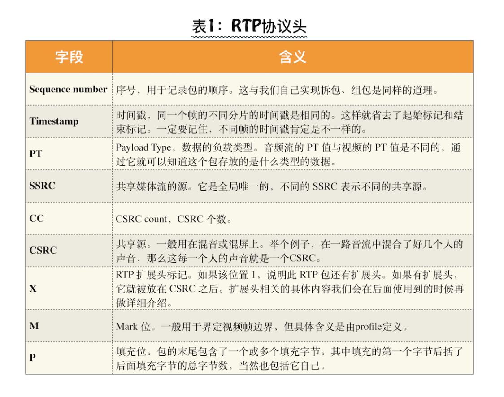
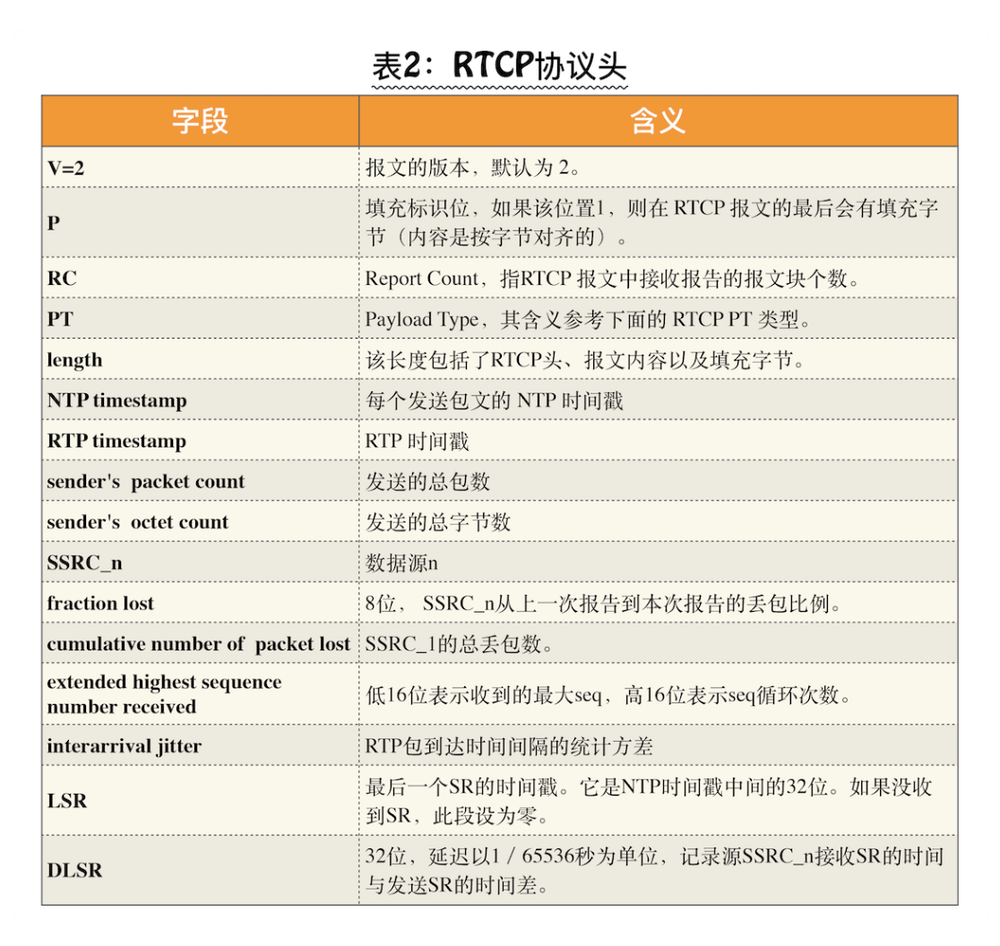

# 视频技术

## 图像的基础和前处理
### 图像的基本概念
* 像素
  - 是图像的基本单元，一个个像素就组成了图像。你可以认为像素就是图像中的一个点
* 分辨率
  - 图像（或视频）的分辨率是指图像的大小或尺寸。我们一般用像素个数来表示图像的尺寸
  - 视频行业常见的分辨率有 QCIF（176x144）、CIF（352x288）、D1（704x576 或720x576）
  - 我们熟悉的分辨率有 360P（640x360）、720P（1280x720）、1080P（1920x1080）、4K（4096x2160）、8K（7680x4320）
  - 分辨率越高图像就越清晰，但同时也带来一个问题，即占用的带宽也就越多。所以，在直播系统中，分辨率的高低与网络带宽有紧密的联系。也就是说，分辨率会跟据你的网络带宽进行动态调整。
* 位深
  - 像素就是一个带有颜色的小块，那这个小块到底是怎么组成的呢？
  - 我们看到的彩色图像中，都有三个通道，这三个通道就是 R、G、B 通道（有的时候还会有 Alpha 值，代表透明度），彩色图像中的像素是有三个颜色值的，分别是红、绿、蓝三个值
  - 通常 R、G、B 各占 8 个位，也就是一个字节。8 个位能表示 256 种颜色值，那 3 个通道的话就是 256 的 3 次方个颜色值，总共是 1677 万种颜色。我们称这种图像是 8bit 图像，而这个 8bit 就是位深，可见位深越大，我们能够表示的颜色值就越多
  - 8bit 图像的每一个像素需要占用 3x8 总共 24 个位，3 个字节，同理 10bit、12bit 就会占用更多，图像的位深越大，需要的存储空间就会越大
  - 我们大多数情况下看到的图像以及视频还是 8bit 位深的
* Stride
  - 也可以称之为跨距，是图像存储的时候有的一个概念，指的是图像存储时内存中每行像素所占用的空间
  - 如一张 RGB 图像，分辨率是 1278x720。我们将它存储在内存当中，一行像素需要 1278x3=3834 个字节，3834 除以 16 无法整除。因此，没有 16 字节对齐。所以如果需要对齐的话，我们需要在 3834 个字节后面填充 6 个字节，也就是 3840 个字节做16 字节对齐，这样这幅图像的 Stride 就是 3840 了
  - 所以每读取一行数据的时候需要跳过这多余的 6 个字节，否则会出现花屏

### 视频的一些基本概念
* 帧率
  - 视频是由一系列图像组成的，即“连续”的一帧帧图像就可以组成视频，实际上视频中的图像并不是真正意义上的连续，在 1 秒钟之内，图像的数量是有限的。只是当数量达到一定值之后，人的眼睛的灵敏度就察觉不出来了，看起来就是连续的视频了，1 秒钟内图像的数量就是帧率
  - 常见的帧率：电影院看的电影帧率一般是 24fps（帧每秒），监控行业常用 25fps，帧率高，代表着每秒钟处理的图像数量会很高，从而需要的设备性能就比较高
  - 现在的摄像头一般情况下，一秒钟可以采集 30 张以上的图像。帧率越高，视频就越平滑流畅。然而，在直播系统中一般不会设置太高的帧率，因为帧率越高，占的网络带宽就越多
* 码率
  - 视频的帧率越高，1 秒钟内的图像数据量就会越大。通常我们存储视频的时候需要对图像进行压缩之后再存储，否则视频会非常大
  - 那么压缩之后的视频我们一般如何描述它的大小呢？一般对于一个视频文件，我们直接看视频的大小就可以了。但是在实时通信或者直播的时候，视频是视频流的形式，我们怎么衡量呢？
  - 码率是指视频在单位时间内的数据量的大小，单位一般是 Kb/s 或者 Mb/s
  - 通常，我们用压缩工具压缩同一个原始视频的时候，码率越高，图像的失真就会越小，视频画面就会越清晰。但同时，码率越高，存储时占用的内存空间就会越大，传输时使用的流量就会越多
* 宽高比
  - 分辨率一般分为两种宽高比，即 16:9 或 4:3。
  - 4:3 的宽高比是从黑白电视而来，而 16:9 的宽高比是从显示器而来。现在一般情况下都采用 16:9 的比例
* 图像的颜色空间 YUV & RGB
  + 在视频技术中，我们经常碰到的颜色空间有两种：RGB 和 YUV
    - RGB：比如摄像头采集的原始图像就是 RGB 图像，且显示器显示的图像也是 RGB 图像，将红（Red）、绿（Green）、蓝（Blue）三原色的色光按照不同的比例相加，来合成各种色彩光
    - YUV：在视频领域，我们更多地是使用 YUV 颜色空间来表示图像的。这是因为 R、G、B 三个颜色是有相关性的，所以不太方便做图像压缩编码。它将亮度信息（Y）与色彩信息（UV）分离，即使没有 UV 信息一样可以显示完整的图像，只不过是黑白的，它解决了彩色电视机与黑白电视的兼容问题，最大的优点在于每个像素点的色彩表示值占用的带宽或者存储空间非常少
  + YUV 的类型和存储方式
    - YUV 主要分为 YUV 4:4:4、YUV 4:2:2、YUV 4:2:0 这几种常用的类型
    - 最常用的是YUV 4:2:0，三种类型的 YUV 主要的区别就是 U、V 分量像素点的个数和采集方式
    - YUV 4:4:4 就是每一个 Y 就对应一个 U 和一个 V；而 YUV 4:2:2 则是每两个 Y 共用一个 U、一个 V；YUV 4:2:0 则每四个 Y 共用一个 U、V
  + RGB 和 YUV 之间的转换
    - 一般来说，采集到的原始图像、给显示器渲染的最终图像都是 RGB 图像，但是视频编码一般用的是 YUV 图像，所以两者需要转换
    - 转换的标准有两种：一种是 BT601；一种是 BT709
* 图像的缩放算法
  + 缩放的基本原理：图像的缩放就是将原图像的已有像素经过加权运算得到目标图像的目标像素
  + 常用的图像缩放算法
    - 插值算法：目前绝大多数图像的缩放还是通过插值算法来实现的，插值算法有很多种，但是其基本原理都是差不多的。都是使用周围已有的像素值通过一定的加权运算得到“插值像素值”，插值算法主要包括：最近邻插值算法（Nearest）、双线性插值算法（Bilinear）、双三次插值算法（BiCubic）
    + 最近邻插值（Nearest Neighbor Interpolation）
      - 原理：对目标像素的颜色值直接取最近邻的像素值。
      - 优点：实现简单，计算速度快。
      - 缺点：可能导致锯齿状边缘和图像模糊。
    + 双线性插值（Bilinear Interpolation）
      - 原理：通过将目标像素的颜色值计算为其周围四个像素的加权平均值。
      - 优点：比最近邻插值更平滑，效果较好。
      - 缺点：计算量比最近邻插值大，可能会稍微模糊。
    + 双三次插值（Bicubic Interpolation）
      - 原理：使用目标像素周围16个像素的加权平均进行插值。
      - 优点：提供更好的图像质量，比双线性插值更加平滑。
      - 缺点：计算复杂度高，速度较慢。

    - AI 超分算法
  ```python
    import cv2

    # 读取图像
    image = cv2.imread('image.jpg')
    
    # 默认插值算法是 双线性插值

    # 使用双线性插值缩放图像
    resized_image = cv2.resize(image, (width, height), interpolation=cv2.INTER_LINEAR)

    # 使用双三次插值缩放图像
    resized_image_cubic = cv2.resize(image, (width, height), interpolation=cv2.INTER_CUBIC)

  ```

## 视频编码
* 视频编码原理
  - 视频编码是对一帧帧图像来进行的。一般我们所熟知的彩色图像的格式是 RGB 的，即用红绿蓝三个分量的组合来表示所有颜色。但是，RGB 三个颜色是有相关性的，为了去掉这个相关性，减少需要编码的信息量，我们通常会把 RGB 转换成 YUV，也就是 1 个亮度分量和 2 个色度分量。
  - 人眼对于亮度信息更加敏感，而对于色度信息稍弱，所以视频编码是将 Y 分量和 UV分量分开来编码的
  - 对于每一帧图像，又是划分成一个个块来进行编码的，这一个个块在 H264 中叫做宏块，而在 VP9、AV1 中称之为超级块
  - 宏块大小一般是 16x16（H264、VP8），32x32（H265、VP9），64x64（H265、VP9、AV1），128x128（AV1）这几种。这里提到的 H264、H265、VP8、VP9 和 AV1 都是市面上常见的编码标准
  + 图像一般都是有数据冗余的，主要包括以下 4 种：视频编码就是通过减少 4 种冗余来达到压缩视频的目的
    - 空间冗余：比如说将一帧图像划分成一个个 16x16 的块之后，相邻的块很多时候都有比较明显的相似性
    - 时间冗余：一个帧率为 25fps 的视频中前后两帧图像相差只有 40ms，两张图像的变化是比较小的，相似性很高
    - 视觉冗余：人的眼睛对于图像中高频信息的敏感度是小于低频信息的。有的时候去除图像中的一些高频信息人眼看起来跟不去除高频信息差别不大
    - 信息熵冗余：我们一般会使用 Zip 等压缩工具去压缩文件，将文件大小减小，这个对于图像来说也是可以做的，这种冗余叫做信息熵冗余

* 编解码技术的演进
  - 现在市面上常见的编码标准有 H264、H265、VP8、VP9 和 AV1。
  - 目前 H264 和 VP8 是最常用的编码标准，且两者的标准非常相似。
  - H265 和 VP9 分别是他们的下一代编码标准，这两个标准也非常相似。
  - AV1 是 VP9 的下一代编码标准
  - H264 和 H265 是需要专利费的，而 VP8 和 VP9 是完全免费的
  - VP8 是 WebRTC 默认的编码标准用的最多，WebRTC 也支持 VP9 和 AV1

* H264码流结构
  + 编码帧
    - 通过编码器（如 H264/H265、VP8/VP9）压缩后的帧称为编码帧
    - 以 H264 为例，经过 H264 编码的帧包括以下三种类型
    
  + 非编码帧（解码帧）
    - 播放器播的是非编码帧（解码后的帧），这些非编码帧就是一幅幅独立的图像
    - 从摄像头里采集的帧或通过解码器解码后的帧都是非编码帧。
    - 非编码帧的格式一般是 YUV 格式或是 RGB 格式
  + IDR 帧
    - 如果编码或者解码的过程中有一个参考帧出现错误的话，那依赖它的 P 帧和 B 帧肯定也会出现错误，而这些有问题的 P 帧,又会继续作为之后 P 帧或 B 帧的参考帧,错误会不断的传递,为了避免错误的不断传递，就有了一种特殊的 I 帧叫 IDR 帧，也叫立即刷新帧
    - H264 编码标准中规定，IDR 帧之后的帧不能再参考 IDR 帧之前的帧,截断了编码错误的传递，且之后的帧就可以正常编 / 解码了
  + GOP
    - 从一个 IDR 帧开始到下一个 IDR 帧的前一帧为止，这里面包含的 IDR 帧、普通 I 帧、P 帧和 B 帧，我们称为一个GOP（图像组）
    - GOP 的大小是由 IDR 帧之间的间隔来确定的，而这个间隔我们叫关键帧间隔
    - 关键帧间隔越大，两个 IDR 相隔就会越远，GOP 也就越大，反之 IDR 相隔也就越近，GOP 就越小
    - GOP 越大，编码的 I 帧就会越少。相比而言，P 帧、B 帧的压缩率更高，因此整个视频的编码效率就会越高。但是 GOP 太大，也会导致 IDR 帧距离太大，点播场景时进行视频的 seek 操作就会不方便
    - 在 RTC 和直播场景中，可能会因为网络原因导致丢包而引起接收端的丢帧，大的 GOP最终可能导致参考帧丢失而出现解码错误，从而引起长时间花屏和卡顿
  + Slice（片）
    > 上面讲的是视频图像序列的层次结构，那图像内的层次结构是怎样的呢
    - Slice 其实是为了并行编码设计的,在机器性能比较高的情况下，我们就可以多线程并行对多个 Slice 进行编码，从而提升速度
    - 图像内的层次结构就是一帧图像可以划分成一个或多个 Slice，并且 Slice 之间相互独立、互不依赖、独立编码,而一个 Slice 包含多个宏块，且一个宏块又可以划分成多个不同尺寸的子块
  + 码流格式
    + Annexb
      - 使用起始码来表示一个编码数据的开始。起始码本身不是图像编码的内容，只是用来分隔用的
      - 起始码有两种，一种是 4 字节的“00 00 00 01”，一种是 3 字节的“00 00 01”
      - 由于图像编码出来的数据中也有可能出现“00 00 00 01”和“00 00 01”的数据，H264 会将图像编码数据中的做修改，在解码端，我们在去掉起始码之后，也需要将对应的字节串转换回来
    + MP4
      - MP4 格式没有起始码，而是在图像编码数据的开始使用了 4 个字节作为长度标识，用来表示编码数据的长度
      - 每次读取 4 个字节，计算出编码数据长度，然后取出编码数据，再继续读取 4 个字节得到长度，一直继续下去就可以取出所有的编码数据了
  + NALU(编码数据)
    - 图像分成 I 帧、P 帧和 B 帧这三种类型的帧。其实除了图像数据，视频编码的时候还有一些编码参数数据，为了能够将一些通用的编码参数提取出来，不在图像编码数据中重复，H264 设计了两个重要的参数集：一个是 SPS（序列参数集）；一个是 PPS（图像参数集）
    - H264 码流主要包含了 SPS、PPS、I 帧、P 帧和 B 帧。由于帧又可以划分成一个或多个 Slice。因此，帧在码流中实际上是以 Slice 的形式呈现的。所以，H264 的码流主要是由 SPS、PPS、I Slice、P Slice和B Slice 组成的
    + NALU Type
      - SPS（序列参数集）
      - PPS（图像参数集）
      - IDR Slice
      - 非 IDR Slice

* 帧内预测
  > 帧内预测到底是怎么做到减少空间冗余
  - 通过利用已经编码的相邻像素的值来预测待编码的像素值，最后达到减少空间冗余的目的

* 帧间预测
  - 通过帧间编码可以去除时间冗余
  - 需要参考已编码帧的，并对已编码帧具有依赖性
  - 又可以分为只参考前面帧的前向编码帧，和既可以参考前面帧又可以参考后面帧的双向编码帧
  
* 变换和量化
  - 为了分离图像块的高频和低频信息从而去除视觉冗余，我们需要做 DCT 变换和量化

## 视频传输和网络对抗
* 常见的实时媒体流协议及其适用场景
  + RTP (Real-time Transport Protocol):
    - 场景：RTP 是一个标准的实时音频和视频传输协议，通常与 RTCP（RTP Control Protocol）一起使用，用于传输多媒体数据，如语音电话、视频会议等实时通信场景。
    - 协议：RTP 通常运行在 UDP（用户数据报协议）之上，允许快速传输数据，但不保证数据包的交付。
    - 特点：支持实时数据传输、时间同步、延迟控制等功能，常用于需要即时性和低延迟的应用中。
  + RTCP
    - RTCP 主要用于监控 RTP 流的传输质量，并提供传输质量的反馈信息
    - RTCP 提供了会话控制、参与者信息和流的统计信息。通过 RTCP，接收方可以向发送方反馈流的质量问题，从而进行适当的调整
  + RTSP (Real-time Streaming Protocol):
    - 场景：RTSP 是一种客户端和服务器之间用来控制多媒体流传输的应用层协议，常用于流媒体服务、IP 监控摄像头等需要远程控制和实时传输的场景。
    - 特点：RTSP 本身不传输数据，而是建立和控制流媒体会话的控制协议，通常与 RTP 结合使用，用于实时媒体流的控制和管理。
    - 协议：RTP 是 RTSP 的底层协议之一，用于实际的媒体数据传输，支持 TCP 和 UDP 两种传输协议
  + RTMP 协议：
    - 延迟：RTMP 的延迟通常在 1-3 秒左右，适合实时直播场景。相较于 HLS 协议，它的实时性要高很多。
    - 协议：底层依赖于 TCP 协议，不会出现丢包、乱序等问题，因此音视频业务质量有很好的保障。但可能会引入一些延迟。
    - 特点：Real-Time Messaging Protocol (RTMP): 主要用于 Flash Player，但现代浏览器已经逐渐不再支持 Flash。
    - 适用场景：常用于游戏直播、互动直播等需要较低延迟的应用
  + WebRTC (Web Real-Time Communication):
    + 特点：
      - 实时性：支持低延迟的音视频通话，适合在线会议、直播等场景。延迟通常在 100 毫秒以下
      - 浏览器支持：主流浏览器（如 Chrome、Firefox、Safari 和 Edge）都支持 WebRTC。
      - 点对点通信：允许直接在用户之间建立连接，减少服务器负担。
      - 安全性：使用加密协议（SRTP、DTLS）确保通信安全。
    + 组成部分
      - MediaStream：用于处理媒体流（音频和视频）。
      - RTCPeerConnection：处理网络连接和媒体流的传输。负责信令和 ICE（Interactive Connectivity Establishment）。
      - RTCDataChannel：用于在两个浏览器之间传输任意数据，实现实时数据交换。
  + HLS (HTTP Live Streaming):
    - 延迟：HLS 的延迟通常在 15-30 秒，具体取决于切片长度和播放器设置
    - 协议：使用 HTTP，数据通过分段（小文件）传输，适合大规模分发，但相对延迟较高。
    - 特点：HLS 将整个媒体文件分成短小的 HTTP 下载流，每个流以 MPEG-2 Transport Stream（MPEG-TS）格式传输，利用 HTTP 服务器进行内容传输，支持自适应码率和跨平台播放。
    - 适用场景：适用于点播和大规模直播，不太关注实时性
    > h5支持播放:HLS (.m3u8) 或 MPEG-DASH (.mpd)。
  + SRT
    - 是一种现代的视频流传输协议，旨在提供高质量的视频传输，尤其适用于不稳定网络环境。它能够通过加密和纠错机制，在丢包、延迟或带宽波动的情况下，保证视频传输的可靠性和流畅性。
    - 协议：底层协议基于 UDP，在 UDP 的基础上增加了多种功能来提高传输的可靠性和稳定性
    + SRT 的特点：
      - 低延迟：SRT 设计时特别优化了低延迟性能，非常适合需要实时性的视频传输，比如直播和远程制作。
      - 容错机制：SRT 包含内建的纠错和重传机制，能够在网络丢包的情况下修复损坏的数据包，从而提高视频传输的稳定性。
      - 加密功能：SRT 支持加密传输（AES），确保数据传输过程中的安全性。
      - 适应性强：SRT 会根据网络的状况动态调整带宽，从而避免网络波动导致的卡顿或中断。
      - 适用于各种网络环境：无论是在传统的有线网络中，还是在不稳定的移动或无线网络中，SRT 都能提供较为稳定的流媒体传输。
    + 应用场景：
        - 远程制作：适用于广播电视等行业，在不同地理位置之间传输高清视频，保障实时性和稳定性。
        - 直播流：对于具有网络波动或较差连接条件的地区，SRT 提供了比传统的 RTMP 更可靠的视频传输方式。
        - 灾备和容灾：SRT 可以用于多地点备份传输，确保即使某个链路失败，视频也能继续稳定地传输。

* RTP & RTCP 协议 和 H264 的 RTP 打包
  > 音频和视频数据经过编码压缩后，不会直接将编码码流进行传输，而是先将码流打包成一个个 RTP 包再进行发送
  - 
  - 

* 带宽预测
* 视频编码码控原理及算法
* 视频花屏卡顿的产生原因及处理方法
* 可伸缩编码 SVC

## 视频封装和播放
* 视频封装技术 MPC & FLV
  - FLV：适合录制的多媒体格式
  - flv.js，可以用 h5 播放 flv
* 视频渲染和音画同步的基本方法

