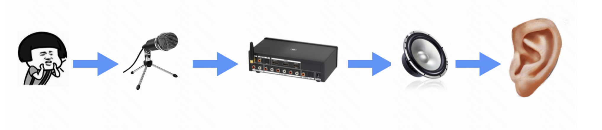

# 音频技术

## 声音的产生
  - 我们平常听到的自然界的声音，比如说鸟鸣、水流，其实是一种模拟信号
  - 声音是振动产生的一种声波，通过气态、液态、固态的物理介质传播并能被人或动物感知的波动现象
  
  - 模拟信号->数字信号->采样、量化和编码->离散的数字信号

## 声音的一些概念
* 声音的频率：
  - 一般会以赫兹（Hz）表示，指每秒钟周期性振动的次数, 通常我们人耳能够听到的频率范围是在 20Hz～20kHz 之间
* 声音的强度单位则用分贝（dB）来表示
  - 44dB 属于人类可以接受的程度
  - 55dB 会使人感觉到烦躁
  - 60dB 会让人没有睡意
  - 70dB 会令人精神紧张
  - 85dB 长时间听会让人感觉刺耳
  - 100dB 会使人暂时失去听觉
  - 120dB 可以瞬间刺穿你的耳膜
  - 160dB 会通过空气振波震碎玻璃
  - 200dB 可以使人死亡
* 采样频率:
  - 为了保证音频不失真，音频的采样频率通常应该在 40kHz 以上,理论上采样率大于 40kHz 的音频格式都可以称之为无损格式
  + 常用的采样率与对应的使用场景:
    - 8000 Hz 主要是电话通信时用的采样率，对于传达人们说话时的声音已经足够了；
    - 11025 Hz、22050 Hz 主要是无线电广播用的采样率；
    - 44100 Hz 常用于音频 CD，MP3 音乐播放等场景；
    - 48000 Hz 常用于 miniDV、数字电视、DVD、电影和专业音频等设备中
* 音频声道及其布局
  - 采集不同方位的声源，然后通过不同方位的扬声器播放出来就产生了不同的声道
  - 常见的声道内容除了左声道、右声道，还有立体声等
* 采样位深度
  - 也叫采样位深，它决定了声音的动态范围,
  - 常见的 16 位（16bit）可以记录大概 96 分贝（96dB）的动态范围。也可以理解为每一个比特大约可以记录 6dB 的声音
  - 计算公司：20 × math.log10(65535)
* 音频的码率：
  - 也就是一秒钟的数据量，通常我们用 bps（bits per second）来表示，音频的码率可以间接地表示音频的质量，一般高清格式的码率更高。
* 音频的编解码：
  - 因为音频在传输和存储时，如果直接存储 PCM 音频数据的话，消耗的带宽或者存储空间会比较多，所以我们为了节省传输带宽或者存储，通常会选择对音频数据做编码
压缩处理
  + 互联网上常见的音频编码有： 
    - AAC、MP3、AC-3、OPUS，从兼容性来看，AAC 和 OPUS 更出众一些
    - 做音频通话的话可以考虑使用 OPUS，因为基于 OPUS 的音频，处理语音更方便一些，例如回声消除，降噪等
    - 做音乐压缩，我们可以考虑 AAC，因为 AAC 支持的音质与硬件兼容性更好一些、要效果更好，但不太要求兼容性的话，AC-3 是一个不错的选择